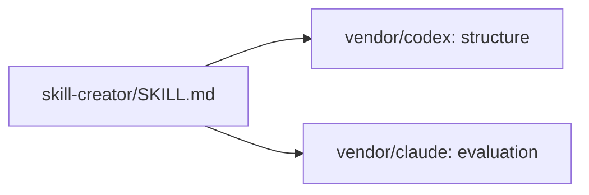

# alex-skills

A collection of skills for Claude Code and opencode — modular instruction packs that give AI agents domain-specific expertise, voice guidelines, and tooling.

## Install

```bash
git clone https://github.com/acastro2/alex-skills.git ~/.agents/skills
```

This puts each skill at `~/.agents/skills/<name>/SKILL.md`, which opencode discovers automatically.

Skills are also discoverable from `~/.config/opencode/skills/` and `~/.claude/skills/` — see [opencode skills docs](https://opencode.ai/v2/docs/skills/).

### Voice skill

- `alex-voice/SKILL.md` — Discoverable voice skill for docs, comms, exec, chat, and general prose
- `alex-voice/references/alex-blogger.md` — Blog-specific guidance loaded by the voice skill
- `alex-voice/references/voice-fingerprint.md` — Measured rhythm and vocabulary per register, from Alex's own words
- `alex-voice/scripts/voice_check.py` — Scores a draft against the fingerprint; em dashes and banned phrases are blockers

## Skill creator

`skill-creator/SKILL.md` routes structure work to OpenAI's creator and evaluation work to Anthropic's creator. Both creators are vendored into `skill-creator/vendor/` as pinned copies. There are no Git submodules.



The vendored entry file is `CREATOR.md`, not `SKILL.md`, because OpenCode discovers any file named exactly `SKILL.md` at any depth, with dot-directories and symlinks included. A vendored `SKILL.md` would register a second skill, and a nested one sorts after `skill-creator/SKILL.md` and shadows the wrapper.

`skill-creator/vendor/PROVENANCE.md` records the source repositories, pinned commits, dates, and licenses. To move to a newer upstream commit, re-copy both directories, rename the new `SKILL.md` to `CREATOR.md`, drop any `__pycache__`, update that table, then rerun validation and a representative skill task. Do not edit files inside `vendor/`. Upstream licenses stay in each vendored directory. Because the sources now live inside the skill, `skill-creator/` installs standalone.

## Skill anatomy

```
skill-name/
├── SKILL.md        # Entry point (YAML frontmatter + instructions)
├── scripts/        # Executable helpers
├── references/    # Docs loaded into context as needed
├── assets/         # Templates, icons, fonts
├── agents/         # Subagent instructions
├── evals/          # Test prompts and assertions
└── LICENSE.txt     # Per-skill license
```

## Development and validation

Install the pre-commit hooks:

```bash
pre-commit install
```

Run all hooks on all files:

```bash
pre-commit run --all-files
```

The local validator checks top-level skill frontmatter, directory and name agreement, and sibling relative references.

## License

Apache License 2.0 — see [LICENSE](LICENSE).
