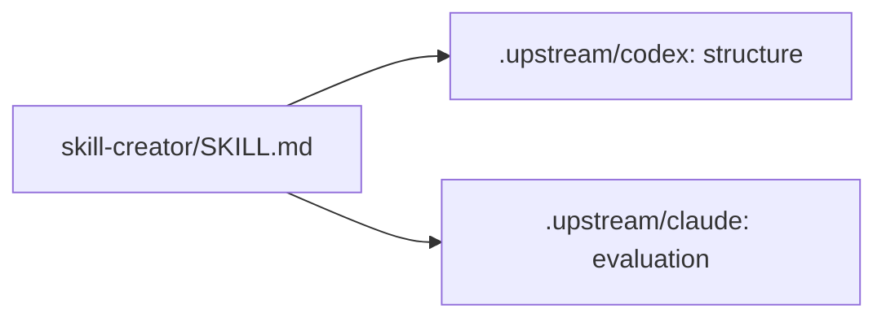

# alex-skills

A collection of skills for Claude Code and opencode — modular instruction packs that give AI agents domain-specific expertise, voice guidelines, and tooling.

## Install

```bash
git clone --recurse-submodules https://github.com/acastro2/alex-skills.git ~/.agents/skills
```

This puts each skill at `~/.agents/skills/<name>/SKILL.md`, which opencode discovers automatically.

Skills are also discoverable from `~/.config/opencode/skills/` and `~/.claude/skills/` — see [opencode skills docs](https://opencode.ai/docs/skills/).

### Voice skill

- `alex-voice/SKILL.md` — Discoverable voice skill for docs, comms, exec, chat, and general prose
- `alex-voice/references/alex-blogger.md` — Blog-specific guidance loaded by the voice skill
- `alex-voice/references/voice-fingerprint.md` — Measured rhythm and vocabulary per register, from Alex's own words
- `alex-voice/scripts/voice_check.py` — Scores a draft against the fingerprint; em dashes and banned phrases are blockers

## Skill creator

`skill-creator/SKILL.md` routes structure work to OpenAI's creator and evaluation work to Anthropic's creator. Both stay unchanged in Git submodules at `.upstream/codex` and `.upstream/claude`. The hidden parent keeps them out of normal Pi and Codex skill discovery; do not register `.upstream/` as a skill search path.



For an existing clone, run from the repository root (Git changes require approval when an agent runs them):

```bash
git submodule update --init --recursive -- .upstream/codex .upstream/claude
```

This restores the recorded versions. To deliberately test newer upstream versions:

```bash
git submodule update --remote -- .upstream/codex .upstream/claude
git diff --submodule=log
git submodule status
```

Review the changed creator instructions and scripts, then rerun validation and a representative skill task before recording the new pins. Do not edit files inside the submodules. Upstream licenses remain in their repositories. Install this wrapper with the parent repository, not as a standalone `.skill` archive.

## Skill anatomy

```
skill-name/
├── SKILL.md        # Entry point (YAML frontmatter + instructions)
├── scripts/        # Executable helpers
├── references/    # Docs loaded into context as needed
├── assets/         # Templates, icons, fonts
├── agents/         # Subagent instructions
├── evals/          # Test prompts and assertions
└── LICENSE.txt     # Per-skill license
```

## Development and validation

Install the pre-commit hooks:

```bash
pre-commit install
```

Run all hooks on all files:

```bash
pre-commit run --all-files
```

The local validator checks top-level skill frontmatter, directory and name agreement, and sibling relative references.

## License

Apache License 2.0 — see [LICENSE](LICENSE).
