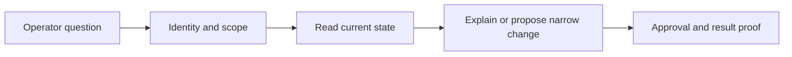

# AWS

Help the operator find the right account, explain what failed, make one reviewed change, and prove the result. This skill covers existing workloads and practical next steps from them. It is not a catalog of everything AWS sells.

Before any AWS command, read the [shared CLI guide](references/cli-operating.md). Then load only the relevant module. Read the [workload scope](references/workload-scope.md) when deciding whether to expand coverage or propose a new service.

## Working defaults

- Discover the configured operator profile and verify STS identity. Never hardcode an account from this skill.
- Start with metadata, resource state and existing telemetry. Do not fetch secrets, customer objects, database rows or desktop user details just to inventory a service.
- Follow the existing repo and release path. Inspect its Terraform/OpenTofu modules, workflows and owner before proposing CDK, SAM, console setup or a new platform. Keep CDK/SAM examples for repos that actually use them.
- A timeout, stopped task, billing line or successful API response is evidence, not a complete diagnosis. Separate observation, hypothesis and proof.
- Prefer a reviewed IaC change. Emergency CLI changes need exact targets, before state, approval, rollback and reconciliation into IaC.
- Use Exa for current AWS guidance and Context7 for library/CLI details when extending this skill or using changing APIs. Do not send internal resource data to either service.

## Routing

| Task | Module |
|---|---|
| Credentials, SSO, expired session | [auth](auth/instructions.md) |
| General CLI, profiles, pagination, account sweeps, safe shell commands | [shared CLI](references/cli-operating.md) |
| EC2, AMI, Auto Scaling, SSM fleet diagnosis | [compute](compute/instructions.md) |
| ECS/Fargate tasks, EKS access/nodes/add-ons, ECR images | [containers](containers/instructions.md) |
| RDS, SQL Server, PostgreSQL, Aurora Serverless, Redis/Valkey, DynamoDB, DocumentDB, OpenSearch | [databases](databases/instructions.md) |
| S3 access/storage, FSx ONTAP, EFS, Transfer, DataSync, DMS, Athena/Glue adjacency | [storage](storage/instructions.md) |
| WorkSpaces, WorkSpaces Applications/AppStream, directory and fleet diagnosis | [end-user computing](euc/instructions.md) |
| VPC/TGW, DNS/Resolver, endpoints, security groups, Direct Connect, ALB containment | [networking](networking/instructions.md) |
| GuardDuty, WAF, CloudTrail data events, IAM/KMS, secret exposure, security service discovery | [security](security/instructions.md) |
| Logs, metrics/streams, alarms, CloudTrail, existing AWS telemetry | [observability](observability/instructions.md) |
| GitHub Actions OIDC, ECR/ECS/SSM releases, S3 publication, rollback proof | [delivery](delivery/instructions.md) |
| Lambda, API Gateway, Step Functions, event-driven app diagnosis | [serverless](serverless/instructions.md) |
| SQS/SNS/EventBridge, Kinesis/Firehose, queue and stream choices | [messaging](messaging/instructions.md) |
| Service/account spend, budgets, sizing, commitments, CUR | [billing](billing/instructions.md) |
| Bedrock invocation, access, residency, cache/quota/cost; related agent options | [Bedrock](bedrock/instructions.md) |
| SageMaker resource/cost discovery; Airflow ownership discovery | [data platform discovery](references/data-platform-discovery.md) |

For Grafana, Loki, Mimir, Tempo and Pyroscope, use the installed observability skills for that stack. Do not enable a second telemetry stack just because this AWS skill includes it.

## Questions that cross modules

- ECS release: delivery owns artifact and rollback proof; containers owns runtime diagnosis.
- Database connection failure: databases owns engine/access checks; networking owns the path; security owns IAM/KMS evidence.
- S3 deployment: delivery owns sync and deletion review; storage owns storage/access diagnosis; networking owns endpoint-policy alignment.
- Public route exposure: security owns incident evidence; networking owns the approved listener change.
- EKS application failure: establish AWS cluster access here, then inspect the exact Kubernetes context, namespace and workload with the relevant tooling.

## Coverage limits

Current use gets operational depth. Direct successors, alternatives and complements get a short comparison and discovery path. Adoption of one service does not approve another.

If no module fits, identify the service and task, check current official documentation, and use the shared safety rules. Ask only for missing scope or decisions. Do not force the task into the nearest module or invent a local helper script.
