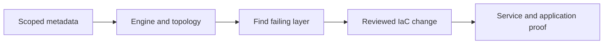

# Databases and caches

Find the engine and the failing layer before changing anything. A reachable endpoint is not proof of database access. A backup is not proof of recovery.

Read the [shared CLI guide](../references/cli-operating.md) first. It owns named SSO profiles, account/Region checks, output limits, and mutation gates.

## Scope

Cover SQL Server editions, PostgreSQL, Aurora PostgreSQL and Aurora MySQL, DocumentDB, Redis OSS, and Valkey. Inspect Aurora members for `db.serverless` rather than assuming their capacity type. Discover exact identifiers; never invent internal names or infer deployment from this coverage list.

ElastiCache Serverless and other related options need an actual workload fit check. Availability in AWS is not evidence that an organization uses or should adopt the service.

| Need | Read next |
|---|---|
| Identify a DB/cache, its engine, endpoints, or network placement | [Metadata discovery](references/discovery.md) |
| Diagnose a connection, prove recovery, or review a change | [Connection and recovery checks](references/connection-recovery.md) |
| DNS, routes, security group rules, or private access path | [Networking](../networking/instructions.md) |
| Secret metadata, IAM, KMS, or exposure | [Security](../security/instructions.md) |
| Load, saturation, errors, or change timing | [Observability](../observability/instructions.md) |

## Distinguish the engines

| Metadata | Operator rule |
|---|---|
| `sqlserver-*` | Preserve the edition suffix, version, license model, option group, and domain membership. Do not treat all SQL Server instances as interchangeable. |
| `postgres` | RDS PostgreSQL, not Aurora. Check extensions and parameter compatibility before a version change. |
| `aurora-postgresql`, `aurora-mysql` | Inspect the cluster **and each member**. Preserve writer/reader roles and each instance class. |
| `DBInstanceClass=db.serverless` | Aurora Serverless v2 member. Record cluster `ServerlessV2ScalingConfiguration` and engine version. |
| `EngineMode=provisioned` | Does **not** exclude Serverless v2. Do not classify capacity from this field alone. A scaling configuration alone also does not prove a serverless member exists. |
| `docdb` | DocumentDB: use `aws docdb` for follow-up. MongoDB-compatible does not mean every MongoDB feature or driver setting works. |
| `redis`, `valkey` | Keep the engine and version distinct. Inspect node-based replication groups and members; do not assume a rename is an approved migration. |

Keep unexpected engines in the findings. RDS describe calls can also return DocumentDB and Neptune resources. Do not count the same cluster twice when switching to its service API.

For Aurora Serverless v2, compare observed capacity/load with configured limits before proposing an ACU change. Check the exact engine version and Region for supported limits; do not copy a universal minimum or assume auto-pause is enabled.

## Work contract

1. Record the requested question, exact resource, owner, application path, and UTC incident window.
2. Read metadata before any SQL, document, or cache command. Do not scan tables, documents, or keys to identify a service.
3. Separate network reachability, TLS, secret access, database authentication, and database authorization. Fix the layer with evidence.
4. Find the owning IaC repo and resource before proposing a change. Follow the shared approval gate; no generic deploy or restore recipe belongs here.
5. Report what changed, before/after evidence, application checks, restore/rollback proof, and checks not run. Redact connection strings and data.

## Small routing cases

- **DynamoDB:** start with `list-tables` / `describe-table` metadata: key schema, indexes, billing mode, status, and protection settings. Confirm the exact table before backup or access checks. Do not use `scan` for discovery.
- **OpenSearch:** distinguish managed domains (`aws opensearch`) from Serverless collections (`aws opensearchserverless`). Discover metadata and access paths first. Do not query index contents or infer adoption from service availability.
- **DMS:** this module owns source/target database readiness, engine compatibility, permissions, and recovery evidence. The `storage` module owns DMS movement: endpoints, replication tasks, mappings, validation, and cutover. Do not duplicate those steps here.

## Sources

Public AWS details were checked through Exa and the Context7 AWS CLI collection. Discover live resource state separately.

- [RDS instance metadata](https://docs.aws.amazon.com/cli/latest/reference/rds/describe-db-instances.html)
- [RDS cluster metadata](https://docs.aws.amazon.com/cli/latest/reference/rds/describe-db-clusters.html)
- [Aurora Serverless v2 requirements](https://docs.aws.amazon.com/AmazonRDS/latest/AuroraUserGuide/aurora-serverless-v2.requirements.html)
- [RDS point-in-time restore](https://docs.aws.amazon.com/AmazonRDS/latest/UserGuide/USER_PIT.html)
- [DocumentDB connectivity](https://docs.aws.amazon.com/documentdb/latest/developerguide/troubleshooting.connecting.html)
- [ElastiCache restore](https://docs.aws.amazon.com/AmazonElastiCache/latest/dg/backups-restoring.html)
