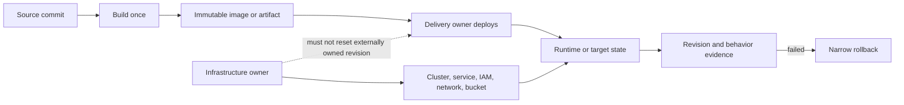

# AWS delivery

Ship one known revision, prove that revision reached the target, and keep rollback narrow.

Before writing or running any `aws` command, read the shared [CLI operating guide](../references/cli-operating.md). It owns identity, Region, output, payload-file, polling, and mutation controls. Do not copy or weaken those rules here.

## Route the work

| Delivery need | Read next | Also load |
|---|---|---|
| Call an Attain reusable workflow | [Reusable workflow contracts](references/reusable-workflows.md) | This page |
| Build to ECR and deploy to ECS | [Verification, ownership, and rollback](references/release-controls.md) | [Containers](../containers/instructions.md) |
| Deploy to a Windows EC2 fleet | [Reusable workflow contracts](references/reusable-workflows.md#ec2-ssm-deployyml) | [Systems Manager](../compute/references/systems-manager.md) |
| Publish an immutable S3 artifact | [Reusable workflow contracts](references/reusable-workflows.md#s3-artifact-deployyml) | [Release controls](references/release-controls.md) |
| Sync a static site to S3 | [Static-site limits](references/reusable-workflows.md#static-site-s3-deployyml) | [S3 controls](references/release-controls.md#s3-delivery) |
| Apply only the intended infrastructure repair | [Targeted applies](references/release-controls.md#targeted-applies-when-unrelated-drift-exists) | The repository's own infrastructure rules |
| Roll back a failed release | [Narrow rollback](references/release-controls.md#narrow-rollback) | The service module for the target |

This module does not cover generic GitHub Actions setup, application build logic, Kubernetes or EKS, full Terraform standards, or authoring a new reusable workflow.

## Keep one owner for each state



Write down the boundary before deployment:

- Infrastructure code owns durable AWS resources, IAM, network, service settings, buckets, and approved SSM documents.
- The delivery workflow owns the active ECS task-definition revision, immutable artifact selection, or static content release.
- If delivery owns the ECS revision, infrastructure code must not reset `task_definition` during a later apply. Stop if both systems can update it.
- A green infrastructure apply proves only that the requested infrastructure change completed. It does not prove the intended application revision is running.

## Use the Attain workflow when it fits

Prefer the central workflows in `Engineering-Attain-Finance/reusable-workflows/.github/workflows/`. Pin calls to an approved ref. Do not guess a workflow path, input name, or default. The verified contracts are in [reusable-workflows.md](references/reusable-workflows.md).

Use custom repository jobs only when the central workflow cannot enforce the required control. The current static-site workflow is the important case: it has `DELETE`, but no dry-run preview or GitHub environment input. Use it with `DEPLOY=false` to build the artifact. Then use two jobs for controlled production delivery:

1. An unprotected preview job downloads that exact artifact, records its digest, runs the shared CLI guide's S3 dry-run flow, and publishes the preview, destination, and delete mode for review.
2. A dependent apply job uses the protected production environment. After approval, it downloads the same artifact, verifies its digest and fixed inputs, repeats the dry run, stops if the result differs, and runs the bounded sync.

GitHub approves an environment before its job starts. A dry run inside the protected apply job cannot be the evidence that the approver reviews. Add delete only when both previews and the approval include it.

## Release contract

Do not start a write until all of these are known:

1. Source commit and immutable image digest or artifact SHA-256.
2. AWS identity, account, Region, environment, and exact target set.
3. The one system that owns the active revision.
4. Before-state evidence and service-specific pre-checks.
5. Write scope, expected impact, hard timeout, and failure threshold.
6. Exact rollback revision or artifact. "Redeploy latest" is not rollback.
7. Production or disruptive-write approval.
8. Post-checks that prove revision and behavior instead of command success alone.

## Gate writes

- Use GitHub OIDC for GitHub Actions delivery, including jobs on self-hosted runners. Grant `id-token: write` only to the job that assumes the scoped deployment role.
- Use the attached machine role or its configured profile on AWS-managed hosts. Never add static keys because injected credentials are absent.
- Verify the caller before the first custom write. Follow the shared CLI guide rather than adding a second identity recipe here.
- Treat ECS rollout, SSM Run Command, production S3 publication, and any restart as disruptive.
- Treat S3 sync with `--delete` as destructive.
- A workflow `environment: prod` is a gate only when that GitHub environment has active protection rules.
- If a central workflow has no environment input, put an approved protected-environment job before the reusable-workflow call. Do not treat `workflow_dispatch` alone as approval.

## Verify the release

Keep a small evidence chain:

```text
source commit -> build output digest -> requested deployment -> AWS target revision -> app check
```

For ECS, compare the ECR digest with every running target container's `imageDigest`, then run the application's revision or behavior check. For SSM, require every expected target to reach `Success`, then check the deployed file, service, or endpoint. For S3, compare the uploaded object or fetched static file with the local artifact.

If any link is missing, report the release as unverified. Do not convert "apply succeeded," "service stable," or "SSM command succeeded" into "the intended app is live."
