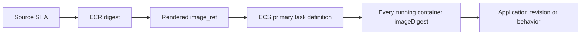

# Delivery verification, ownership, and rollback

Use this after selecting a central workflow. The [shared CLI operating guide](../../references/cli-operating.md) owns the common preflight, evidence directory, confirmation, wait, and mutation rules.

## Evidence before and after

Capture only what proves the change. Do not collect broad account dumps.

| Before | After |
|---|---|
| Source commit and build run | Same source commit linked to the immutable digest |
| Caller, account, and Region | Caller and target still match |
| Exact service, fleet tags and count, bucket prefix, or infrastructure project | Same bounded target set |
| Current active revision and health | Requested revision and health |
| Proposed write or dry-run output | Waiter or bounded poll result |
| Exact rollback revision or artifact | Application revision or behavior check |

Redact account IDs, role ARNs, hostnames, bucket names, URLs, and sensitive output before sharing evidence. Keep raw evidence only in the approved restricted location.

## Identity boundary

### GitHub Actions

Use OIDC and one least-privilege role per delivery purpose. Keep `id-token: write` on the one job that assumes the role. Restrict the role trust policy to the approved organization, repository, ref, and environment where the release model supports it.

Do not pass access keys through GitHub secrets. Do not let a build role deploy, or a deploy role change unrelated infrastructure.

The central ECR workflow constructs its role ARN from `aws_account_id` and `iam_role_name`. The ECS, SSM, S3 artifact, and static workflows accept `ROLE_ARN`. Treat those as two verified contracts, not interchangeable input names.

### AWS-managed host

Use the attached machine role or its configured profile. If injected credentials are absent on an AppStream or EC2 host, that is not a reason to add static keys. Verify the machine caller and Region through the shared CLI guide before the first write.

## ECR build proof

Use `ecr-image-build.yml` against an existing immutable repository and a unique source-derived tag. Retain all four outputs:

- `source_sha`
- `image_tag`
- `image_digest`
- `image_ref`

The authoritative release identity is `image_digest`. The deployment input is `image_ref`, which includes the tag and digest. Never promote a mutable tag by itself.

If the central workflow is not used, follow the [ECR section of the shared CLI guide](../../references/cli-operating.md#ecr). A successful Docker push is not enough; read the digest back from ECR.

## ECS external deployment ownership

Choose one owner for the active task definition:

| State | Owner |
|---|---|
| Cluster, service shell, load balancer, network, IAM, autoscaling, log groups | Infrastructure code |
| Container image build and immutable digest | Build workflow |
| Rendered task definition, registration, `UpdateService`, rollout | Delivery workflow |
| Runtime digest and application behavior proof | Delivery workflow |

When this split applies, infrastructure code must ignore the externally managed task-definition value after bootstrap. Review the full plan: an infrastructure apply that resets the task definition is an ownership defect, not harmless drift.

Do not infer app deployment from an infrastructure plan or apply. The minimum proof is:



## ECS runtime proof

First let `ecs-deploy-task-definition.yml` complete its rollout and health checks. Then compare every running target container with the ECR `image_digest` output.

The command options below are verified by the current central ECS workflow and the current AWS CLI command reference. `describe-tasks` exposes `containers[].imageDigest` as the container image manifest digest. This operator form uses `PROFILE`, `REGION`, and `EVIDENCE_DIR` from the shared CLI guide. In an OIDC job, use the configured environment credentials and omit each `AWS_PROFILE` assignment.

```bash
set -euo pipefail

EXPECTED_DIGEST=replace-with-ecr-image-digest
CLUSTER=replace-with-cluster
SERVICE=replace-with-service
CONTAINER=replace-with-container

AWS_PROFILE="$PROFILE" aws ecs describe-services \
  --region "$REGION" \
  --cluster "$CLUSTER" \
  --services "$SERVICE" \
  --output json \
  --no-cli-pager \
  > "$EVIDENCE_DIR/ecs-service-after.json"

PRIMARY_TASK_DEFINITION=$(
  jq -er '
    [.services[0].deployments[] | select(.status == "PRIMARY" and .rolloutState == "COMPLETED")]
    | select(length == 1)
    | .[0].taskDefinition
  ' "$EVIDENCE_DIR/ecs-service-after.json"
)

AWS_PROFILE="$PROFILE" aws ecs list-tasks \
  --region "$REGION" \
  --cluster "$CLUSTER" \
  --service-name "$SERVICE" \
  --desired-status RUNNING \
  --query 'taskArns' \
  --output text \
  --no-cli-pager \
| tr '\t' '\n' \
| sed '/^$/d; /^None$/d' \
> "$EVIDENCE_DIR/ecs-running-task-arns.txt"

test -s "$EVIDENCE_DIR/ecs-running-task-arns.txt"
: > "$EVIDENCE_DIR/ecs-running-tasks.jsonl"

while IFS= read -r task_arn; do
  AWS_PROFILE="$PROFILE" aws ecs describe-tasks \
    --region "$REGION" \
    --cluster "$CLUSTER" \
    --tasks "$task_arn" \
    --output json \
    --no-cli-pager \
  | jq -ce 'select(.failures == [] and (.tasks | length) == 1) | .tasks[0]' \
  >> "$EVIDENCE_DIR/ecs-running-tasks.jsonl"
done < "$EVIDENCE_DIR/ecs-running-task-arns.txt"

test "$(wc -l < "$EVIDENCE_DIR/ecs-running-tasks.jsonl" | tr -d ' ')" \
  -eq "$(wc -l < "$EVIDENCE_DIR/ecs-running-task-arns.txt" | tr -d ' ')"

jq -s -e \
  --arg task_definition "$PRIMARY_TASK_DEFINITION" \
  --arg container "$CONTAINER" \
  --arg digest "$EXPECTED_DIGEST" '
    length > 0 and all(.[];
      .lastStatus == "RUNNING"
      and .taskDefinitionArn == $task_definition
      and ([.containers[]
        | select(
            .name == $container
            and .lastStatus == "RUNNING"
            and .imageDigest == $digest
          )] | length) == 1
    )
  ' "$EVIDENCE_DIR/ecs-running-tasks.jsonl"
```

The final `jq` command is the revision gate. Fixing a shell typo in this evidence command does not authorize another deployment.

After the digest gate, run the service's existing health and behavior check. Prefer an endpoint or diagnostic field that returns the source revision. If the app does not expose one, report digest proof and behavior proof separately. Do not invent revision proof.

Official command references:

- [AWS CLI `ecs list-tasks`](https://docs.aws.amazon.com/cli/latest/reference/ecs/list-tasks.html)
- [AWS CLI `ecs describe-tasks`](https://docs.aws.amazon.com/cli/latest/reference/ecs/describe-tasks.html)

## SSM fleet delivery

Prefer `ec2-ssm-deploy.yml` for its supported Windows deployment kinds. It already provides the controls that are easy to miss in an ad hoc script:

- fixed approved document names and an explicit document version;
- exact tag target and expected target count;
- running, managed, online Windows pre-checks;
- immutable S3 staging and artifact SHA-256;
- bounded `MAX_CONCURRENCY`, `MAX_ERRORS`, command timeout, and poll interval;
- one command ID and a hard polling deadline;
- failure unless every expected invocation reaches `Success`;
- `deploy` and narrow `rollback` operations.

Start with `DEPLOY=true` and `DRY_RUN=true`. This performs the real AWS preflight without uploading or sending a command. Review the target count, document version, artifact identity, concurrency, failure threshold, timeout, and rollback before setting `DRY_RUN=false`.

Do not replace the fixed document with an inline production PowerShell payload. For diagnostics or an unsupported deployment kind, use the [Systems Manager reference](../../compute/references/systems-manager.md). Keep payloads in files, validate external values, and keep the same target, concurrency, error, timeout, and polling controls.

SSM `Success` means the command finished. It does not prove the intended service version is active. Add the narrow target check:

- IIS: deployed file digest, app-pool state, then endpoint revision or behavior.
- Windows service: installed file digest, service state, then service behavior.
- Windows file: destination file digest and the consuming application's check.

If only part of the fleet succeeds, stop. Keep the command ID and per-target results. Do not automatically rerun against the whole fleet or claim rollback completed everywhere.

## S3 delivery

### Immutable artifact

Use `s3-artifact-deploy.yml` for one release file. Run `DEPLOY=true`, `DRY_RUN=true` first. A real write requires `DRY_RUN=false` after review. Keep its `object-key` and `sha256` outputs as deployment and rollback evidence.

The workflow proves expected ownership, default KMS encryption, versioning, key absence before upload, object metadata, and downloaded SHA-256. It uses a run-specific key and never uses `--delete`.

### Static content

Direction and scope decide the risk. Use a dedicated prefix. A root-bucket destination is not bounded enough for delete mode.

The central static-site workflow can build without deploying and can sync with `DELETE=false`. It cannot show an AWS dry run and it has no built-in GitHub environment gate. For a controlled production release, use it with `DEPLOY=false`, then split delivery into two dependent custom jobs.

The unprotected preview job must:

1. Download the exact build artifact and record its SHA-256.
2. Assume a scoped preview identity that can read destination state but cannot write it.
3. Run the shared CLI guide's [S3 sync dry run](../../references/cli-operating.md#s3-sync) against the exact source and dedicated destination prefix. Omit delete unless stale objects must be removed.
4. Publish the artifact digest, source, destination, prefix, delete mode, and proposed uploads, overwrites, and deletions for the approver.

The dependent apply job must declare the protected production environment. GitHub requests approval before this job starts, so the approver can review the completed preview. After approval, the job must:

1. Download the same build artifact and stop if its SHA-256 differs.
2. Use the same source, destination, prefix, and delete mode from fixed workflow inputs.
3. Assume the scoped deployment role and verify identity.
4. Repeat the dry run and stop if its normalized result differs from the reviewed preview. A destination change requires a new review.
5. Run the bounded sync without dry-run mode.
6. Compare representative critical files and run the site's behavior check.

Do not rebuild between preview and execution. Do not let the apply job accept mutable destination or delete inputs that were absent from the preview. If delete is enabled, the reviewed preview and production approval must both include it. For nonproduction, the central deploy path is acceptable only with `DELETE=false` and the repository's normal write gate.

## Targeted applies when unrelated drift exists

A delivery repair must not carry unrelated infrastructure drift.

1. Read the full plan and name every unrelated change.
2. Stop the broad apply.
3. Use the repository's supported Atlantis project or exact resource target only when the address is already verified.
4. Save the targeted plan and require that it contains only the intended change and no surprise destroy action.
5. Gate production, apply once, and verify the AWS resource plus the application revision separately.
6. Remove stale plans or locks through the repository's normal control-plane process.
7. Run a full read-only plan afterward and leave unrelated drift visible for separate work.

Targeting is an incident or repair control, not the normal deployment model. Do not guess a resource address. Do not use a targeted apply to hide dependencies or call a partially reconciled stack healthy.

## Narrow rollback

Rollback the release selector, not the whole platform.

| Target | Narrow rollback |
|---|---|
| ECS | Re-render with the previous verified digest reference, deploy one new task-definition revision, then repeat runtime digest and app checks |
| SSM fleet | Call `ec2-ssm-deploy.yml` with `OPERATION=rollback`, the exact prior key under the approved prefix, and its recorded SHA-256 |
| Immutable S3 artifact | Keep the old object unchanged; move only the consumer's release pointer through its approved process |
| Static S3 prefix | Restore the prior captured artifact to the same bounded prefix; preview deletions before execution |
| Targeted infrastructure repair | Apply only the recorded inverse of the object or value changed by the repair |

Never retag an old image as "latest." Never select a rollback artifact by timestamp or name alone. Never roll back healthy infrastructure because the application check failed unless the evidence shows infrastructure caused the failure.

After rollback, prove the rollback revision and behavior with the same checks used for deployment. "Rollback command succeeded" is not the final state.

## Evidence behind these controls

Verified current implementation evidence:

- `reusable-workflows/.github/workflows/ecr-image-build.yml` owns OIDC build identity, immutable tags, and authoritative ECR digest outputs.
- `ecs-render-task-definition.yml` and `ecs-deploy-task-definition.yml` own render, registration, rollout, service stability, and task health. Their current post-check does not compare the running image digest.
- `ec2-ssm-deploy.yml` owns supported Windows deployment kinds, target counts, concurrency, failure bounds, polling, immutable staging, and rollback selection.
- `s3-artifact-deploy.yml` owns versioned KMS artifact publication and readback digest verification.
- `static-site-s3-deploy.yml` has delete mode but no dry-run or environment input.

Verified historical operating evidence:

- `Engineering-Attain-Finance/tf-aws-reusable-workflows-canary-infra#6` records external ECS task-definition ownership and warns that a green infrastructure apply does not prove the new revision is running.
- `Engineering-Attain-Finance/Cloud#1976` records targeted applies because unrelated drift could not ride with the repair.
- `Engineering-Attain-Finance/AppStream#23` records machine-role profile fallback instead of embedded credentials.
- Repeated delivery investigations record ECR stdin login, digest inspection, bounded SSM polling, and failures caused by unbounded remote checks.

Confidence is high for these controls. The actual content and behavior of the named SSM documents in each AWS account were not checked because this work did not call live AWS APIs.
