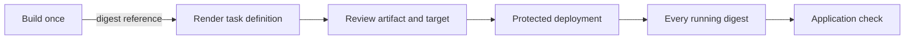

# Reusable workflow contracts

Read the actual workflow at the ref the caller uses. Internal filenames, runner labels, SSM document names and input defaults are not portable AWS contracts. Discover them from the owning repository; do not copy a guessed `uses:` path from a skill.

## Inspect before calling

1. Resolve the approved central repository, workflow path and ref from existing callers or repository guidance.
2. Read `on.workflow_call.inputs`, secrets, outputs, permissions, job environments and `runs-on` expressions at that ref.
3. Follow nested reusable workflows and actions when they own authentication, writes, polling or rollback.
4. Compare declared defaults with what jobs actually use. A declared runner input can be ignored by hardcoded job configuration.
5. Show any missing safety control before selecting the deploy path. A parameter named `DRY_RUN` or `DEPLOY` proves nothing until its branches are read.

Do not add a second delivery platform because an existing workflow lacks one control. Use an approved caller-side check if it can enforce the boundary. Otherwise stop for the workflow owner's decision.

## Contract by target

| Target | Require before use | Proof still needed after it returns |
|---|---|---|
| ECR build | Scoped temporary identity, immutable repository/tag policy, unused release tag, supported architecture, authoritative digest output | Registry image digest is not runtime proof |
| ECS render | Exact container name, digest-pinned image, validated task definition and unambiguous artifact name | No deployment has occurred yet |
| ECS deploy | Reviewed artifact, production gate, one revision owner, rollback revision, bounded stability/rollout checks | Every target container's running digest plus application check |
| Windows SSM fleet | Approved document and exact version, reviewed document implementation, expected managed/online target count, bounded concurrency/errors/timeout | Every invocation/plugin result plus deployed service/file behavior |
| Immutable S3 artifact | Exact owner/bucket/prefix, encryption and versioning requirements, unique key, checksum, reviewed overwrite semantics | Readback digest and consumer revision |
| Static S3 sync | Fixed artifact/destination, reviewed dry run, explicit delete mode, production approval and rollback content | Expected files/content and application behavior, not only one successful upload |

## ECS chain

Keep artifact identity stable across jobs. Inspect whether the workflow checks only service stability, task health or also the running `imageDigest`. Add the missing proof from [release controls](release-controls.md#ecs-runtime-proof).

## Windows fleet contract

Discover the exact SSM document name and numeric version from the owning infrastructure. Read its commands, input validation and rollback behavior. Status `Active` and type `Command` do not prove its implementation is safe.

Distinguish these modes in the real workflow:

- **Local validation:** may not assume a role or check AWS at all.
- **AWS preflight:** checks identity, artifact storage, document and targets without uploading or sending a command.
- **Apply or rollback:** stages/selects the exact artifact and sends a bounded command.

Keep the immutable artifact key and SHA-256 for rollback. Require every expected target, every command/plugin result and meaningful exit codes. Parent `Success` alone is not sufficient.

## Static-site production boundary

If a workflow has delete mode but no preview or protected environment, its deploy path is not suitable for controlled production. Use its build-only path when available, then the [preview and protected apply flow](release-controls.md#static-content):

1. An unprotected preview job publishes the completed dry run, artifact digest, destination and delete mode.
2. A dependent protected apply job starts only after review. It verifies the same inputs/digest, repeats the preview, and stops if the result differs before syncing.

The approver cannot review a dry run that will execute only after approving the job. GitHub requests environment approval before that job starts. Keep deletion off unless both the preview and approval include it.

## Rollback

Use the workflow's actual rollback contract. Do not assume it accepts `OPERATION=rollback` or any other named input. Confirm how it selects the prior immutable artifact, bounds the target set and verifies recovery. Preserve the narrow controls in [release controls](release-controls.md#narrow-rollback).
