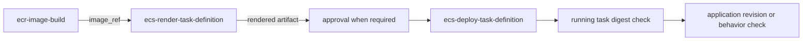

# Attain reusable workflow contracts

These contracts were read from the current local checkout of:

```text
Engineering-Attain-Finance/reusable-workflows/.github/workflows/
```

Use the exact path and input case shown here. Pin `REPLACE_WITH_APPROVED_REF` to the approved tag or commit for the caller. Re-read the central file before changing a caller because these contracts can move.

## Selection

| Target | Workflow | Clean fit |
|---|---|---|
| Existing immutable ECR repository | `ecr-image-build.yml` | Yes |
| Render an ECS task definition | `ecs-render-task-definition.yml` | Yes |
| Register and deploy an ECS task definition | `ecs-deploy-task-definition.yml` | Yes, with an upstream production gate |
| Windows EC2 fleet through approved SSM documents | `ec2-ssm-deploy.yml` | Yes |
| One immutable, versioned, KMS-encrypted S3 artifact | `s3-artifact-deploy.yml` | Yes |
| Build a static site, or run a nonproduction sync without deletion | `static-site-s3-deploy.yml` | Yes |
| Controlled production static sync, with or without deletion | `static-site-s3-deploy.yml` | Build only. Its deploy path has no dry-run preview or environment input |

## `ecr-image-build.yml`

Call path:

```yaml
uses: Engineering-Attain-Finance/reusable-workflows/.github/workflows/ecr-image-build.yml@REPLACE_WITH_APPROVED_REF
```

### Inputs and outputs

| Input | Contract |
|---|---|
| `aws_account_id` | Required string |
| `ecr_region` | Optional string; default `us-east-2` |
| `iam_role_name` | Optional string; default `github-actions-ecr-push` |
| `ecr_repository` | Required string; repository must already exist and be immutable |
| `image_tag` | Required string; must be unused and unique |
| `build_context` | Optional repository-relative path; default `.` |
| `dockerfile` | Optional repository-relative path; default `Dockerfile` |
| `gitops_repository` | Optional `owner/repo`; use with `gitops_target_key` |
| `gitops_target_key` | Optional target profile key; use with `gitops_repository` |
| `GITHUB_APP_ID` | Optional; centrally defaulted and used only in GitOps mode |
| Secret `GITHUB_APP_PRIVATE_KEY` | Optional; used only in GitOps mode |

Outputs: `image_tag`, `image_digest`, `image_ref`, `source_sha`, `pr_url`, and `target_sha`.

The build job grants `id-token: write` and assumes the role made from `aws_account_id` plus `iam_role_name`. It rejects a mutable repository and an existing tag, builds `linux/amd64`, pushes once, reads the authoritative digest with `ecr describe-images`, validates `sha256:<64 lowercase hex>`, and returns:

```text
image_ref = registry/repository:tag@digest
```

Use `image_ref`, not the tag-only reference, in the task definition. The workflow proves the registry digest. It does not prove ECS is running it.

Minimal build-only caller shape:

```yaml
jobs:
  image:
    permissions:
      id-token: write
      contents: read
    uses: Engineering-Attain-Finance/reusable-workflows/.github/workflows/ecr-image-build.yml@REPLACE_WITH_APPROVED_REF
    with:
      aws_account_id: ${{ vars.AWS_ACCOUNT_ID }}
      ecr_region: ${{ vars.AWS_REGION }}
      ecr_repository: ${{ vars.ECR_REPOSITORY }}
      image_tag: ${{ github.sha }}
```

## `ecs-render-task-definition.yml`

Call path:

```yaml
uses: Engineering-Attain-Finance/reusable-workflows/.github/workflows/ecs-render-task-definition.yml@REPLACE_WITH_APPROVED_REF
```

| Input | Contract |
|---|---|
| `GITHUB_RUNNER` | Optional string; declared default `ubuntu-latest`, but the current job runs on `attain-eks` |
| `FILE` | Required repository-relative task-definition file |
| `CONTAINER` | Required container name |
| `IMAGE` | Required image reference; pass the ECR `image_ref` output |
| `ENVIRONMENT_VARIABLES` | Optional string; default empty |
| `ARTIFACT_NAME` | Optional string; default `ecs-task-definition` |

The workflow validates and renders the task definition, normalizes its file name to `rendered-task-definition.json`, validates it with `jq`, and uploads it under `ARTIFACT_NAME`.

## `ecs-deploy-task-definition.yml`

Call path:

```yaml
uses: Engineering-Attain-Finance/reusable-workflows/.github/workflows/ecs-deploy-task-definition.yml@REPLACE_WITH_APPROVED_REF
```

| Input | Contract |
|---|---|
| `GITHUB_RUNNER` | Optional string; declared default `ubuntu-latest`, but the current job runs on `attain-eks` |
| `ARTIFACT_NAME` | Required artifact name from render |
| `FILE` | Required downloaded file path; normally `rendered-task-definition.json` |
| `ROLE_ARN` | Optional string; required when `DEPLOY=true` |
| `AWS_REGION` | Optional string; required when `DEPLOY=true` |
| `CLUSTER` | Optional string; required when `DEPLOY=true` |
| `SERVICE` | Optional string; required when `DEPLOY=true` |
| `DEPLOY` | Optional boolean; default `false` |
| `REQUIRE_HEALTHY` | Optional boolean; default `false` |

The deploy job grants `id-token: write`, assumes `ROLE_ARN`, registers and deploys the rendered task definition, waits for service stability, then polls the primary rollout for at most 600 seconds. It requires the service counts to settle and checks every listed running task. `REQUIRE_HEALTHY=true` also requires ECS task health `HEALTHY`.

The workflow has no GitHub `environment` input. Put a protected approval job before a production call. Its health check does not compare running container `imageDigest` with the build output. Add the digest and application checks from [release-controls.md](release-controls.md#ecs-runtime-proof).

## ECS chain



Keep the same unique `ARTIFACT_NAME` between render and deploy. Keep `DEPLOY=false` until the target and rollback are reviewed.

## `ec2-ssm-deploy.yml`

Call path:

```yaml
uses: Engineering-Attain-Finance/reusable-workflows/.github/workflows/ec2-ssm-deploy.yml@REPLACE_WITH_APPROVED_REF
```

### Inputs

| Input | Contract |
|---|---|
| `GITHUB_RUNNER` | Optional string; declared default `ubuntu-latest`, but current jobs run on `attain-eks` |
| `DEPLOYMENT_KIND` | Required; `iis`, `windows-service`, or `windows-file` |
| `OPERATION` | Optional; `deploy` or `rollback`; default `deploy` |
| `ARTIFACT_NAME` | Required for a real `deploy` operation |
| `DEPLOY` | Optional boolean; default `false` |
| `DRY_RUN` | Optional boolean; default `true` |
| `ROLE_ARN` | Required when `DEPLOY=true` |
| `AWS_REGION` | Required when `DEPLOY=true` |
| `ENVIRONMENT` | `nonprod` or `prod`; default `nonprod` |
| `S3_BUCKET` | Required when `DEPLOY=true` |
| `S3_PREFIX` | Optional; default `ec2-deployments` |
| `KMS_KEY_ARN` | Required when `DEPLOY=true` |
| `TARGET_TAG_KEY` | Required when `DEPLOY=true` |
| `TARGET_TAG_VALUE` | Required when `DEPLOY=true` |
| `EXPECTED_TARGET_COUNT` | Required when `DEPLOY=true`; 1 through 100 |
| `DOCUMENT_VERSION` | Required positive numeric version when `DEPLOY=true` |
| `COMMAND_TIMEOUT_SECONDS` | 30 through 172800; default `1800` |
| `POLL_INTERVAL_SECONDS` | 5 through 60; default `15` |
| `MAX_CONCURRENCY` | Count or percentage; default `1` |
| `MAX_ERRORS` | Count or percentage; default `0` |
| `ROLLBACK_ARTIFACT_KEY` | Required for rollback; must stay under `S3_PREFIX` |
| `ROLLBACK_ARTIFACT_SHA256` | Required 64-character lowercase SHA-256 for rollback |

Outputs: `artifact-key`, `artifact-sha256`, and `command-id`.

The kind selects one fixed document: `Attain-Deploy-IIS`, `Attain-Deploy-WindowsService`, or `Attain-Deploy-WindowsFile`. The workflow requires an explicit document version, verifies that it is an active Command document, verifies KMS bucket encryption, and requires the exact expected count of running, managed, online Windows targets.

Use these modes exactly:

| Purpose | `DEPLOY` | `DRY_RUN` | Effect |
|---|---:|---:|---|
| Local contract check only | `false` | `true` | No AWS preflight and no write |
| Real AWS preflight | `true` | `true` | Assumes the role and checks document, bucket, and targets; no upload or SSM command |
| Approved deployment or rollback | `true` | `false` | Stages/selects the artifact, sends one bounded command, polls every invocation |

The deployment job uses `environment: ENVIRONMENT`. Protection exists only if that environment is configured in GitHub. The workflow packages one immutable artifact, passes its SHA-256 to the approved document, sets concurrency and error bounds, applies a hard deadline, and fails unless every expected invocation reaches `Success`.

`Success` proves the SSM document completed. Add a service, file, or endpoint post-check. The workflow validates the selected document's status and type, not its implementation in each AWS account.

## `s3-artifact-deploy.yml`

Call path:

```yaml
uses: Engineering-Attain-Finance/reusable-workflows/.github/workflows/s3-artifact-deploy.yml@REPLACE_WITH_APPROVED_REF
```

| Input | Contract |
|---|---|
| `GITHUB_RUNNER` | Deprecated; current jobs run on `attain-eks` |
| `ARTIFACT_NAME` | Required uploaded GitHub artifact |
| `SOURCE_PATH` | Required relative file path inside the artifact |
| `OBJECT_NAME` | Required bounded object name |
| `ROLE_ARN` | Required when `DEPLOY=true` |
| `AWS_REGION` | Optional; default `us-east-2` |
| `BUCKET` | Required when `DEPLOY=true` |
| `EXPECTED_BUCKET_OWNER` | Required when `DEPLOY=true` |
| `PREFIX` | Optional; default `releases` |
| `KMS_KEY_ARN` | Required when `DEPLOY=true` |
| `ENVIRONMENT` | `nonprod` or `prod`; default `nonprod` |
| `DEPLOY` | Optional boolean; default `false` |
| `DRY_RUN` | Optional boolean; default `true` |

Outputs: `object-key` and `sha256`.

For a real AWS dry run, set `DEPLOY=true` and `DRY_RUN=true`. The workflow enters the GitHub environment, assumes the OIDC role, computes the immutable key and SHA-256, checks expected bucket ownership, KMS default encryption, versioning, and key absence, but does not write.

With `DRY_RUN=false`, it uploads to a run-specific key with SSE-KMS and checksum metadata, reads the object metadata back, downloads the object, and compares local SHA-256. It does not expose a delete operation and rejects a key found before upload.

## `static-site-s3-deploy.yml`

Call path:

```yaml
uses: Engineering-Attain-Finance/reusable-workflows/.github/workflows/static-site-s3-deploy.yml@REPLACE_WITH_APPROVED_REF
```

| Input | Contract |
|---|---|
| `GITHUB_RUNNER` | Optional string; declared default `ubuntu-latest`, but current jobs run on `attain-eks` |
| `NODE_VERSION` | Required string |
| `WORKING_DIRECTORY` | Optional relative path; default `.` |
| `PACKAGE_MANAGER` | Required; current workflow accepts `npm`, `pnpm`, or `yarn` |
| `BUILD_SCRIPT` | Optional; default `build` |
| `OUTPUT_PATH` | Required relative directory |
| `DEPLOY` | Optional boolean; default `false` |
| `DELETE` | Optional boolean; default `false` |
| `ROLE_ARN` | Required when `DEPLOY=true` |
| `AWS_REGION` | Required when `DEPLOY=true` |
| `BUCKET` | Required when `DEPLOY=true` |
| `PREFIX` | Optional; default empty |
| `ARTIFACT_NAME` | Optional; default `static-site` |

The workflow builds and uploads a GitHub artifact even when `DEPLOY=false`. When deployment is enabled, it assumes `ROLE_ARN`, syncs the site, optionally passes `--delete`, then fetches and compares one deployed file through a presigned HTTPS URL.

Current limits matter:

- There is no `DRY_RUN` input.
- There is no `ENVIRONMENT` input or built-in production approval.
- There is no `EXPECTED_BUCKET_OWNER`, KMS, or bucket-versioning check.
- `DELETE=true` performs the destructive sync without first showing the deletion list.
- The post-check proves one file, not the whole site or application behavior.

Use it for build-only work or a nonproduction sync with `DELETE=false`. For controlled production, use `DEPLOY=false`, then use the [two-job preview and protected apply flow](release-controls.md#static-content). The approver must see the completed preview before GitHub starts the protected apply job. Omit delete when it is not required. Do not create a second reusable workflow as part of an application delivery change.
