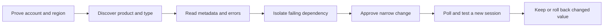

# EUC: find the fault before restarting sessions

Use this module to separate identity, directory, network, capacity, and image failures. A reboot does not fix a broken DNS path.
Read [CLI operating](../references/cli-operating.md) first. It owns scope checks, SSO/auth, pagination, evidence, and write gates.

## Start in the right place

Use recent billing or approved inventory to locate candidate accounts and Regions. Neither source proves current resource state, desktop type or directory ownership. Discover directory dependencies from the affected resource; they may have a different owner or Region.

**WorkSpaces Applications was formerly AppStream 2.0. The CLI namespace remains `appstream`.** Do not invent `aws workspaces-applications` commands.
Resolve the target to an exact configured profile and account ID. Do not invent profile names or sweep all accounts. Repeat discovery separately for each approved account/Region.
On managed hosts, use the machine role or configured profile. No generic interactive login and no static keys. On an operator laptop, use the existing auth flow in the shared guide.



## Read only: scope and discover

These Bash examples are operator commands, not an unattended repair script. Complete the shared preflight first. Set `REGION`, `EXPECTED_ACCOUNT_ID`, and the selected `PROFILE`; leave `PROFILE` empty only for a verified machine-role credential chain. Never carry an unexpected profile or credential override into that chain.

```bash
set -euo pipefail
: "${REGION:?Set the approved Region}" "${EXPECTED_ACCOUNT_ID:?Set the approved account ID}"
AWS_ARGS=(--region "$REGION" --output json --no-cli-pager)
if [[ -n "${PROFILE:-}" ]]; then AWS_ARGS+=(--profile "$PROFILE"); fi
euc_aws() { aws "${AWS_ARGS[@]}" "$@"; }
actual_account=$(euc_aws sts get-caller-identity --query Account --output text)
[[ "$actual_account" == "$EXPECTED_ACCOUNT_ID" ]] || { echo 'Wrong AWS account' >&2; exit 1; }
```

Keep only IDs, state, error codes, image/bundle IDs, network IDs, and aggregate capacity. No user inventory, usernames, email addresses, computer names, session lists, tags, free-text error messages, customer files, or secret values. Do not use `--debug`. CLI projections reduce displayed output; the API response can still contain sensitive fields in memory. Keep approved evidence access-restricted and local. Never send it to public research tools.

### WorkSpaces: discover Personal versus Pools first

Run only in the selected WorkSpaces scope. Empty results or denied access do not prove another product is absent. Pools uses a separate API; billing does not distinguish it.

```bash
euc_aws workspaces describe-workspace-directories \
  --query 'Directories[].{Id:DirectoryId,Type:WorkspaceType,Identity:UserIdentityType,DirectoryType:DirectoryType,State:State}'
euc_aws workspaces describe-workspaces \
  --query 'Workspaces[].{Id:WorkspaceId,Directory:DirectoryId,State:State,Bundle:BundleId,Subnet:SubnetId,Mode:WorkspaceProperties.RunningMode,Error:ErrorCode}'
euc_aws workspaces describe-workspaces-pools \
  --query '{Pools:WorkspacesPools[].{Id:PoolId,State:State,Directory:DirectoryId,Bundle:BundleId,Capacity:CapacityStatus,Errors:Errors[].ErrorCode},NextToken:NextToken}'
```

Pools discovery exposes a service `NextToken`; repeat with `--next-token` until absent. Do not report the first page as complete. Use the shared guide for CLI-managed pagination on other commands.
Select an exact desktop or pool ID before diagnosis. For Personal, repeat `describe-workspaces --workspace-ids "$WORKSPACE_ID"` with the same projection. For Pools, use `describe-workspaces-pools --pool-ids "$POOL_ID"`.

| Confirmed type | Follow this path | Do not substitute |
|---|---|---|
| Personal | Exact desktop state, bundle, directory registration, running mode | Pools lifecycle or AppStream fleet operations |
| Pools | Pool state, session-slot capacity, bundle and directory, error codes | Personal reboot/rebuild or AppStream image commands |
| Unknown/new identity or directory type | Read metadata, verify current type-specific API support, then ask before action | An assumed AD join or Personal workflow |

Read only the selected dependency IDs from discovery:

```bash
: "${DIRECTORY_ID:?Select the affected directory}" "${BUNDLE_ID:?Select the affected bundle}"
euc_aws workspaces describe-workspace-directories --directory-ids "$DIRECTORY_ID" \
  --query 'Directories[].{Id:DirectoryId,Type:WorkspaceType,Identity:UserIdentityType,State:State,DNS:DnsIpAddresses,Subnets:SubnetIds,SG:WorkspaceSecurityGroupId}'
euc_aws workspaces describe-workspace-bundles --bundle-ids "$BUNDLE_ID" \
  --query 'Bundles[].{Id:BundleId,Image:ImageId,State:State,Updated:LastUpdatedTime}'
```

A bundle's image pointer does not prove an existing Personal desktop was rebuilt from it. For Pools changes, verify the pool-specific update lifecycle and new-session behavior before proposing a write. This module does not supply a Pools mutation recipe.

### WorkSpaces Applications: fleet and image metadata

Run only in the selected Applications scope. Discover first; add `--names "$FLEET"` to the same fleet query once the target is known.

```bash
euc_aws appstream describe-fleets \
  --query 'Fleets[].{Name:Name,Type:FleetType,State:State,Image:ImageName,ImageArn:ImageArn,Platform:Platform,Capacity:ComputeCapacityStatus,MaxSessions:MaxConcurrentSessions,Vpc:VpcConfig,Join:DomainJoinInfo,Errors:FleetErrors[].ErrorCode}'
: "${IMAGE_ARN:?Select the current or candidate image ARN}"
euc_aws appstream describe-images --arns "$IMAGE_ARN" \
  --query 'Images[].{Arn:Arn,State:State,Platform:Platform,Created:CreatedTime,Base:BaseImageArn,Agent:AppstreamAgentVersion,Visibility:Visibility}'
```

For `ALWAYS_ON` or `ON_DEMAND`, inspect the current and candidate images separately. Require `AVAILABLE` and compatible platform/instance family. For `ELASTIC`, stop this image workflow: discover its app-block/application associations and current Elastic-specific APIs before action. Do not apply an image-based fleet recipe to it.
If an image build is stuck, select its exact builder name. Builder state is not image availability or fleet rollout proof:

```bash
: "${BUILDER:?Select the affected image builder}"
euc_aws appstream describe-image-builders --names "$BUILDER" \
  --query 'ImageBuilders[].{Name:Name,State:State,Image:ImageArn,Platform:Platform,Vpc:VpcConfig,Reason:StateChangeReason.Code,Errors:ImageBuilderErrors[].Code}'
```

## Isolate the failing layer

Use one UTC incident window. Compare metadata, aggregate metrics, and narrow change events. Keep authentication failures separate from desktop launch failures.

| Signal | Check next | Avoid |
|---|---|---|
| CLI identity fails | Shared auth guide; configured role/profile | Changing desktop identity settings |
| STS works, service call denied | Caller, exact action/resource, role policy | Retrying with guessed admin credentials |
| Login fails before resource launch | Confirm identity mode; IdP assignment/assertion timing and stack or directory auth settings | Dumping assertions, tokens, or directory users |
| Directory/domain-join error | Registration state, actual directory type, join config/OU, machine-account permissions, time sync and DNS reachability | Resetting a join password or rebooting the fleet first |
| DNS/network failure | Resource subnets/SGs, routes/NACLs, Resolver forwarding, endpoints and required service/domain paths | Testing only from the laptop or opening broad ports |
| Desired capacity exceeds available | Error codes, subnet free IPs, quotas, instance capacity, scaling limits and recent change | Treating quota exhaustion, IP exhaustion, and AWS capacity shortage as the same fault |
| Personal desktop stopped/unhealthy | Running mode and exact state/error; approved single-desktop recovery | Inferring user absence from `STOPPED` or rebooting all desktops |
| Failure starts after image change | Candidate state, platform, agent, app launch test and rollout timing | Calling fleet `RUNNING` a successful application test |

For an actual Directory Service dependency, use its verified `d-...` ID and account/Region. Repeat the scope setup and account check for that dependency before the command below. A WorkSpaces `wsd-...` directory is not a Directory Service ID. AppStream domain-join settings do not prove AWS Directory Service manages that domain.

```bash
: "${DS_DIRECTORY_ID:?Set the verified Directory Service ID}"
euc_aws ds describe-directories --directory-ids "$DS_DIRECTORY_ID" \
  --query 'DirectoryDescriptions[].{Id:DirectoryId,Type:Type,Stage:Stage,DNS:DnsIpAddrs,Vpc:VpcSettings.VpcId,Subnets:VpcSettings.SubnetIds,ConnectorVpc:ConnectSettings.VpcId,ConnectorSubnets:ConnectSettings.SubnetIds,ConnectorDNS:ConnectSettings.ConnectIps}'
```

Do not print all `ConnectSettings` or `RadiusSettings`: they can carry service-account or auth details. `Active` directory state alone does not prove the affected subnet can reach DNS or domain controllers. For shared directories, prove the owner and consumer scopes separately.
Use [networking](../networking/instructions.md) for bounded path evidence and [observability](../observability/instructions.md) for aggregate metrics. Test from an approved host on the affected path, not an arbitrary desktop. Record pass/fail and error codes, not customer/user content.
**Remote fleet Run Command needs a gate even for diagnostics.** Confirm exact managed-node targets, count, command, timeout, concurrency, output redaction, and impact through the shared guide. Never assume streaming instances are SSM-managed or patch a live fleet through a broad tag target.

## Image changes: prove the update and the rollback

Get explicit approval before reboots, rebuilds, starts/stops, fleet/pool changes, directory changes, or remote execution. Show exact profile/account/Region, IDs/count, changed fields, active-session impact, maintenance window, verification deadline, and rollback. Explain data loss for rebuild/restore; do not promise a reboot can undo it. If session impact is unknown, stop and ask the owner. Do not dump session identities to answer that question.

For an image-only change on an `ALWAYS_ON` or `ON_DEMAND` AppStream fleet:

1. Capture the exact fleet's projected before state and old image ARN. Keep that immutable image available and its permissions intact. Do not rebuild an image under a reused release label or delete the old image during rollout.
2. Inspect the candidate ARN and require `AVAILABLE`. Test a new session on an approved test fleet with synthetic data. Check application launch, auth and required network paths; keep only pass/fail evidence.
3. Check fleet state and OS compatibility. A same-OS image update can run while the fleet is `RUNNING`; a different OS requires `STOPPED`. `STARTING` cannot be updated. Do not add a stop/start workaround without a separate disruption approval.
4. A running image update preserves active sessions. New instances use the new image; unused old instances are replaced over time and occupied ones after sessions end. Mixed revisions can exist. The catalog follows the new image, so a new app may not launch on an old instance.
5. Present the narrow command below and its reverse. Execute only after approval. Do not add capacity, network, role, or timeout changes to the same request.

```bash
# APPROVED image-only change; not for Elastic fleets or WorkSpaces.
: "${FLEET:?Select one approved fleet}" "${NEW_IMAGE_ARN:?Select the tested image}"
euc_aws appstream update-fleet --name "$FLEET" --image-arn "$NEW_IMAGE_ARN" \
  --query 'Fleet.{Name:Name,State:State,ImageArn:ImageArn}'
```

6. Poll the exact fleet and candidate image with an agreed deadline. Require the expected pointer, healthy capacity and no new errors. Confirm the release marker in a newly launched approved test session, without printing host/user data. A returned ARN or `RUNNING` alone is not rollout completion.
7. If checks fail, stop expansion. After the rollback gate, repeat the image-only command with the captured old ARN. Do not replay an entire saved fleet definition over unrelated changes. Read current state first if the update response was lost.
8. Rollback changes the fleet pointer, not every active instance immediately. Repeat polling and the new-session test against the old release marker. Record remaining mixed-image exposure and any separate approved session-drain plan. Do not call it recovered while the agreed user-path test still fails.

For Personal reboot/rebuild, first verify that operation supports the exact desktop type and state. Capture the desktop/bundle state and data recovery limits. Rebuild is not an image-pointer rollback. Get one-desktop approval; then poll its final state and run an approved connection test. Never translate this into a Pools batch action.

## Close with evidence, not a claim

Report exact scope and UTC window, affected type/IDs, observed state and error codes, isolated layer, approved change, before/after image or bundle identity, test result, and rollback status. Label partial discovery, unresolved mixed-image rollout, and checks not run. No secret, customer, or user data in the report.
See [sources and validation](references/sources.md) for the documentation basis and offline limits.
