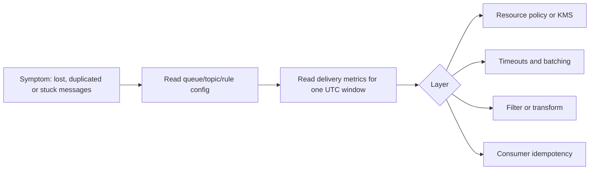

# AWS Messaging & Streaming Services

Read the [shared CLI guide](../references/cli-operating.md) before any command. It owns identity, Region, output shaping, evidence files and write gates. Limits, versions and alarm thresholds change; when a number matters, check current AWS documentation instead of guessing. A wrong limit is worse than "not verified".

## Diagnose a delivery problem before choosing a service

Most messaging incidents are one of four things: a missing resource policy, a wrong timeout, a filter that drops records, or a consumer that is not idempotent. Read the configuration first; message bodies are application data and often personal data, so never `receive-message` on a production queue to "see what is in it".



Discovery commands, metadata only. Set `PROFILE` and `REGION` after the shared preflight.

```bash
aws sqs get-queue-attributes --queue-url "$QUEUE_URL" --profile "$PROFILE" --region "$REGION" \
  --attribute-names Policy RedrivePolicy VisibilityTimeout ReceiveMessageWaitTimeSeconds KmsMasterKeyId \
    ApproximateNumberOfMessages ApproximateNumberOfMessagesNotVisible --output json --no-cli-pager
aws events list-targets-by-rule --rule "$RULE" --event-bus-name "$BUS" --profile "$PROFILE" --region "$REGION" \
  --query 'Targets[].{Id:Id,Arn:Arn,DLQ:DeadLetterConfig.Arn,Retry:RetryPolicy}' --output json --no-cli-pager
aws sns get-subscription-attributes --subscription-arn "$SUB_ARN" --profile "$PROFILE" --region "$REGION" \
  --query 'Attributes.{Protocol:Protocol,Raw:RawMessageDelivery,Redrive:RedrivePolicy,Filter:FilterPolicy}' \
  --output json --no-cli-pager
aws firehose describe-delivery-stream --delivery-stream-name "$STREAM" --profile "$PROFILE" --region "$REGION" \
  --query 'DeliveryStreamDescription.Destinations[].{Processing:ExtendedS3DestinationDescription.ProcessingConfiguration,Buffer:ExtendedS3DestinationDescription.BufferingHints}' \
  --output json --no-cli-pager
aws lambda get-event-source-mapping --uuid "$ESM_UUID" --profile "$PROFILE" --region "$REGION" \
  --query '{State:State,Batch:BatchSize,Window:MaximumBatchingWindowInSeconds,Partial:FunctionResponseTypes,Filters:FilterCriteria}' \
  --output json --no-cli-pager
```

Then one UTC window of delivery metrics: SQS `ApproximateAgeOfOldestMessage` and `NumberOfMessagesReceived` versus `NumberOfMessagesDeleted`; EventBridge `FailedInvocations`, `InvocationsSentToDlq` and `InvocationsFailedToBeSentToDlq`; SNS `NumberOfNotificationsFailed`; Firehose `DeliveryToS3.Success`. A missing series is unknown, not zero.

| Signal | Check next | Do not |
|---|---|---|
| Target fails, DLQ empty | DLQ queue policy for the sending service principal with `aws:SourceArn`; KMS key policy if the DLQ is encrypted | Recreate the rule or topic |
| Same message processed twice | Visibility timeout vs consumer timeout (at least 6x for Lambda), partial-batch response, consumer idempotency key | Raise `maxReceiveCount` to hide it |
| Records dropped | Subscription or rule filter policy, ESM filter criteria, Firehose transform errors | Remove the filter without reading it |
| Consumer stalls | `ApproximateNumberOfMessagesNotVisible` growing, ESM state, poison message and DLQ `maxReceiveCount` | Purge the queue |

Changes go through the owning IaC. `sqs set-queue-attributes --attributes Policy=...` replaces the whole policy; merge with `jq` from the saved before state, and follow the shared write gate.

## Overview

Domain expertise for choosing and using AWS services that move data between producers and consumers.
This skill covers two fundamental patterns — **messaging** and **streaming** — and the AWS services that implement each.
Use this skill to decide which pattern fits a workload, select the right service, and understand how services integrate with each other.

## Streaming and Messaging

### What Is Messaging?

Messaging enables **decoupled, asynchronous communication** between components. A producer sends a message; one or more consumers receive and process it. Once processed, the message is typically deleted. Messaging services handle delivery guarantees, retries, and dead-letter routing.

**Key characteristics:**

- Consumers acknowledge or delete messages after processing. Delivery can repeat, so consumers must be idempotent.
- No replay — once acknowledged, a message is gone
- Designed for command/request workloads, task distribution, and event notification

### What Is Streaming?

Streaming enables **ordered, durable, high-throughput continuous data flow**. Producers append records to a log; consumers read from positions in that log. Records persist for a configurable retention period regardless of consumption.

**Key characteristics:**

- Records are retained and replayable within the retention window
- Strict ordering within a partition/shard
- Multiple independent consumers can read the same data at different positions
- Designed for event sourcing, real-time analytics, change data capture, and continuous processing

### Key Differences

| Dimension | Messaging | Streaming |
|---|---|---|
| **Data lifecycle** | Deleted after acknowledgement or retention expiry | Retained for replay only inside the configured service window; Kinesis Data Streams supports 1–365 days |
| **Ordering** | Best-effort (Standard) or per-group (FIFO) | Strict per-partition/shard |
| **Consumer model** | Competing consumers (work distribution) | Independent readers (fan-out by position) |
| **Throughput pattern** | Bursty, variable | Sustained, high-volume |
| **Replay** | Not supported (except DLQ redrive) | Native — seek to any position in retention |
| **Typical latency** | Milliseconds (push or short-poll) | Milliseconds to low seconds |
| **Scaling unit** | Concurrency (consumers/pollers) | Partitions or shards |

### Messaging Use Cases

- Decoupling microservices with request/response or command patterns
- Distributing work across a pool of competing consumers (task queues)
- Fan-out notifications where each subscriber acts independently
- Workloads that are bursty and benefit from queue buffering
- Migrating existing JMS/AMQP applications (Amazon MQ)

### Streaming Use Cases

- Continuous, high-throughput data ingestion (logs, metrics, clickstreams, IoT telemetry)
- Event sourcing where consumers need to replay from any point in time
- Multiple independent consumers processing the same data differently
- Real-time analytics, windowed aggregations, or complex event processing
- Change data capture (CDC) pipelines

### Messaging Services

These services are generally used for messaging workloads.
Sometimes streaming services (Kinesis Data Streams, Managed Streaming for Apache Kafka) are also used for messaging workloads, depending on exact use case and requirements.

| Service | Best For | Key Differentiator |
|---|---|---|
| **Amazon SQS** | Task queues, decoupling, buffering | Fully managed; Standard queues scale for high throughput; FIFO deduplicates sends only when deduplication is configured and retries occur inside the 5-minute deduplication interval |
| **Amazon SNS** | Fan-out, pub/sub notifications | Push to multiple subscribers (SQS, Lambda, HTTP, email, SMS) |
| **Amazon EventBridge** | Event routing, cross-account/SaaS integration | Content-based filtering, schema registry, 200+ AWS source integrations |
| **Amazon MQ** | Lift-and-shift of existing JMS/AMQP/MQTT apps | Protocol compatibility (ActiveMQ, RabbitMQ) for legacy migration |

### Streaming Services

These services are generally used for streaming workloads.

| Service | Best For | Key Differentiator |
|---|---|---|
| **Amazon Kinesis Data Streams** | Real-time ingestion with AWS-native consumers | On-demand Advantage mode (instant scaling, no shard management), 1–365 day retention |
| **Amazon Data Firehose** | Zero-admin delivery to storage/analytics | Auto-scales, buffers, batches, and delivers to destinations |
| **Amazon Managed Service for Apache Flink** | Complex stream processing (joins, windows, state) | Full Apache Flink runtime — SQL, Java, Python APIs for stateful computation |
| **Amazon MSK** | Kafka-native workloads, ecosystem compatibility | Apache Kafka API, Express brokers (3x throughput, 20x faster scaling compared to Standard brokers), broad connector ecosystem |

## Common Integration Gotchas

- **SQS system vs. user message attributes:** Attributes like `AWSTraceHeader` (set by X-Ray / EventBridge / Pipes when sending to an SQS DLQ) and `SenderId`, `SentTimestamp` are SQS *system* attributes, NOT user message attributes. They are never returned by default from `ReceiveMessage` — request them explicitly via `AttributeNames=[...]` (or `MessageSystemAttributeNames`), separate from `MessageAttributeNames` which fetches user attributes. This matters for DLQs, where the trace header rides on the system attribute and the user-attributes slot carries the service's failure metadata (e.g. EventBridge's `RULE_ARN`, `ERROR_CODE`).

- **SNS → Firehose → S3 record separator:** For SNS subscriptions using the `firehose` protocol that land in S3, records are already newline-delimited by default (NDJSON). Do NOT turn on Firehose's `AppendDelimiterToRecord` — SNS emits the newline itself, and enabling the processor produces double newlines.

- **EventBridge rule target DLQ + SNS subscription DLQ both need a DLQ queue policy.** Attaching the DLQ alone is not enough — the DLQ silently drops messages until its queue policy allows the service principal. EventBridge: `PutTargets` with `DeadLetterConfig.Arn=<DLQ>`, plus SQS policy `Allow sqs:SendMessage` for `Service: events.amazonaws.com` with `aws:SourceArn` = the rule ARN. SNS: `SetSubscriptionAttributes` `RedrivePolicy={"deadLetterTargetArn":"<DLQ>"}`, plus SQS policy allowing `Service: sns.amazonaws.com` scoped by the topic ARN.

- **SQS production defaults: long polling + customer-managed encryption.** New queues default to short-poll (`ReceiveMessageWaitTimeSeconds=0`) and SSE-SQS (AWS-owned key). For production, `SetQueueAttributes` with `ReceiveMessageWaitTimeSeconds=20` (long polling) and `KmsMasterKeyId=<customer-managed key id/ARN>` rather than leaving `alias/aws/sqs`.

- **Broker and Kafka credentials belong in Secrets Manager, not connection strings.** Do not hardcode usernames, passwords, or SASL/SCRAM credentials in application config, env vars, JAAS files, or IaC. For Amazon MQ (ActiveMQ/RabbitMQ) store broker users as secrets and fetch at startup; Lambda event source mappings for Amazon MQ require the broker credentials to be supplied as a Secrets Manager secret ARN (`BASIC_AUTH`), not inline. For MSK SASL/SCRAM the secret is not optional: it must be named with the `AmazonMSK_` prefix and encrypted with a **customer-managed** KMS key (secrets created with the default `aws/secretsmanager` key cannot be associated with a cluster), then attached via `BatchAssociateScramSecret`. Lambda event source mappings for MSK (SASL/SCRAM or mTLS) and self-managed Kafka also reference a Secrets Manager secret ARN rather than inline credentials. Enable rotation and scope IAM read access (`secretsmanager:GetSecretValue`) to the consuming role only. See AWS Well-Architected [SEC02-BP03 Store and use secrets securely](https://docs.aws.amazon.com/wellarchitected/latest/security-pillar/sec_identities_secrets.html).

- **Service-principal resource policies need `aws:SourceArn` / `aws:SourceAccount` conditions.** When a queue or topic policy grants a service principal like `events.amazonaws.com`, `sns.amazonaws.com`, or `s3.amazonaws.com` permission to `sqs:SendMessage` or `sns:Publish`, omitting source conditions opens a confused-deputy hole — any rule, topic, or bucket in any AWS account can drive writes. Scope every such statement with `aws:SourceArn` (the specific rule/topic/bucket/pipe ARN; use `ArnLike` with `*` when the ARN isn't fully known yet) and `aws:SourceAccount` (your account ID). For S3 event notifications both keys are required because S3 bucket ARNs don't carry the account ID, so `aws:SourceArn` alone doesn't constrain the account. The same pattern applies to role trust policies for IAM roles used by EventBridge rules and EventBridge Pipes (principal `events.amazonaws.com` / `pipes.amazonaws.com`, `aws:SourceArn` = the rule or pipe ARN) — not just the DLQ case called out above. See the IAM User Guide on [The confused deputy problem](https://docs.aws.amazon.com/IAM/latest/UserGuide/confused-deputy.html).
