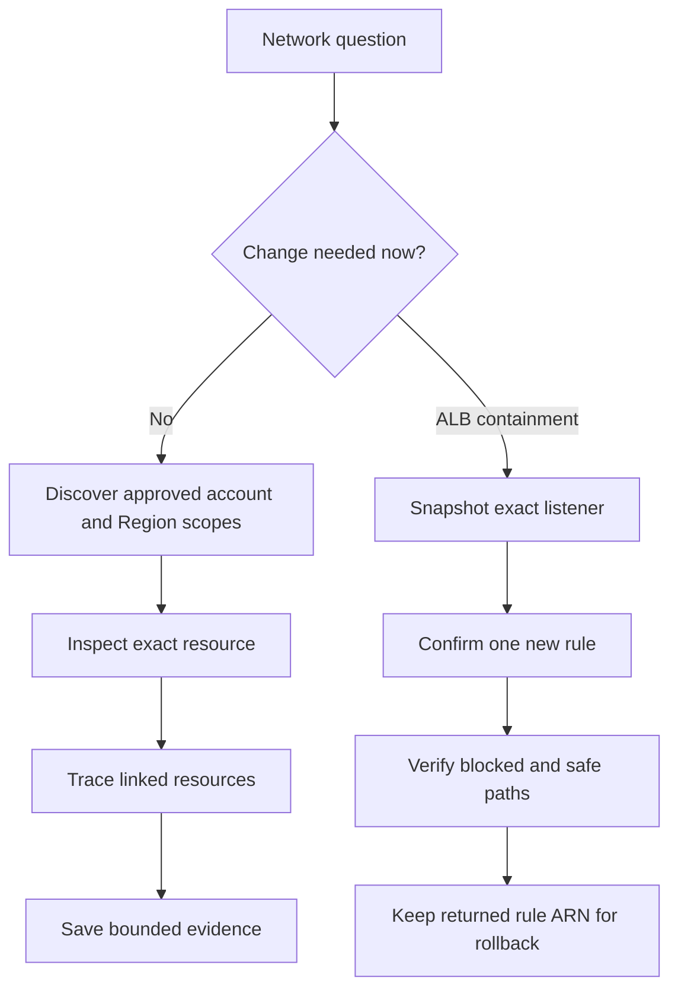

# AWS Networking Operations

Use this module to prove the live path and its owner. Do not guess an account from a
resource name, repository, profile name, or old diagram.

Before writing or running any AWS CLI command, read the shared
[CLI operating guide](../references/cli-operating.md). It owns identity checks,
profile and Region handling, pagination, evidence files, confirmation, rollback,
and failure reporting. This module does not copy that baseline.

## Route the task

| Need | Read |
|---|---|
| Find an unknown owner across approved profiles | [Cross-account ownership](references/investigation.md#cross-account-ownership) |
| Inspect TGW route tables or prove an exact prefix exists | [Transit Gateway](references/investigation.md#transit-gateway-route-tables-and-exact-routes) |
| Find a hosted zone, record, Resolver rule, association, or endpoint | [Route 53 and Resolver](references/investigation.md#route-53-and-resolver) |
| Compare a VPC endpoint with an S3 bucket policy | [Endpoint and bucket policy](references/investigation.md#vpc-endpoint-and-s3-bucket-policy-alignment) |
| Trace a security group through ENIs and referenced groups | [Security-group topology](references/investigation.md#security-group-topology) |
| Add a temporary fixed-response ALB rule during an incident | [Listener emergency response](references/listener-emergency.md) |

Load only the section needed for the task. Load the listener reference only for an
approved emergency change.

## Scope traps

- Transit Gateways, TGW route tables, VPC endpoints, ENIs, security groups, load
  balancers, and Route 53 Resolver are Regional. A miss proves nothing outside the
  selected account and Region.
- Route 53 hosted zones and records are account-scoped but not Region-scoped. Keep an
  explicit CLI Region for command context, but do not describe that Region as the
  hosted zone's location.
- A shared resource can be visible from a participant account. Use returned owner and
  attachment fields. Visibility does not prove configuration ownership or write access.
- A profile failure is evidence. Show it beside successful profiles. Never discard
  cross-account errors or call partial coverage complete.
- An exact TGW route search proves only whether that exact prefix exists. It does not
  calculate longest-prefix forwarding for an address.
- A security-group reference is not a full path. The attached ENIs, both groups,
  routing, and other network controls still matter.

## Change boundary

Read-only discovery is the default. Do not turn an investigation into a network build.
For a listener incident, create one exact rule only after approval, retain the returned
rule ARN, and roll back only that ARN. For every other policy or route change, stop after
the evidence unless the user supplies the owning system and an approved change plan.

Do not invent Terraform ownership or add the same resource to two repositories. If live
state and source ownership disagree, report the conflict and stop.

## Not covered

- General VPC or network design theory
- Direct Connect or VPN build guides without evidence from the task
- GuardDuty or WAF response
- CI or deployment workflow design
- Broad service-by-service networking reference material
