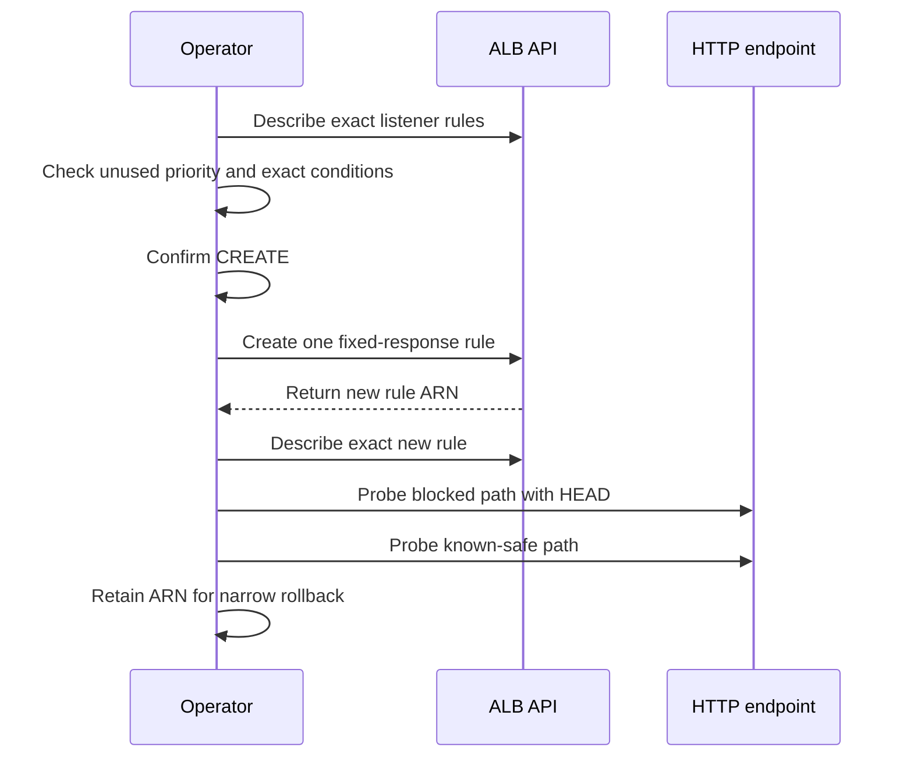

# ALB Listener Emergency Response

Use this only for approved temporary containment on one ALB listener. The proven pattern is:
snapshot the listener, add one higher-priority fixed response for an exact host and path,
verify the blocked and safe paths, and keep only the returned rule ARN for rollback.

Read the shared [AWS CLI operating guide](../../references/cli-operating.md) first. Its
identity, evidence handling, confirmation, and rollback rules still apply.



## Stop conditions

Stop before mutation when any of these is true:

- The account, Region, load balancer, listener, host, path, or owning team is not proven.
- The requested priority already exists or will not run before the rule being contained.
- The condition can match another application or a broader path than approved.
- The application accepts path variants that the listener condition does not cover.
- There is no known-safe URL for the same service.
- The user or incident commander has not approved the exact rule and rollback.

Do not modify or delete an existing rule to make room. Pick an approved unused priority.
A lower numeric value runs first, so prove the new value executes before the rule being
contained. Do not use a default-action change when one exact listener rule can contain
the path.

## Capture and create one rule

Use a private evidence directory. The condition files avoid shell damage to a path regular
expression. Replace every value before running the block.

```bash
set -euo pipefail
PROFILE=replace-with-confirmed-profile
REGION=replace-with-region
LISTENER_ARN=replace-with-exact-listener-arn
CONTAINED_RULE_ARN=replace-with-exact-contained-rule-arn
PRIORITY=replace-with-approved-unused-priority
EXACT_HOST=replace-with-exact-host
EXACT_PATH_REGEX='replace-with-exact-path-regular-expression'
EVIDENCE_DIR=replace-with-private-evidence-directory
mkdir -p "$EVIDENCE_DIR"

[[ "$PRIORITY" =~ ^[0-9]+$ ]] && (( PRIORITY >= 1 && PRIORITY <= 50000 )) || {
  printf 'Priority must be from 1 through 50000.\n' >&2
  exit 1
}

aws elbv2 describe-rules \
  --profile "$PROFILE" \
  --region "$REGION" \
  --listener-arn "$LISTENER_ARN" \
  --query '{Rules:Rules[].{RuleArn:RuleArn,Priority:Priority,Conditions:Conditions,Actions:Actions}}' \
  --output json \
  --no-cli-pager \
  > "$EVIDENCE_DIR/listener-rules-before.json"

if jq -e --arg priority "$PRIORITY" \
    '.Rules | any(.[]; .Priority == $priority)' \
    "$EVIDENCE_DIR/listener-rules-before.json" >/dev/null; then
  printf 'Stop: listener priority %s already exists.\n' "$PRIORITY" >&2
  exit 1
fi

CONTAINED_PRIORITY=$(jq -er --arg arn "$CONTAINED_RULE_ARN" '
  [.Rules[] | select(.RuleArn == $arn)]
  | if length == 1 then .[0].Priority else error("contained rule not found exactly once") end
' "$EVIDENCE_DIR/listener-rules-before.json")

if [[ "$CONTAINED_PRIORITY" != "default" ]]; then
  [[ "$CONTAINED_PRIORITY" =~ ^[0-9]+$ ]] || {
    printf 'Stop: contained rule priority is invalid.\n' >&2
    exit 1
  }
  (( PRIORITY < CONTAINED_PRIORITY )) || {
    printf 'Stop: new priority %s will not run before contained priority %s.\n' \
      "$PRIORITY" "$CONTAINED_PRIORITY" >&2
    exit 1
  }
fi

jq -n \
  --arg host "$EXACT_HOST" \
  --arg path "$EXACT_PATH_REGEX" \
  '[
    {Field:"host-header",HostHeaderConfig:{Values:[$host]}},
    {Field:"path-pattern",PathPatternConfig:{RegexValues:[$path]}}
  ]' > "$EVIDENCE_DIR/create-conditions.json"

jq -n \
  '[
    {Type:"fixed-response",FixedResponseConfig:{StatusCode:"404",ContentType:"text/plain",MessageBody:"Not Found"}}
  ]' > "$EVIDENCE_DIR/create-actions.json"

jq -e . "$EVIDENCE_DIR/create-conditions.json" >/dev/null
jq -e . "$EVIDENCE_DIR/create-actions.json" >/dev/null

printf 'CREATE one rule on listener %s at priority %s for host %s and path %s? Type CREATE: ' \
  "$LISTENER_ARN" "$PRIORITY" "$EXACT_HOST" "$EXACT_PATH_REGEX"
read -r confirmation
[[ "$confirmation" == CREATE ]] || {
  printf 'Aborted.\n' >&2
  exit 1
}

aws elbv2 create-rule \
  --profile "$PROFILE" \
  --region "$REGION" \
  --listener-arn "$LISTENER_ARN" \
  --priority "$PRIORITY" \
  --conditions "file://$EVIDENCE_DIR/create-conditions.json" \
  --actions "file://$EVIDENCE_DIR/create-actions.json" \
  --query '{Rules:Rules[].{RuleArn:RuleArn,Priority:Priority,Conditions:Conditions,Actions:Actions}}' \
  --output json \
  --no-cli-pager \
  > "$EVIDENCE_DIR/create-rule-result.json"

NEW_RULE_ARN=$(jq -er \
  '.Rules | if length == 1 then .[0].RuleArn else error("expected one returned rule") end' \
  "$EVIDENCE_DIR/create-rule-result.json")
printf '%s\n' "$NEW_RULE_ARN" > "$EVIDENCE_DIR/new-rule-arn.txt"
```

The returned ARN is the rollback target. Do not rediscover it later from host or path
conditions.

## Verify the API state and behavior

Describe the exact returned rule, then the full exact listener. Automatic pagination stays
on for listener rules.

```bash
aws elbv2 describe-rules \
  --profile "$PROFILE" \
  --region "$REGION" \
  --rule-arns "$NEW_RULE_ARN" \
  --query '{Rules:Rules[].{RuleArn:RuleArn,Priority:Priority,Conditions:Conditions,Actions:Actions}}' \
  --output json \
  --no-cli-pager \
  > "$EVIDENCE_DIR/new-rule-after.json"

jq -e \
  --arg rule_arn "$NEW_RULE_ARN" \
  --arg priority "$PRIORITY" \
  --arg host "$EXACT_HOST" \
  --arg path "$EXACT_PATH_REGEX" \
  '.Rules | length == 1
    and .[0].RuleArn == $rule_arn
    and .[0].Priority == $priority
    and any(.[0].Conditions[]; .Field == "host-header" and any(.HostHeaderConfig.Values[]; . == $host))
    and any(.[0].Conditions[]; .Field == "path-pattern" and any(.PathPatternConfig.RegexValues[]; . == $path))
    and any(.[0].Actions[]; .Type == "fixed-response" and .FixedResponseConfig.StatusCode == "404")' \
  "$EVIDENCE_DIR/new-rule-after.json" >/dev/null

aws elbv2 describe-rules \
  --profile "$PROFILE" \
  --region "$REGION" \
  --listener-arn "$LISTENER_ARN" \
  --query '{Rules:Rules[].{RuleArn:RuleArn,Priority:Priority,Conditions:Conditions,Actions:Actions}}' \
  --output json \
  --no-cli-pager \
  > "$EVIDENCE_DIR/listener-rules-after.json"
```

A successful API response does not prove containment. Probe the exact blocked URL without
saving its body, then smoke-test one known-safe URL on the same service.

```bash
BLOCKED_URL=replace-with-exact-blocked-url
SAFE_URL=replace-with-known-safe-url

curl --head --silent --show-error \
  --max-time 20 \
  --output /dev/null \
  --write-out 'blocked HEAD HTTP=%{http_code}\n' \
  "$BLOCKED_URL"

curl --head --silent --show-error \
  --max-time 20 \
  --output /dev/null \
  --write-out 'safe HEAD HTTP=%{http_code}\n' \
  "$SAFE_URL"
```

Confirm the blocked path returns the approved fixed-response status. Confirm the safe path
keeps its known-good `HEAD` behavior. These checks do not download either response body,
and they do not prove application `GET` behavior. Use an existing safe synthetic or
application check for that proof. If any check is unclear, stop and decide whether to roll
back.

## Narrow rollback

Rollback only the exact ARN written to `new-rule-arn.txt`. Snapshot that rule first. Then
require a second confirmation and delete only that rule.

```bash
set -euo pipefail
PROFILE=replace-with-confirmed-profile
REGION=replace-with-region
LISTENER_ARN=replace-with-exact-listener-arn
EVIDENCE_DIR=replace-with-private-evidence-directory
NEW_RULE_ARN=$(cat "$EVIDENCE_DIR/new-rule-arn.txt")

aws elbv2 describe-rules \
  --profile "$PROFILE" \
  --region "$REGION" \
  --rule-arns "$NEW_RULE_ARN" \
  --query '{Rules:Rules[].{RuleArn:RuleArn,Priority:Priority,Conditions:Conditions,Actions:Actions}}' \
  --output json \
  --no-cli-pager \
  > "$EVIDENCE_DIR/rollback-rule-before.json"

printf 'DELETE only rule %s? Type DELETE: ' "$NEW_RULE_ARN"
read -r confirmation
[[ "$confirmation" == DELETE ]] || {
  printf 'Aborted.\n' >&2
  exit 1
}

aws elbv2 delete-rule \
  --profile "$PROFILE" \
  --region "$REGION" \
  --rule-arn "$NEW_RULE_ARN" \
  --output json \
  --no-cli-pager

aws elbv2 describe-rules \
  --profile "$PROFILE" \
  --region "$REGION" \
  --listener-arn "$LISTENER_ARN" \
  --query '{Rules:Rules[].{RuleArn:RuleArn,Priority:Priority,Conditions:Conditions,Actions:Actions}}' \
  --output json \
  --no-cli-pager \
  > "$EVIDENCE_DIR/listener-rules-after-rollback.json"

if jq -e --arg rule_arn "$NEW_RULE_ARN" \
    '.Rules | any(.[]; .RuleArn == $rule_arn)' \
    "$EVIDENCE_DIR/listener-rules-after-rollback.json" >/dev/null; then
  printf 'Rollback verification failed: rule still exists.\n' >&2
  exit 1
fi
```

Repeat both HTTP probes after rollback. Do not reverse any concurrent rule change made by
another operator. After containment, identify the one confirmed source owner for the
listener. Do not add the same rule to two systems.

## Evidence basis and current references

This sequence comes from the supplied durable evidence for a real listener incident:
before snapshot, one fixed-response rule, verification without reading the response body,
and rollback by the newly returned rule ARN. Current syntax was checked against the
official AWS CLI references:

- [Describe listener rules](https://docs.aws.amazon.com/cli/latest/reference/elbv2/describe-rules.html)
- [Create a listener rule](https://docs.aws.amazon.com/cli/latest/reference/elbv2/create-rule.html)
- [Delete a listener rule](https://docs.aws.amazon.com/cli/latest/reference/elbv2/delete-rule.html)
