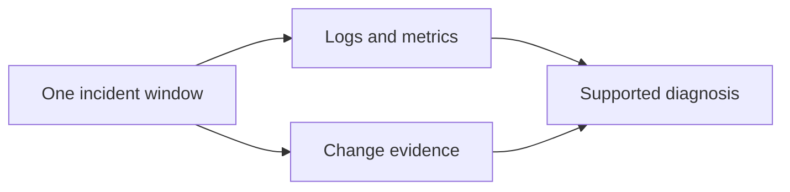

# AWS observability

Use the telemetry already connected to the workload. Start with the caller, account, Region, resource and one UTC incident window. Read the [shared CLI guide](../references/cli-operating.md) before commands.

Do not enable a new collector, trace backend, log class or retention policy just to investigate an incident. Find the actual telemetry path and its owner first.

## Pick the evidence

| Question | Reference |
|---|---|
| What failed in the application? | [Logs Insights](references/log-insights.md) |
| Is load, latency or saturation different? | [Metrics](references/metrics.md) |
| Why is telemetry missing downstream? | [Metric streams](references/metric-streams.md) |
| Why did an alarm fire or miss a failure? | [Alarms](references/alarms.md) |
| Who changed the resource? | [CloudTrail](references/cloudtrail.md) |
| What does an existing AWS dashboard show? | [Dashboards](references/dashboards.md) |
| How do I diagnose existing tracing? | [Tracing](references/tracing.md) |
| Why did an existing canary fail? | [Synthetics](references/synthetics.md) |
| Common AWS telemetry errors | [Troubleshooting](references/troubleshooting.md) |
| Does this workload need Application Signals or dynamic capture? | [Optional application telemetry](references/application-telemetry-options.md) |

For Grafana queries, dashboards, alert investigation and .NET instrumentation, load the installed skills for that stack. Do not treat generic CloudWatch onboarding examples as the workload's instrumentation standard.

## Working rules

- Match the same resource dimensions and time window across logs, metrics and changes. State missing coverage rather than filling gaps with a theory.
- Project only needed fields. Logs, traces, SQL text and snapshots can contain customer data or credentials. Obtain an evidence plan before content capture.
- Discover metric names and dimensions live. No matching series does not mean a zero value.
- Check current limits/API behavior through official docs before copying version-sensitive examples. Use the repo's existing IaC and deployment tool; CDK assets are examples for CDK repos only.
- A telemetry change needs a reviewed before/after configuration, cost and retention impact, owner approval, and an actual delivery/query test. Preserve the previous export path until replacement coverage is proven.

