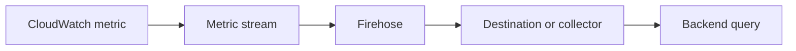

# Metric stream diagnosis

Use this when metrics exist in CloudWatch but disappear or arrive late downstream. Prove each hop before changing stream filters.



Complete the [shared preflight](../../references/cli-operating.md). Use the Region where the source metric and stream live, not the backend's location.

```bash
set -euo pipefail
PROFILE="<confirmed-profile>"
REGION="<confirmed-region>"
aws cloudwatch list-metric-streams --profile "$PROFILE" --region "$REGION" \
  --query 'Entries[].{Name:Name,State:State,Arn:Arn}' --output json --no-cli-pager
```

For a discovered stream:

```bash
set -euo pipefail
PROFILE="<confirmed-profile>"
REGION="<confirmed-region>"
STREAM="<discovered-stream-name>"
aws cloudwatch get-metric-stream --profile "$PROFILE" --region "$REGION" \
  --name "$STREAM" \
  --query '{Name:Name,State:State,FirehoseArn:FirehoseArn,RoleArn:RoleArn,Format:OutputFormat,Include:IncludeFilters,Exclude:ExcludeFilters,LinkedAccounts:IncludeLinkedAccountsMetrics}' \
  --output json --no-cli-pager
```

This projection is for diagnosis, not a complete rollback payload.

## Follow the missing metric

1. Verify the exact source namespace, metric, dimensions and time window. Query the source value, not just a catalog name.
2. Compare stream include/exclude filters with that metric. Include and exclude modes are alternatives, not a combined allow/deny list.
3. Inspect the named Firehose stream's state, delivery metrics and bounded errors. Keep destination credentials out of output.
4. Verify delivery at the destination and the backend's label/time mapping. Use the relevant backend skill for that query.
5. Check linked-account settings if the source is a monitoring account. Do not assume one stream covers every account.

Stream updates and Firehose delivery both incur charges. More metrics and extra statistics can change cost. Check actual usage before increasing coverage.

`put-metric-stream` replaces the stream definition. Before approval, capture the complete unprojected configuration in restricted evidence storage and prepare a supported full request plus rollback. Do not patch one filter with an incomplete payload. After a change, prove an intended metric arrives and required existing coverage remains.

## Source

[CloudWatch metric streams](https://docs.aws.amazon.com/AmazonCloudWatch/latest/monitoring/CloudWatch-Metric-Streams.html), checked through Exa on 2026-09-04. Verify exact command shapes against the current CLI reference before a write.
