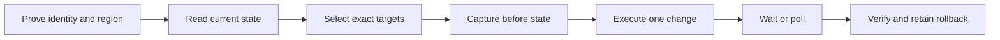

# AWS CLI Operating Guide

Use this guide before you write or run any `aws` command. It captures the operating patterns that repeatedly worked across Attain investigations, deployments, audits, and recovery work.

The rule is simple: prove the scope, reduce the data, make the smallest change, wait for AWS, and verify the result.



## Start with a scope preflight

Do not debug a service until you know which identity, account, and Region the CLI will use.

```bash
command -v aws
aws --version
aws configure list-profiles

PROFILE=replace-with-profile
REGION=replace-with-region

env | grep -E '^AWS_(PROFILE|REGION|DEFAULT_REGION|ACCESS_KEY_ID|SECRET_ACCESS_KEY|SESSION_TOKEN|ROLE_ARN|ROLE_SESSION_NAME|WEB_IDENTITY_TOKEN_FILE|CONTAINER_CREDENTIALS_FULL_URI|CONTAINER_CREDENTIALS_RELATIVE_URI|SHARED_CREDENTIALS_FILE|CONFIG_FILE|EC2_METADATA_DISABLED)=' \
  | sed 's/=.*/=<set>/' || true

AWS_PROFILE="$PROFILE" AWS_REGION="$REGION" \
  aws sts get-caller-identity \
  --query '[Account,Arn]' \
  --output text \
  --no-cli-pager
```

This environment check shows which AWS variables are set without printing their values. Command-line options and environment variables can override role, IAM Identity Center, and profile settings. This includes static credentials, web-identity roles, container credential endpoints, and alternate shared credential or config files. Stop if an override is unexpected or the identity or Region is not the intended target.

Use the authentication flow that is already configured:

- If the profile uses IAM Identity Center, run `aws sso login --profile "$PROFILE"`.
- If the machine uses a named SSO session, `aws sso login --sso-session <session>` is also valid.
- Do not replace an established SSO profile with generic `aws login` or static access keys.
- Read [../auth/instructions.md](../auth/instructions.md) when credentials are missing or expired.
- If more than one profile can match the target, stop and ask which account to use. Do not guess.

Prefer command-scoped context for one-off work:

```bash
SERVICE="<service>"
OPERATION="<operation>"
AWS_PROFILE="$PROFILE" AWS_REGION="$REGION" aws "$SERVICE" "$OPERATION" ...
```

For a sequence, contain exported context in a subshell so it cannot leak into later work:

```bash
(
  set -euo pipefail
  export AWS_PROFILE="$PROFILE"
  export AWS_REGION="$REGION"
  SERVICE="<service>"
  READ_OPERATION="<read-operation>"

  aws sts get-caller-identity --output json --no-cli-pager
  aws "$SERVICE" "$READ_OPERATION" --output json --no-cli-pager
)
```

Pass `--region "$REGION"` on copied commands when Region ambiguity would be dangerous. A command-line Region overrides profile and environment defaults. Check both `AWS_REGION` and `AWS_DEFAULT_REGION` when results appear in the wrong Region.

In CI, use OIDC role assumption or the runner's machine role. On managed hosts such as AppStream, use the attached machine role or its configured profile when injected credentials are absent. Do not use interactive login or static long-lived keys. Verify the caller before the first write.

## Shape output before it reaches the terminal

Use `--query` to reduce the AWS response. Use `jq` or Python only for processing that JMESPath cannot express clearly.

```bash
AWS_PROFILE="$PROFILE" aws rds describe-db-instances \
  --region "$REGION" \
  --query 'DBInstances[].{Name:DBInstanceIdentifier,Engine:Engine,Status:DBInstanceStatus,Vpc:DBSubnetGroup.VpcId}' \
  --output json \
  --no-cli-pager \
| jq -e '.'
```

Use these defaults:

- Use `--output json` for scripts, validation, and evidence files.
- Use `--output text` only for a scalar or when you handle its tab-separated arrays.
- Use `--no-cli-pager` for automation. It controls the local display pager, not API pagination.
- Keep sensitive fields out of `--query`. Reducing terminal output is safer than filtering it after display.
- Use `jq -e` when an empty or invalid result must fail the step.

AWS CLI automatically fetches all API pages for pageable commands. Do not add `--no-paginate` to an inventory command: it makes one API call and returns only the first page.

When you need a bounded result:

- `--page-size` changes the number of items in each service call. It does not cap final output.
- `--max-items` caps CLI output and returns a token when more data exists.
- `--starting-token` resumes a capped request. Keep the other request parameters unchanged.
- Use the same `--page-size` and `--max-items` when stable continuation matters.

AWS text arrays are tab-separated. Convert them before a shell loop:

```bash
while IFS= read -r service; do
  [[ -n "$service" ]] || continue
  AWS_PROFILE="$PROFILE" aws ecs describe-services \
    --region "$REGION" \
    --cluster "$CLUSTER" \
    --services "$service" \
    --output json \
    --no-cli-pager
done < <(
  AWS_PROFILE="$PROFILE" aws ecs list-services \
    --region "$REGION" \
    --cluster "$CLUSTER" \
    --query 'serviceArns' \
    --output text \
    --no-cli-pager \
  | tr '\t' '\n'
)
```

Do not parse display tables. They are for people, not scripts.

## Sweep accounts and Regions without hiding failures

Discover configured profiles instead of constructing account IDs or role ARNs. Print the profile and caller for every result.

```bash
PROFILE_PREFIX=CloudEngineering-
SERVICE="<service>"
LIST_OPERATION="<list-operation>"
BOUNDED_PROJECTION="<bounded-projection>"

aws configure list-profiles \
| grep "^${PROFILE_PREFIX}" \
| while IFS= read -r profile; do
    printf '\n=== %s ===\n' "$profile"

    if ! caller=$(AWS_PROFILE="$profile" \
      aws sts get-caller-identity --query Arn --output text --no-cli-pager 2>&1); then
      printf 'identity failed: %s\n' "$caller" >&2
      continue
    fi

    printf 'caller: %s\n' "$caller"
    AWS_PROFILE="$profile" aws "$SERVICE" "$LIST_OPERATION" \
      --region "$REGION" \
      --query "$BOUNDED_PROJECTION" \
      --output json \
      --no-cli-pager
  done
```

Do not send all errors to `/dev/null`. Cross-account sweeps often fail because one SSO session expired or one role lacks permission. Record that failure next to the profile and continue only when partial coverage is acceptable.

Use an explicit governed Region list for compliance checks. Enabled Regions and governed Regions are not always the same set.

GuardDuty detector IDs are regional. Discover each one inside the Region loop:

```bash
REGIONS=(replace-with-region-1 replace-with-region-2)

for region in "${REGIONS[@]}"; do
  detector_id=$(AWS_PROFILE="$PROFILE" aws guardduty list-detectors \
    --region "$region" \
    --query 'DetectorIds[0]' \
    --output text \
    --no-cli-pager)

  if [[ -z "$detector_id" || "$detector_id" == "None" ]]; then
    printf '%s: no detector\n' "$region" >&2
    continue
  fi

  AWS_PROFILE="$PROFILE" aws guardduty list-coverage \
    --region "$region" \
    --detector-id "$detector_id" \
    --query 'Resources | length(@)' \
    --output text \
    --no-cli-pager
done
```

## Gate every state change

Treat AWS commands by effect:

| Class | Examples | Required control |
|---|---|---|
| Read | `list-*`, `describe-*`, `get-*`, CloudTrail lookup | Prove identity and Region; bound output |
| Reversible write | Add one rule, update one setting | Capture before state; state rollback; confirm production target |
| Disruptive write | Deploy, restart, invoke cleanup, fleet Run Command | Show targets and impact; get confirmation; wait and verify |
| Destructive write | Delete, terminate, deregister, S3 sync with `--delete` | Get explicit confirmation; use exact IDs; retain narrow rollback when possible |

Do not treat an exit code of zero as proof that the final state is correct.

For a write:

1. Capture the current state.
2. Count and print the exact targets.
3. Show the proposed command and rollback.
4. Get confirmation for production, disruptive, fleet, or destructive work.
5. Execute the narrowest operation.
6. Use a service waiter when one exists. Otherwise poll with a deadline.
7. Capture and compare the final state.
8. Roll back only the object or value changed by this operation.

Use a timestamped evidence directory for approved operational work:

```bash
set -euo pipefail
STAMP=$(date -u +%Y%m%dT%H%M%SZ)
EVIDENCE_DIR="replace-with-approved-evidence-dir/$STAMP"
SERVICE="<service>"
DESCRIBE_OPERATION="<describe-operation>"
mkdir -p "$EVIDENCE_DIR"

AWS_PROFILE="$PROFILE" aws "$SERVICE" "$DESCRIBE_OPERATION" \
  --region "$REGION" \
  --output json \
  --no-cli-pager \
  > "$EVIDENCE_DIR/before.json"

jq -e '.' "$EVIDENCE_DIR/before.json" >/dev/null
```

Use `--dry-run` only when the specific AWS operation documents it. The flag is not universal. If no dry run exists, use the read, validate, confirm, execute, wait, verify loop.

## Put complex payloads in files

Inline JSON, PowerShell, brackets, pipes, and backslashes can fail in zsh before AWS receives the request. A shell error such as `no matches found` is not an AWS service error.

Use a file:

```bash
cat > parameters.json <<'JSON'
{
  "commands": [
    "$ErrorActionPreference = 'Stop'",
    "Get-Service -Name '<service-name>'"
  ],
  "executionTimeout": ["60"]
}
JSON

jq -e '.' parameters.json >/dev/null
```

Then pass it with `file://`:

```bash
command_id=$(
  AWS_PROFILE="$PROFILE" aws ssm send-command \
    --region "$REGION" \
    --document-name AWS-RunPowerShellScript \
    --instance-ids "$INSTANCE_ID" \
    --parameters file://parameters.json \
    --comment "$CHANGE_DESCRIPTION" \
    --timeout-seconds 120 \
    --query 'Command.CommandId' \
    --output text \
    --no-cli-pager
)
```

Poll a single target with a hard deadline:

```bash
deadline=$((SECONDS + 300))
completed=false

while (( SECONDS < deadline )); do
  if response=$(AWS_PROFILE="$PROFILE" aws ssm get-command-invocation \
    --region "$REGION" \
    --command-id "$command_id" \
    --instance-id "$INSTANCE_ID" \
    --output json \
    --no-cli-pager 2>&1); then
    status=$(jq -r '.Status' <<<"$response")
    case "$status" in
      Success)
        completed=true
        break
        ;;
      Failed|TimedOut|Cancelled)
        printf 'SSM command ended with %s\n' "$status" >&2
        exit 1
        ;;
    esac
  elif grep -q 'InvocationDoesNotExist' <<<"$response"; then
    : # AWS has not exposed the invocation yet.
  else
    printf 'SSM status check failed\n' >&2
    exit 1
  fi

  sleep 5
done

[[ "$completed" == true ]] || {
  printf 'SSM command exceeded the polling deadline\n' >&2
  exit 1
}
```

This example proves one instance. For tag-based targets, use `list-command-invocations --command-id "$command_id" --details` and require every resolved target to succeed.

Use the correct file prefix:

- `file://path` loads text or JSON parameters.
- `fileb://path` loads raw binary bytes regardless of `cli_binary_format`.
- AWS CLI v2 defaults binary blob input to base64. Use `--cli-binary-format raw-in-base64-out` only when a command requires AWS CLI v1-compatible raw input.

Generate JSON with `jq -n` when values come from variables. Do not build JSON through string concatenation. You can use `printf` or `jq -e` to inspect a non-sensitive payload before execution. Never print a secret payload for a quoting test.

For KMS smoke tests, use non-secret text and `fileb://` input. Put temporary plaintext in a permission-restricted temporary directory and remove it with a trap.

## Bound SSM fleet work

Inspect management state before remediation:

```bash
AWS_PROFILE="$PROFILE" aws ssm describe-instance-information \
  --region "$REGION" \
  --query 'InstanceInformationList[].{Id:InstanceId,Ping:PingStatus,Platform:PlatformName}' \
  --output json \
  --no-cli-pager
```

For fleet Run Command:

- Target tags or exact instance IDs. Print the resolved count before sending.
- Add an audit comment and timeout.
- Set `--max-concurrency` and `--max-errors` for tag-based fleet work.
- Poll every invocation until all targets reach a terminal state.
- Treat immediate `InvocationDoesNotExist` as eventual consistency only inside a bounded poll.
- Fail if any target is `Failed`, `TimedOut`, or `Cancelled`.
- Encrypt S3 or CloudWatch output because command output can contain sensitive data.
- Avoid recursive root-disk searches. Bound the path, depth, and time.
- Check which tools exist on the target. If `sqlcmd` is absent on Windows, a small `.NET SqlClient` script can be safer than installing a package during diagnosis.

Read [../compute/references/systems-manager.md](../compute/references/systems-manager.md) for network, IAM, logging, and endpoint requirements.

## Keep secrets out of output

Inventory secret metadata first:

```bash
AWS_PROFILE="$PROFILE" aws secretsmanager describe-secret \
  --region "$REGION" \
  --secret-id "$SECRET_ID" \
  --query '{ARN:ARN,Name:Name,LastChangedDate:LastChangedDate}' \
  --output json \
  --no-cli-pager
```

If you must test `GetSecretValue` permission without displaying the value, project only metadata:

```bash
AWS_PROFILE="$PROFILE" aws secretsmanager get-secret-value \
  --region "$REGION" \
  --secret-id "$SECRET_ID" \
  --query ARN \
  --output text \
  --no-cli-pager
```

This request still retrieves the secret response into the CLI process. Use it only when the permission test is required. Never query, echo, log, or paste `SecretString` during routine diagnosis.

During an approved rollback, Secrets Manager exposes the prior version through `--version-stage AWSPREVIOUS`. Send that value directly to the recovery process. Do not display it or leave it in shell history, logs, transcripts, or a world-readable file.

## Correlate logs, metrics, and changes

Use one UTC incident window across all three data sources:

1. CloudWatch Logs shows the application symptom.
2. CloudWatch metrics shows load, saturation, and timing.
3. CloudTrail shows who or what changed the resource.

Calculate timestamps at runtime. Do not copy an old epoch value into a new investigation.

```bash
iso_to_epoch_ms() {
  python3 - "$1" <<'PY'
from datetime import datetime
import sys
value = sys.argv[1].replace("Z", "+00:00")
print(int(datetime.fromisoformat(value).timestamp() * 1000))
PY
}

START_MS=$(iso_to_epoch_ms '<start-iso-8601>')
END_MS=$(iso_to_epoch_ms '<end-iso-8601>')

AWS_PROFILE="$PROFILE" aws logs filter-log-events \
  --region "$REGION" \
  --log-group-name "/aws/lambda/$FUNCTION_NAME" \
  --start-time "$START_MS" \
  --end-time "$END_MS" \
  --filter-pattern '<narrow-pattern>' \
  --query 'events[].{Timestamp:timestamp,Message:message}' \
  --output json \
  --no-cli-pager
```

Keep the window and dimensions identical when you query metrics. Then use a bounded CloudTrail `lookup-events` query for the relevant change event. This separates a traffic symptom from a deployment or configuration change.

Before you invoke or modify cleanup automation, discover its function, schedule, configuration, recent logs, and exclusions. Finding a function with a cleanup-like name does not prove it is the active mechanism.

## Preserve service-specific hard lessons

### S3 sync

Direction matters. `--delete` deletes objects or files from the destination that do not exist in the source.

```bash
AWS_PROFILE="$PROFILE" aws s3 sync \
  replace-with-source \
  replace-with-destination \
  --region "$REGION" \
  --dryrun \
  --delete
```

Run the dry run first. Use `--delete` only with a dedicated, bounded bucket prefix or local directory. Verify the source, destination, account, Region, endpoint policy, and proposed deletion list before the real sync.

### ECR

Send the registry password through stdin:

```bash
AWS_PROFILE="$PROFILE" aws ecr get-login-password --region "$REGION" \
| docker login \
    --username AWS \
    --password-stdin \
    "${ACCOUNT_ID}.dkr.ecr.${REGION}.amazonaws.com"
```

After a push or deployment, verify the immutable digest with `ecr describe-images`. A successful build or infrastructure apply does not prove the intended image revision is running.

### Bedrock inference profiles

Look up model and profile identifiers in the runtime account and Region:

```bash
AWS_PROFILE="$PROFILE" aws bedrock list-foundation-models \
  --region "$REGION" \
  --output json \
  --no-cli-pager
AWS_PROFILE="$PROFILE" aws bedrock list-inference-profiles \
  --region "$REGION" \
  --output json \
  --no-cli-pager
AWS_PROFILE="$PROFILE" aws bedrock get-inference-profile \
  --region "$REGION" \
  --inference-profile-identifier "$PROFILE_ID" \
  --output json \
  --no-cli-pager
```

Use the returned ID or ARN. Never construct an inference profile ARN from a model name, display name, account ID, or assumed format. Profile choice is also a data residency decision. Inspect candidate profiles and their destination models. Use a global profile only when global routing is approved; otherwise select the required geography or stop and ask.

### CloudWatch Metric Streams

`cloudwatch put-metric-stream` replaces the full stream definition. It is not a patch. Read the current stream first and preserve every required field. A partial include-filter list silently drops every namespace that is not included. Prefer no filters or an exclusion list unless cost and cardinality require a controlled allowlist.

## Classify failures before retrying

| Failure | Meaning | Action |
|---|---|---|
| Missing or expired SSO token | Authentication is stale | Login to the selected SSO profile, then repeat STS verification |
| `AccessDeniedException` after STS succeeds | The caller lacks authorization | Stop. Show caller, action, and resource. Fix policy or choose the approved role |
| `ValidationException` or invalid parameter | The request shape, identifier, or Region is wrong | Fix the request. Do not retry unchanged |
| `ResourceNotFoundException` | Wrong scope, stale ID, or true absence | Recheck account, Region, and discovery query |
| Throttling, service unavailable, or server error | Transient service failure | Retry with bounded exponential backoff and jitter |
| `InvocationDoesNotExist` just after SSM send | Eventual consistency | Poll with a short delay and hard deadline |
| Shell parse error before an AWS response | Local quoting or glob expansion failed | Move the payload to a file and validate it |

Never retry a mutating command blindly. Read the resource first because the first request may have succeeded before the client saw the response.

## Finish cleanly

- Remove temporary payload and binary files.
- Do not leave a broad `AWS_PROFILE` or Region exported in the user's shell.
- Keep approved before and after evidence. Remove ad hoc files that contain identifiers or sensitive output.
- Report profiles or Regions that failed during a sweep. Do not present partial coverage as complete.
- State which checks were not run.
