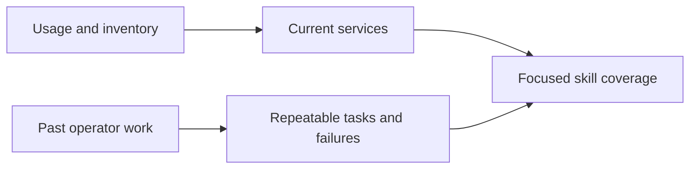

# Workload-driven scope

Use the services an organization runs to choose coverage. Use its repeated operator tasks to choose the depth. A billing line selects a subject; a real failure or delivery task tells you what the skill needs to remember.

## Working pattern

Keep scoped SSO discovery, metadata-first diagnosis, private connectivity checks, existing IaC/release paths, safe changes and result proof. Avoid account IDs, company names, internal workflow URLs and copied resource inventories in reusable guidance.

## Core and related coverage

| Current workload family | Operational depth | Related options to evaluate only when needed |
|---|---|---|
| SQL Server, PostgreSQL, Aurora, caches | Engine-aware access, backup/restore, capacity and changes | Related engines, cache serverless, migration tools |
| DynamoDB, DocumentDB, OpenSearch | Service-specific discovery and access/health checks | Alternative data models only for an actual workload requirement |
| S3, FSx ONTAP, EFS | Metadata, private access, storage and recovery | Athena/Glue for an approved S3 query need |
| WorkSpaces and application streaming | Identity path, session-safe diagnosis, images and fleets | Other desktop delivery types after compatibility checks |
| ECS, EKS, ECR | Runtime/access diagnosis and immutable delivery | Different deployment models only when the existing platform does not fit |
| EC2, networking, security, billing | Ownership, evidence, scoped changes and coverage | A short discovery path for a new dependency |
| Lambda and messaging | Runtime failures, event delivery and idempotency | MSK or Amazon MQ when protocol/integration needs justify them |
| CloudWatch and external telemetry | Existing logs, metrics, streams, alarms and audit evidence | Application Signals/ADOT/X-Ray only after checking current collection |
| Bedrock and data platforms | Invocation, access, cost and resource/owner discovery | RAG and agent hosting for an actual application need |

These are coverage boundaries, not a statement that a service is deployed in the user's account. Discover that at runtime. In particular, do not infer Serverless v2 from an Aurora engine name alone, or infer an agent platform from model-invocation charges.

## Keep related options small

For a successor, alternative or complement, explain the practical connection, first compatibility/access checks and current documentation path. Do not write a full provisioning guide until a real task needs it.

Specialist payment wallets, every agent-hosting variant and repeated platform-by-language instrumentation recipes do not belong in default coverage. For an explicit request, fetch current docs and apply the shared operating rules.

## Repeat the scope check cheaply

1. Use Organizations for the account denominator, then payer Cost Explorer by `SERVICE` and `LINKED_ACCOUNT` over recent complete months.
2. Inspect service/Region and usage-type groups only where they change a decision. Follow pagination and keep failed accounts visible.
3. Use targeted metadata discovery to distinguish engines, platform types and old charges from current resources.
4. Use prior sessions and owning repos to identify how people investigate, change and verify those resources.
5. Keep raw evidence private. Missing access, free usage and zero spend remain coverage gaps, not proof that a service is unused.

For updates, use Exa for official AWS guidance and Context7 for exact CLI/SDK details. Record decisive source links in the affected reference. Avoid refreshing an entire service catalog when one API lookup answers the question.
