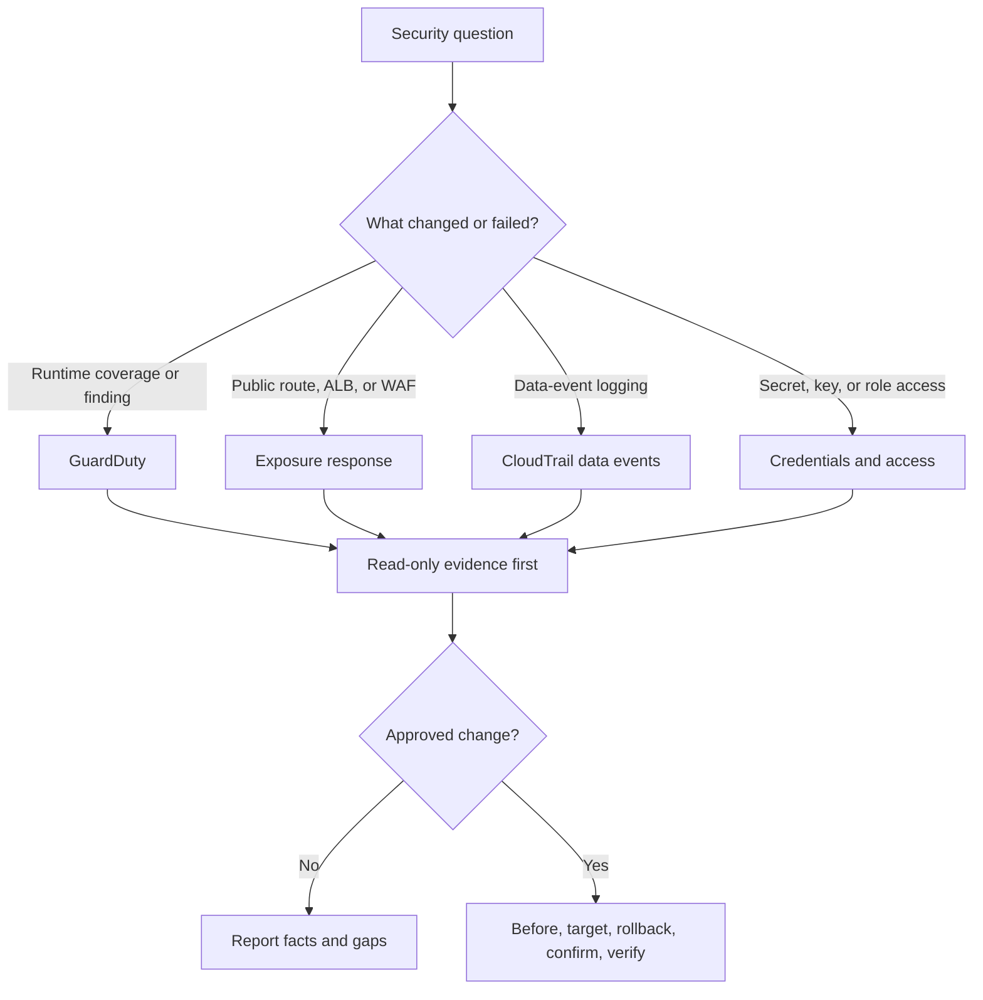

# AWS Security Operations

This module helps you investigate the security problem first, preserve evidence, and make one narrow change only when the owner approves it.

Before you write or run any AWS CLI command, read the shared [AWS CLI operating guide](../references/cli-operating.md). It owns authentication, caller and Region checks, output shaping, pagination, evidence files, approval, polling, and failure handling. Do not copy that baseline into an incident command set.

## Route the work

| Need | Read |
|---|---|
| GuardDuty detector or Runtime Monitoring coverage, ECS or EC2 remediation | [GuardDuty coverage and remediation](references/guardduty.md) |
| Exposed endpoint, ALB or WAF scope, log evidence, emergency containment | [Exposure investigation and containment](references/exposure-response.md) |
| Enable, change, prove, or remove CloudTrail data events | [CloudTrail data-event changes](references/cloudtrail-data-events.md) |
| Secrets Manager metadata, KMS smoke test, IAM role-policy inventory | [Credentials and access checks](references/credentials-and-access.md) |
| Who changed a resource, management-event history, or long-term trail queries | [CloudTrail operational auditing](../observability/references/cloudtrail.md) |
| SSM fleet mechanics used by GuardDuty remediation | [Systems Manager operations](../compute/references/systems-manager.md) |

If the question crosses lanes, start with the incident symptom. Load a second reference only when the first one names a dependency.

## Default to read-only investigation

Read-only work can inventory resources, inspect configuration, query bounded evidence, and identify the owning deployment path. It must not invoke cleanup, restart workloads, rotate credentials, rerun an association, alter a trail, add a rule, or change a policy.

For incident evidence:

- Use one explicit UTC window across WAF, application, identity, CloudTrail, and vendor logs.
- Record the account, Region, source, query, window, limits, and failures.
- Keep secret values, response bodies, tokens, personal data, hosts, and live identifiers out of chat and tickets.
- Restrict before and after evidence that contains resource identifiers or policy documents.
- A missing log match is not proof that access did not occur. State the evidence gap.
- Do not reboot, redeploy, rotate, or clean a suspected host until evidence-preservation needs are decided.

## Gate every approved mutation

Every security write must use this sequence. No exception:

1. Prove the caller, account, and Region with the shared CLI preflight.
2. Find the source owner. Stop if Terraform, Control Tower, Firewall Manager, or another controller will revert the change.
3. Capture the complete relevant before state in an approved evidence directory.
4. Resolve and show the exact targets, target count, impact, proposed command, and rollback.
5. Get confirmation before execution. Security incidents do not remove the approval gate.
6. Change one bounded object or value. Do not include unrelated drift.
7. Poll with a hard deadline when the service or deployment is asynchronous.
8. Capture after state and compare it with the intended result.
9. Keep the narrow rollback ready. Never retry a failed write blindly because the first request may have succeeded.

If there is no safe rollback, say that before confirmation. The approver must accept that fact.

## Hard-won failure modes

- The GuardDuty management account can show no workload coverage while the delegated administrator has the real organization view.
- GuardDuty detector IDs are regional. Never reuse one detector ID across a Region loop.
- New GuardDuty settings do not inject an agent into tasks that are already running. Prove the actual coverage issue before redeployment.
- GuardDuty EC2 Runtime Monitoring depends on healthy SSM management. Fixing the agent first does nothing when SSM is offline.
- CloudTrail Event history does not contain data events. A management-event lookup cannot prove object or secret access.
- Mixed or unsupported advanced event selectors can fail with `InvalidEventSelectorsException`. Validate the exact resource type and event fields before a write.
- A second organization trail without a named consumer creates cost and alerts, not evidence value.
- `curl --output /dev/null` still downloads a `GET` response body. Use `HEAD` for a no-body route probe, and state that it does not prove `GET` behavior.
- ALB path matching and application route matching can differ in case behavior. Test approved case and trailing-slash variants.
- `--query ARN` on `secretsmanager get-secret-value` hides the value from output, but the CLI process still receives the secret response.
- IAM authentication success does not prove authorization. Attached policy names also do not prove effective access.
- KMS binary inputs need `fileb://`. Shell process substitution and casual temporary files create quoting and plaintext risks.

## Not covered

Use another module for generic CloudWatch observability, VPC, Transit Gateway, DNS, CI/CD deployments, or workload rollout design. This module does not author full IAM, KMS, WAF, or organization policies. It is not a catalogue of Security Hub, Inspector, Macie, Detective, Security Lake, or every AWS security service.
