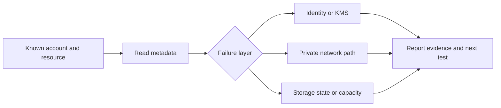

# Storage: prove the path before touching the data

Use this module for S3 access and storage diagnosis, FSx for NetApp ONTAP, EFS, and discovery of managed file or data movement. Inventory does not need customer object bodies, mounted shares, database rows, or a test transfer.

Read [the shared CLI guide](../references/cli-operating.md) first. It owns scoped SSO, identity checks, pagination, approval, and file-based payloads. Use the configured [writing guidance](../../alex-voice/SKILL.md) when writing findings.

## Scope and working pattern

- Cover S3, EFS, FSx ONTAP, Transfer Family, DataSync and DMS. Charges do not prove a current deployment, owner or traffic path.
- Discover current file-system types and state. An available file system is not proof that clients can mount it.
- Read metadata first, then run one scoped test when needed. Use IaC for changes. For S3 publishing, use a dedicated bounded prefix, a dry run, and a separately approved apply through [delivery](../delivery/instructions.md).
- Athena and Glue are related options for querying S3. Do not infer adoption from this skill's coverage.



## Pick the narrow lane

| Need | Load or do |
|---|---|
| Bucket access, class, encryption, recovery state | Start below |
| FSx ONTAP or EFS access and capacity | [File systems](references/file-systems.md) |
| Transfer Family, DataSync, DMS, S3 query needs | [Movement and queries](references/movement-and-queries.md) |
| S3 publishing or rollback | [Delivery](../delivery/instructions.md); no publishing commands here |
| Endpoint, routing, DNS, bucket-policy changes | [Networking](../networking/instructions.md) |
| KMS key state, key policy, IAM denial | [Security](../security/instructions.md) |
| Time-windowed capacity, errors, throughput | [Observability](../observability/instructions.md) |

## S3: start at the bucket, not an object

Set `PROFILE` and `REGION` after the shared preflight. Get `BUCKET` and `OWNER_ACCOUNT` from approved inventory or the owner. These examples target general purpose buckets. Confirm the API and endpoint rules first for directory buckets, access points, or Outposts.

```bash
aws s3api head-bucket --bucket "$BUCKET" --expected-bucket-owner "$OWNER_ACCOUNT" \
  --profile "$PROFILE" --region "$REGION" --no-cli-pager
aws s3api get-bucket-encryption --bucket "$BUCKET" --expected-bucket-owner "$OWNER_ACCOUNT" \
  --profile "$PROFILE" --region "$REGION" --output json --no-cli-pager \
  --query 'ServerSideEncryptionConfiguration.Rules[].{Default:ApplyServerSideEncryptionByDefault,BucketKey:BucketKeyEnabled}'
aws s3api get-bucket-versioning --bucket "$BUCKET" --expected-bucket-owner "$OWNER_ACCOUNT" \
  --profile "$PROFILE" --region "$REGION" --output json --no-cli-pager
```

A successful `head-bucket` proves this caller's bucket check, not object reads, KMS decrypt, or the workload's private path. A 403 does not distinguish a missing bucket from denied access. A laptop check cannot prove access from the application subnet and role.

Choose only the next metadata call needed:

- `get-bucket-lifecycle-configuration`: transitions, expiration, and noncurrent-version rules. Keep prefix and tag values out of the report unless needed.
- `get-bucket-replication`: configured destinations and rules, not replication completion.
- `get-public-access-block` and `get-bucket-policy-status`: exposure checks, not a complete authorization evaluation.
- Use existing storage metrics or inventory reports for size, object count, classes, and incomplete multipart uploads. Do not download a report or scan keys merely to inventory buckets. Reports and key names can contain sensitive data.

Do not turn a 403 into a broader role, policy edit, recursive listing, or object download. Record the exact action, caller, expected owner, Region, endpoint path, time, and error. Check IAM/SCP/resource/endpoint policy conditions and KMS separately through the linked owners.

### Object metadata is a separate, scoped test

Only when the question needs it, ask for an approved exact key, preferably an existing synthetic canary. Do not create one as part of inventory. `head-object` returns no body but needs object-read permission. It can expose user metadata; project only these fields. Do not use `get-object` with a metadata query: it still reads the object.

```bash
aws s3api head-object --bucket "$BUCKET" --key "$APPROVED_KEY" \
  --expected-bucket-owner "$OWNER_ACCOUNT" --profile "$PROFILE" --region "$REGION" \
  --query '{Bytes:ContentLength,Class:StorageClass,Encryption:ServerSideEncryption,KmsKey:SSEKMSKeyId,Version:VersionId,Restore:Restore}' \
  --output json --no-cli-pager
```

- A missing key returns 404 with `s3:ListBucket`, otherwise 403. Neither a denied HEAD nor a missing current version proves data loss.
- Do not request checksum mode by default. KMS-encrypted checksum retrieval needs extra KMS permissions. HEAD success alone does not prove decrypt permission.
- Do not send PUT encryption headers on HEAD. Stop for SSE-C rather than ask someone to paste a customer key.
- An absent `StorageClass` field on a normal S3 object means STANDARD. Inspect the exact version if recovery depends on it; a current delete marker can hide older versions.
- Archive restore metadata shows retrieval state and expiry where applicable. It does not prove that a backup exists. Requesting archive retrieval is a separate approved action with cost and timing.

## A backup is not restore proof

Identify whether protection comes from S3 versioning/replication, FSx backups or snapshots, EFS protection, or AWS Backup. Do not assume AWS Backup is deployed. Inspect the existing mechanism, exact resource, latest successful recovery point, retention, destination, and key availability. Configured schedules alone prove none of these outcomes.

For an existing AWS Backup recovery point and restore job, use owner-supplied IDs:

```bash
aws backup describe-recovery-point --backup-vault-name "$VAULT" --recovery-point-arn "$RECOVERY_POINT_ARN" \
  --profile "$PROFILE" --region "$REGION" --output json --no-cli-pager \
  --query '{Resource:ResourceArn,Status:Status,Created:CreationDate,Completed:CompletionDate,Expires:CalculatedLifecycle.DeleteAt,Key:EncryptionKeyArn}'
aws backup describe-restore-job --restore-job-id "$RESTORE_JOB_ID" \
  --profile "$PROFILE" --region "$REGION" --output json --no-cli-pager \
  --query '{Status:Status,Created:CreationDate,Completed:CompletionDate,RestoredResource:CreatedResourceArn,Validation:ValidationStatus,Deletion:DeletionStatus}'
```

A completed restore job is infrastructure proof, not application or data-integrity proof. Ask for the tested recovery point, isolated target, measured recovery time, acceptable data age, owner validation, and cleanup evidence. Mark missing evidence as **restore unproven**. A replica or same-system snapshot is not independent recovery proof.

Do not start a restore or create a restore-testing plan during diagnosis. Tests create resources, expose restored data, cost money, and can schedule cleanup. Get a separate approved scope, role/KMS/private connectivity checks, validation plan, and cleanup owner first. No customer reads are needed to report that restore proof is missing.

## Return a useful result

State the resource and scope, what metadata proves, what remains untested, and the smallest next check. Separate configuration from observed health and successful recovery. Record denied or skipped scopes; do not call partial discovery complete.

## Official sources checked

- Exa: [S3 HeadObject semantics](https://docs.aws.amazon.com/cli/latest/reference/s3api/head-object.html).
- Exa: [AWS Backup restore testing and validation](https://docs.aws.amazon.com/aws-backup/latest/devguide/restore-testing.html).
- File-system sources are linked in the [focused reference](references/file-systems.md). Command shapes also checked against the installed AWS CLI offline model; no live AWS calls were made while authoring.
