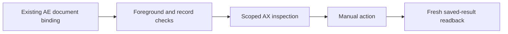

# Read-only Accessibility inspection

Use `scripts/browser_ax.py inspect` to inspect controls that the top-level DOM cannot reach. **AX writes are disabled.** The live Edge fixture accepted AXPress without producing the expected saved result. Two Exa research passes found no reproducible fix within this skill's constraints. This is a local support decision, not a claim that all browser AX actions fail.

For an unreachable control, request a manual click or manual text entry. Do not substitute System Events writes, focused keys, coordinates, clipboard operations, or an alternative AX wrapper. The CLI and native write methods reject writes with `AX_WRITES_DISABLED`; there is no override flag.



## What can the inspector read?

- Ordinary buttons, checkboxes, text fields, and textareas, selected by exact role and name, description, identifier, or label.
- Cross-origin frames selected by exact origin and path, without storing signed query strings. An optional named region narrows the frame further.
- Exact record context within that scope, checked against a fresh top-level account, record, state, and optional revision guard.
- At most 20 controls with role, name, description, identifier, enabled state, advertised actions, and whether AXValue is writable. Advertised write support does not enable writes.

Missing optional attributes appear as null. Inspection does not return text-field values, cached tree paths, or frame URLs. A label matches an exact name OR description, never a substring.

## How is the page associated with AX?

The bound tab must already be active in its containing window, with native window index 1. That index is a live check, not an identity. AppKit's foreground PID, native browser `frontmost`, and the bound AX application's `AXFrontmost` must agree. Its focused window and UI element must belong to that PID. The window must be standard, visible, and unminimized, without a native sheet or dialog.

Exactly one top-level AXWebArea must exist. Its full AXURL must equal the bound document URL. Titles and similar-looking window IDs do not prove identity. The inspector repeats native document/record checks and AX scope resolution, then compares retained references through `CFEqual`. Observed changes stop inspection; it does not select a tab or acquire focus.

This association is not atomic. A switch away and back can go unseen. Adversarial native mapping cases remain unverified; do not claim that concurrent human input is locked out.

The system-wide `AXFocusedApplication` read failed immediately with `-25204` on the test Mac. Application-scoped focus reads worked. The implementation explicitly uses AppKit's foreground PID and application-scoped AX attributes. `AX_CANNOT_COMPLETE` does not prove a timeout or permission denial.

## How do I inspect a control?

Keep the target, specification, and reviewed read-only guard in a private task directory. Use the existing `tabs --out` and `bind` commands first. Never copy historical IDs into a binding.

Example specification for the local fixture (replace its origin with the actual address):

```json
{
  "expected": {"account": "fixture", "record": "FIXTURE-1", "state": "New", "revision": 1},
  "frame": {"origin": "http://127.0.0.1:9102", "path": "/approval"},
  "context": [{"role": "AXStaticText", "value": "Record FIXTURE-1"}],
  "control": {"role": "AXButton", "label": "Submit change for approval"}
}
```

A fixture guard reads current fields, not constants:

```javascript
return {
  account: document.body.dataset.account,
  record: document.body.dataset.record,
  state: document.body.dataset.state,
  revision: Number(document.body.dataset.revision)
};
```

Guard code is trusted agent-supplied JavaScript, not a sandbox. Review it for side effects. Context requires one to four exact selectors. For discovery, the control selector can contain only a role.

```bash
python3 "$SKILL/scripts/browser_ax.py" inspect --target "$TASK/target.json" \
  --spec "$TASK/ax.json" --guard-js "$TASK/guard.js"
```

Traversal is capped at 600 nodes and 24 levels. Native requests use a one-second messaging timeout and a 45-second inspection deadline; an in-flight call can finish after the deadline. Each AE send retains its 20-second timeout. Summaries are capped at 12 KiB of UTF-8. Incomplete traversal is an error, not permission to use a partial match.

Stop on permission, binding, record, mapping, or focus failures. The user handles OS grants manually. Do not bypass errors through another transport.

## What remains after the experiment?

The [verification record](ax-verification.md) separates observed results from unknowns. Historical model-only action/receipt tests remain as regression evidence; they do not expose a live write mode or prove effective browser writes. `tests/live_ax_check.py` is a refusal-only stub so old experiment commands cannot open windows or start servers.

After a manual action, verify the saved fields and revision through a fresh page read or authorized service read. If the result is uncertain, inspect before any retry. Never treat an AX acknowledgement, visible text alone, or a requested action as proof of business success.
