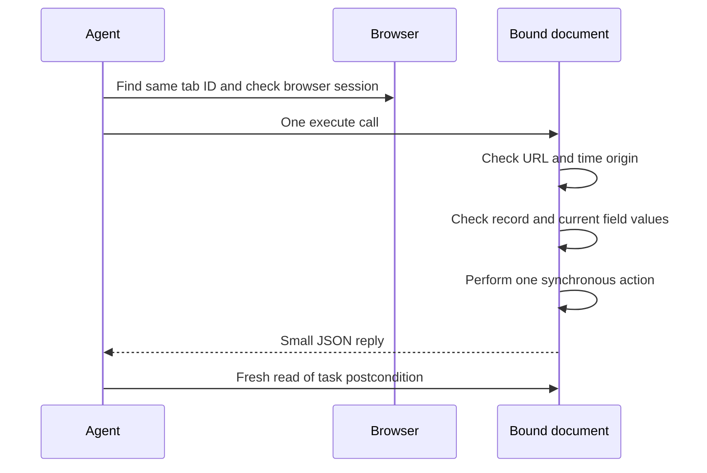

# Work beside the user, not instead of them

The user can change focus, type, drag tabs between windows, close windows, switch Spaces, or navigate while a task runs. No idle-time assumption makes those actions safe to ignore.

## What identifies the target?

Preserve the session from the moment of selection. `tabs --out` writes that snapshot; `bind` and `new-tab` require it. Checking only the current session when binding would miss a restart between selection and binding if the browser reused IDs.

Use the binding as a set of checks, not a saved UI pointer:

| Check | Why it exists | If it changes |
| --- | --- | --- |
| App path, bundle ID, version, dictionary hash | A fork or update can change the protocol | Inspect again; no blind reuse |
| Browser PID and launch time | Tab IDs are not durable across browser sessions | Stop and bind again after review |
| Tab ID, resolved across current window IDs | Focus and ordering can change; a tab can move | Follow only the same unique ID; missing means stop |
| Exact native URL and rendered `location.href` | A tab can navigate while remaining the same tab | Stop; inspect unexpected navigation |
| `performance.timeOrigin` | Reload can keep the URL but replace the document | Stop; inspect and bind the new document deliberately |
| Account, record key, control label, current field value | The same document can change underneath the agent | Stop the write on any conflict |

Binding by tab ID avoids a front-tab error. It does not prove the correct account, record, or action. Verify those from the page.

## How should an action run?

Put all action checks before the first write. Do not do a read in one call, wait, then click from that old observation. Query the element again in the action call. Frameworks replace DOM nodes during rendering.

A synchronous renderer call reduces check-to-action races. It does not create a browser transaction. Event handlers can run synchronously during `.click()` or `dispatchEvent()`. Network responses, server state, browser navigation, and another process remain outside that call. A form submit can reach the server even if the Apple Event later times out.

Native commands have a larger gap: read and write are separate Apple Events. There is no compare-and-set URL command in the inspected Chromium dictionary. Do not describe native navigation or close as atomic. If the user and agent must mutate the exact same tab, ask for a separate task tab or a brief pause.

## What if the user changes something?

- **Focus or window order changes:** in the Apple Events path, keep going by ID. Do not activate the browser or restore the old arrangement. During Accessibility inspection, stop if the user changes focus or target; do not compete with them.
- **Tab moves:** search current windows for the same tab ID, then recheck the page. A move that changes the ID ends the binding. Do not follow the title or URL instead.
- **Tab closes or browser restarts:** stop. Do not recreate the user's page, relaunch the browser, or select a lookalike.
- **Unexpected navigation or reload:** stop before a mutation. Rebinding is a decision, not error recovery. Do it only after confirming the new page still serves the user's task.
- **Expected navigation from your action:** wait with a deadline for the intended destination, inspect it, then make a fresh binding. A redirect can require fresh account and site checks.
- **Human edits the same field:** preserve their edit. Compare the current value with the value the task expects, not just the value observed long ago. If it differs, stop before changing any field.
- **Page is hidden or minimized:** ordinary DOM work may still work. Do not use `document.hidden` as a reason to steal focus. If the site needs foreground interaction that Apple Events cannot supply, request a manual step. AX inspection does not supply trusted input.

The document check does not catch every leave-and-return path, same-document navigation, or back-forward-cache restoration. Record and field preconditions still matter. A background request can also change server state without changing any local document marker.

## Accessibility handoff

AX inspection has standing transport approval within the task. AX writes are disabled after failed live verification and the decision to drop them. This is a capability limit, not a request for more permission.

1. State what Apple Events cannot reach. Preserve the browser session, tab, document, account, and record checks.
2. If the exact tab is already foreground, use the [AX inspector](accessibility.md) for bounded page/frame/region metadata. Never use a whole-window dump, title match, or saved index as identity. Stop on missing or ambiguous mapping.
3. Request a manual click or manual text entry for the exact task control. Do not acquire focus or replace the disabled write path with System Events, keys, coordinates, or clipboard paste.
4. Verify saved fields and revisions through a fresh page or authorized service read. An uncertain result means inspect, not click again. Return to Apple Events for supported work without restoring the desktop.

The user handles AX permission grants manually. Do not automate security prompts, change policy, or bypass permission denials or mandatory harness/tool prompts. Historical ADO clicks do not validate this helper. See [the verification record](ax-verification.md) for the stopped experiment.

## How much should the agent do at once?

Read in small batches. Make one bounded write, then verify it. Do not run a ten-step form workflow inside one unreviewed script. Do not keep intervals, MutationObservers, event listeners, or browser-global workers running after a call.

Allow only one writing agent per tab. Coordinate ownership outside the browser before starting. A task directory or lock file is useful coordination, not exclusive control over a live page.

After a timeout, transport failure, exception, or missing reply, label the outcome **unknown**. Inspect the task's durable result. A visible success message or changed field may help; a server-side record is stronger for a submitted transaction. Never automatically replay a send, save, purchase, or delete.

## What should cleanup remove?

Record created tab IDs immediately. At cleanup, recheck the browser session, exact ID, and expected task page. Close only tabs still owned by the task. Do not close a reused user tab. If the user navigated a created tab elsewhere, leave it and say why. Do not restore old focus or layout; that would overwrite the user's newer choice.
