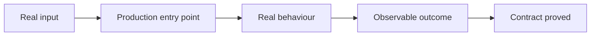

# Code Rules

The coding standards for all code in this setup. `AGENTS.md` and `CLAUDE.md` require every coding session to read and follow this file before changing code. Follow repo-specific rules too. If they conflict with this file, stop and ask instead of guessing.

## Every language

These apply to all code. Language-specific references add to them; they never override them.

### Design for testability. Do not inject everything

- **Testable means controllable and observable.** Controllable: a test can cheaply reproduce the situations the code runs in. Observable: a test can see what the code did. If you can't do both, the design is the problem, not the test.
- **Put a seam only where the real dependency is non-deterministic or outside the process.** That list is short and predictable: clock, randomness, network, filesystem, database, environment variables, subprocesses, message queues. Everything else gets constructed directly.
- **Inject a dependency when one of these is true, not by default:** you genuinely need a second implementation, or you need to test how this code *interacts* with that collaborator. If neither holds, injecting it only complicates every caller.
- **Split newables from injectables.** Value objects and entities are newables: tests just build them. Services (things that *do* something: parsers, clients, repositories) are injectables. Never inject a service into a value object or entity; it makes the value object impossible to build without a mock.
- **Own the interface at the boundary.** Define the interface your code actually needs (`Clock`, `ArticleStore`), not a thin wrapper around the vendor's API. Unit-test the callers against a test double; write one integration test that exercises the real implementation, because that's the only place the vendor's real behaviour gets checked.
- **When something genuinely can't be tested, make it humble.** UI glue, framework entry points, async plumbing: move logic out until what remains is so small it's obviously correct by reading it. Test the logic you moved out; leave the humble part untested on purpose.
- **Never build a seam speculatively.** An interface with one implementation and no test double behind it is not flexibility, it's a maintenance cost. Add the seam when the second implementation or the test that needs it actually shows up. (How much testing a change warrants at all is the tests-and-docs rule in `AGENTS.md`; this section is only about how to shape the code so testing is possible.)
- **Say "seam" for where an interface lives, and "boundary" for a real external edge.** A seam is a place where behaviour can change without editing in that place. A boundary is where the system meets something you do not own, such as a vendor API or a database. Keep both words, but do not use "boundary" to mean the first thing: in domain-driven design it already means a bounded context.

**Why:** testability is a side effect of good design, not a goal you bolt on. Code that's easy to test usually has fewer dependencies and clearer contracts. But "inject everything" is the overengineering I hate: an interface per collaborator, almost all with exactly one implementation forever, and object graphs so big you need a framework to assemble them. Seams at real boundaries buy fast, deterministic tests. Seams everywhere else are pure cost.

Sources for the framing above: Feathers on seams, Beck on controllability, Hevery on newables vs injectables, Meszaros/Martin on the humble object, Fowler on non-determinism, Noback on owning your boundary interfaces.

### Write the test first, at a seam you agreed

- **Agree the seams before you write a test.** Write down the seams under test and confirm them with me first. A seam is the place where you observe behaviour without reaching inside the implementation. You cannot test everything, so agreeing the seams up front is how effort lands on the critical paths and the complex logic instead of every edge case. Tests live at seams, never against internals.
- **Red before green.** Write the failing test first, then write only enough code to pass it. Run it and see it fail for the right reason before you make it pass. Do not anticipate later tests and do not add speculative features.
- **One slice at a time.** One seam, one test, one minimal implementation, then repeat. Do not write all the tests first and then all the implementation: bulk tests verify imagined behaviour, and you lock in a test structure before you understand the implementation.
- **Approve the interface before you build against it.** When the shape of the seam is itself the open question, agree the interface first. A seam chosen badly is expensive to move once callers depend on it.
- **Refactoring is not part of the loop.** It comes after green, as its own step.

**Why:** a test written after the code passes on the first run, so it proves nothing about whether it can ever fail. The failing run is the only evidence that the test reaches the code at all. Working one slice at a time keeps each test honest about what the code does now, instead of what you imagined it would do.

### Prove the contract through behaviour

A test earns its place when it can fail because the system's observable behaviour is wrong. It should not fail only because code moved, a private name changed, or the implementation now reaches the same result by a different path.

Use the closest proof to production that stays deterministic, safe, and cheap:

- **Behaviour tests prove outcomes that matter to a user or operator.** Start through a public entry point. Assert returned data, persisted state, emitted events, logs, metrics, files, process exit status, or another result outside the implementation. Do not substitute assertions about private methods or collaborator calls unless that interaction is itself the contract.
- **Contract tests prove each boundary.** Cover accepted and rejected inputs, outputs, failure semantics, and side effects. Include protocol details such as status codes, schemas, serialization, idempotency, and error shape when callers depend on them.
- **Integration tests prove real boundaries where practical.** Exercise the real database engine, filesystem, network client, subprocess, queue, or vendor adapter in a safe test environment. A test double can isolate caller logic. It cannot prove that the real dependency accepts the request or produces the response your code expects.
- **End-to-end tests prove critical production flows.** Start at the real external entry point and follow the flow to its durable or user-visible result. Keep this set small because these tests cost more and fail for more environmental reasons.
- **Failure-path tests prove safe failure.** Show what happens with invalid input, timeouts, unavailable dependencies, partial work, retries, and cleanup when they apply. Assert the relevant safety contract: no corrupted data, bounded retries, a useful error, and no false success after incomplete work.
- **Unit tests prove focused contracts without copying the implementation.** Use them when you can state the input and expected result independently. If calculating the expected result requires rebuilding the production algorithm inside the test, use a higher-level test or real execution instead.
- **Refactor-safe tests preserve freedom to change the code.** A correct internal rewrite should keep passing when the public contract stays unchanged. Exact call order, object layout, helper names, and file structure are assertions only when consumers truly depend on them.
- **The smallest strong test set wins.** Each test should add a distinct proof or failure mode. Test count and coverage percentage can expose gaps, but neither proves quality.

Reject tests that create the appearance of proof without exercising a contract:

- **Copied production logic:** a second copy can contain the same mistake and agree with the broken code.
- **Source-text or structure checks:** comparing source text, exact implementation shape, or whether a file contains one line freezes the current solution instead of testing its result.
- **Tautological object checks:** constructing the expected object from the same values and path as the actual object only proves that an object equals itself in another variable.
- **Redundant existence checks:** checking that a source or generated file exists adds nothing when the build already fails without it.
- **Fake upstream programs:** a mock that accepts the string the test expects proves string assembly against the mock. It does not prove that the real program parses the command, honours its flags, or produces the required side effect.
- **Volume as quality:** a large test count can repeat one weak assertion many times. Confidence comes from distinct contracts and realistic failure paths, not volume.

**Rule:** Test observable behaviour. Use real execution as proof when a unit test would only mirror the implementation.

**Why:** implementation-shaped tests give false confidence. They can pass while the real workflow is broken, then fail during a safe refactor. Tests should protect contracts, catch regressions, and leave the implementation free to improve.

### Be short on comments

- **Only comment when the why isn't obvious from the code.** No narrating what the code already says.

**Why:** models tend to over-comment, and I don't like it. Noisy comments bury the few that matter, and good names plus small functions already tell the what.

## Terraform and OpenTofu

When writing, changing, or reviewing Terraform/OpenTofu code or its tooling and CI, read [the Terraform and OpenTofu standards](references/terraform-opentofu.md). They cover module choices, version constraints, state safety, hooks, and CI enforcement. Unrelated coding tasks need only the general rules above.
