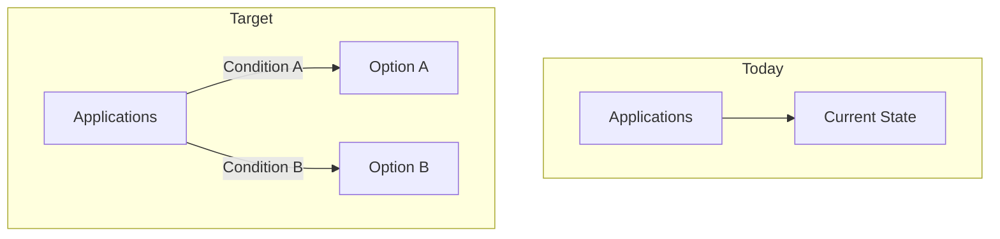

# Decision Engine: Personal Architecture Decision Patterns

Your documented decision-making framework based on analysis of 2,597+ sessions across 73 projects.

## When to Use This Skill

- Technology platform selection (cloud providers, databases, frameworks)
- Build vs. buy vs. integrate decisions
- Migration strategy formulation (on-prem to cloud, legacy to modern)
- Architecture pattern adoption (microservices, event-driven, serverless)
- Tool/framework standardization across teams
- Strategic technology investments and deprecation

---

## PE-Backed Financial Services Decision Context

At a PE-backed consumer lender, every architectural decision is evaluated through these lenses **in this priority order**:

1. **Regulatory compliance** - Does this option create or resolve compliance risk? SOX, PCI-DSS, state lending regulations, GLBA are non-negotiable constraints, not tradeoffs.
2. **Cost impact** - PE sponsors expect measurable ROI within 12-18 months. Every decision must have a $ number attached.
3. **Speed to value** - How fast does this deliver measurable business impact? PE timelines are compressed.
4. **Vendor consolidation** - Does this reduce or increase the vendor portfolio? Consolidation is always preferred.
5. **Operational efficiency** - Does this reduce headcount needs or manual effort? Quantify in FTE-hours.

### The Cost Center Reframe
The CEO views technology as a cost center. Every decision document must answer: **"Why should we spend money on this instead of something else?"**

Frame decisions as:
- **Cost avoidance**: "This prevents $X in regulatory fines / audit remediation / incident costs"
- **Cost reduction**: "This eliminates $X/year in vendor spend / manual effort / infrastructure waste"
- **Revenue protection**: "This system processes $X/month in loans; downtime costs $Y/hour"
- **Revenue enablement**: "This enables entering N new states / launching product X / reducing time-to-fund by Y days"

Never frame as: "This is the right technical choice" or "This follows best practices." Those are irrelevant to the audience.

---

## Your Decision-Making DNA

### 1. Context Framing Pattern

You always start decisions with three elements:

**Current State Reality**
- Document what exists today without judgment
- Include operational burden metrics (on-call pain, maintenance hours)
- Note accumulated technical debt or bespoke solutions

**Pressure Point Identification**
- External forcing function: Tech Radar changes, vendor deprecation, compliance deadlines
- Internal inflection point: team scaling limits, recurring incidents, skill gaps
- Cost trigger: license renewals, infrastructure sprawl, opportunity cost

**Primary Drivers** (you use bold bullet format)
```markdown
* **Strategy alignment**: How this supports/refutes strategic direction
* **Security/compliance posture**: Risk reduction or exposure
* **Operational burden**: Who owns this long-term and can we staff it
* **Expertise sustainability**: Can we maintain competency as technology evolves
* **Standardization impact**: Reducing pattern proliferation vs. adding variety
* **Resilience/DR expectations**: Meeting reliability targets consistently
```

### 2. Options Structure

You evaluate 2-3 primary destinations, never one-and-done:

**Status Quo** (always documented)
- Pros: Lowest short-term change cost, avoids near-term disruption
- Cons: Perpetuates tech debt, increases marginal risk over time, conflicts with strategy

**Target Options** (2 alternatives minimum)
- Primary recommendation with clear "when to choose" criteria
- Secondary option for different workload characteristics
- Decision tree logic: "Prefer X when... otherwise Y"

**Visualization Pattern**
- Mermaid diagram showing before/after architecture
- Comparison table for structured evaluation
- Flowchart for selection criteria logic

### 3. Tradeoff Dimensions (Ranked by Frequency)

From most frequently evaluated to least:

1. **Regulatory compliance impact** - Does this create or resolve compliance obligations? (Non-negotiable — this is a constraint, not a tradeoff)
2. **Total cost of ownership (5-year)** - Infrastructure + licensing + personnel + opportunity cost
3. **Time to measurable business value** - Weeks to first quantifiable impact, not "eventually"
4. **Strategy Alignment** - Does this support documented strategic direction?
5. **Operational Burden** - Can we own this long-term with available staffing?
6. **Security/Compliance Posture** - Risk reduction vs. new exposure
7. **Standardization Impact** - Pattern consolidation vs. proliferation
8. **Expertise Sustainability** - Can we maintain deep competency?
9. **Migration Effort** - Workload fit and refactoring complexity
10. **Time-to-Value** - How quickly does this deliver benefits?
11. **Reversibility** - Can we undo this if wrong?
12. **Team Capability** - Does this match current skills or require upskilling?
13. **Compliance** - Regulatory requirements and audit needs

### 4. Decision Rationale Style

**Hybrid Adoption Pattern** (your signature move)
- You rarely adopt platforms wholesale
- Selective adoption: "Use their X and Y, but our own Z"
- Example: Adopt AWS Agent Core tools/registry/memory, but use k8s deployment + A2A instead of their Gateway

**Explicit Rejection Documentation**
- You document what you're NOT doing and why
- Creates organizational memory for future reconsideration
- Prevents "why didn't we just..." discussions later

**Selection Criteria Format**
```markdown
Working selection criteria (to be refined):
* Prefer **[Option A]** when: [specific conditions]
* Prefer **[Option B]** when: [different conditions]
* If workload doesn't fit either: requires explicit review
```

### Regulatory Constraint Pattern
In regulated financial services, some decisions have non-negotiable constraints. Document them differently:

```markdown
## Regulatory Constraints (Non-Negotiable)
These are not tradeoffs. They are requirements that eliminate options:
- [ ] **PCI-DSS**: [Constraint and which options it eliminates]
- [ ] **SOX**: [Constraint and which options it eliminates]
- [ ] **State lending regulations**: [Constraint and which options it eliminates]
- [ ] **GLBA**: [Constraint and which options it eliminates]
- [ ] **Data residency**: [Constraint and which options it eliminates]

> Options that violate regulatory constraints are listed in "What We're NOT Doing" 
> with the specific regulation as the rejection reason. No further analysis needed.
```

### 5. Deprioritization Patterns

Your consistent "not now" signals:

- **Status quo continuation** - Despite low short-term cost, you reject staying with deprecated tech
- **Vendor lock-in** - You deprioritize deep proprietary integration in favor of API contracts
- **Big-bang migrations** - You prefer incremental, workload-by-workload approaches
- **Custom-built solutions** - When SaaS/managed alternatives meet 80% of needs
- **Immediate perfection** - You ship working solutions with TODOs for refinement

---

## Your Personal ADR Template

Use this exact structure for team decisions:

```markdown
# ADR-[NUMBER]: [Decision Title]

Date: [YYYY-MM-DD]
Status: proposed | accepted | deprecated

## Context

We currently [operate/maintain/build] [current state].

[Optional: Specific scope boundaries - what this decision covers/excludes]

[Pressure point: external forcing function or internal inflection]
[Example: The 2026 Q1 Tech Radar moves [Technology] to **Abandon**...]

Primary drivers for this decision:

* **Strategy alignment**: [How this supports/refutes strategic direction]
* **Security/compliance posture**: [Risk considerations]
* **Operational ownership**: [Who maintains this and can we staff it]
* **Expertise sustainability**: [Can we maintain competency]
* **Standardization**: [Impact on pattern proliferation]
* **Resilience/DR**: [Reliability expectations]

[Current state pain points: ongoing burden, risks, inconsistencies]

## Decision

We will [primary decision - what we're doing].

### Target Destinations

We are evaluating [N] primary destinations, depending on workload characteristics:

1. **[Option A]** for [specific workload type]
2. **[Option B]** for [different workload type]



Working selection criteria (to be refined):

* Prefer **[Option A]** when: [specific conditions]
* Prefer **[Option B]** when: [different conditions]
* If workload doesn't fit cleanly: requires explicit review

[Why Option A is appropriate: business rationale and technical rationale]

## Considered Alternatives

Evaluation criteria used across alternatives:

* Alignment with strategic direction
* Security/compliance posture and auditability
* Operational ownership burden and staffing
* Resilience/DR expectations
* Standardization impact (number of patterns to support)
* Migration effort and workload fit

### [Alternative 1: Status Quo]

* **Pros**: Lowest short-term change cost; avoids near-term refactors
* **Cons**: [Explicit rejection rationale - why status quo is untenable]

### [Alternative 2: Other Option]

* **Pros**: [Benefits]
* **Cons**: [Drawbacks]
* **Why not selected**: [Explicit rationale]

## What We're NOT Doing

* [Rejected approach 1] - [Why rejected, with conditions for reconsideration]
* [Rejected approach 2] - [Why rejected]

## Consequences

### Positive

* [Benefit 1]
* [Benefit 2]

### Negative/Risks

* [Risk 1] - [Mitigation strategy]
* [Risk 2] - [Mitigation strategy]

## TODOs (Explicitly Deferred)

* [ ] [Incomplete analysis piece] - [Why deferred and when to address]
* [ ] [Unanswered question] - [Owner and timeline]

## Related Decisions

* [ADR-XXXX] - [How this relates]
* [Future consideration] - [What might change this decision]
```

---

## Cross-Skill Integration

### Inputs (What Triggers a Decision)
| Source Skill | Trigger | Decision Type |
|---|---|---|
| **architecture-assessor** | Red/Yellow finding requiring action | Remediation ADR: fix, migrate, or accept risk |
| **architecture-assessor** | Vendor concentration risk identified | Vendor consolidation ADR → then **vendor-evaluator** |
| **vendor-evaluator** | Evaluation complete, recommendation ready | Build vs buy ADR with vendor evaluation data |
| **migration-playbook** | Migration approach needs formal decision | ADR for migration strategy (strangler fig vs big-bang, provider selection) |
| Direct request | "Should we do X or Y?" | Standard architectural ADR |

### Outputs (Where Decisions Go)
| Decision Type | Next Skill | Action |
|---|---|---|
| Vendor selected | **vendor-evaluator** | Full evaluation if not already done |
| Decision needs executive approval | **executive-framer** | Use Investment Justification or Executive ADR template |
| Decision creates infrastructure work | **terraform-module-scaffold** | Scaffold modules per decision |
| Decision requires new operational procedures | **runbook-generator** | Generate runbooks for new processes |
| Decision triggers system migration | **migration-playbook** | Create phased migration plan per the selected approach |

### Decision → Executive Presentation Flow
Every ADR that requires budget or executive approval should be paired with an **executive-framer** output:
1. Write the ADR (this skill) — captures full technical rationale
2. Create the executive presentation (executive-framer) — translates to cost/risk/revenue framing
3. The ADR becomes the backup artifact if leadership asks "show me the analysis"

---

## Decision Anti-Patterns to Avoid

**Times you've deviated from your pattern:**

1. **Rushed decisions under incident pressure** - You accepted suboptimal short-term fixes without full evaluation
   - *Correction*: Even under pressure, document the decision as "temporary" with explicit revisit timeline

2. **Over-adoption of vendor platforms** - You adopted more components than needed (learning: AWS Agent Core Gateway)
   - *Correction*: Always do component-level evaluation, not platform-level

3. **Incomplete context** - Early ADRs lacked explicit selection criteria
   - *Correction*: "Working selection criteria" section is now mandatory

**Forces that caused deviation:**
- Executive mandate without evaluation time
- Vendor sales pressure
- Team urgency without strategic alignment check
- Personal excitement about new technology

---

## Usage Workflow

### When Facing a New Decision

1. **Start with pressure point** - What's forcing this decision now?
2. **Document current state honestly** - Don't sugarcoat the pain
3. **List 2-3 real alternatives** - Status quo always counts as one
4. **Apply your 6 primary drivers** - Strategy, security, operations, expertise, standardization, resilience
5. **Use hybrid adoption** - Select components, not whole platforms
6. **Document what you're NOT doing** - Prevents future relitigation
7. **Add TODOs** - Mark incomplete analysis explicitly

### For Team Rollout

Share this template with the message:

> "This is how we make architecture decisions here. Use this ADR template for any decision involving:
> - Technology platform selection
> - Build vs. buy vs. integrate
> - Migration strategies
> - Architecture pattern adoption
> - Tool/framework standardization
> 
> The template ensures we evaluate consistently, document tradeoffs transparently, and create organizational memory."

---

## Continuous Improvement

After each major decision:

1. **Did the decision stick?** If not, why?
2. **What did we miss?** Update the tradeoff dimensions
3. **What surprised us?** Add to consequences section for future ADRs
4. **Would we decide the same way today?** Document learning

Update this skill as your patterns evolve.
