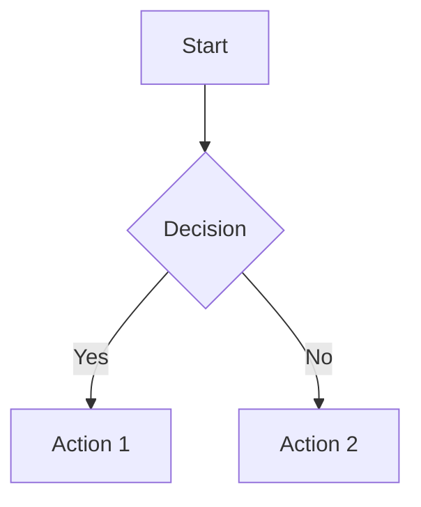

# Skill: dev-to-publisher

Publish Astro blog posts to dev.to with canonical URLs and image support.

## Overview

This MCP skill automates cross-posting blog content from an Astro-based blog to dev.to, maintaining SEO-friendly canonical URLs and preserving post metadata (tags, series, images).

## Tools

- `publish_post`: Creates a new dev.to article from a blog post file (always as draft)
- `edit_post`: Updates an existing dev.to article by ID
- `check_post_exists`: Checks if a post has already been published to dev.to
- `list_recent_posts`: Lists recent blog posts available for publishing

## Workflow

1. User provides path to a blog post MDX file
2. Skill parses frontmatter (title, description, tags, series, heroImage)
3. Converts MDX content to Markdown (removing Astro-specific components, fixing image paths)
4. Prompts for canonical URL pointing to production blog
5. **Creates dev.to post as a DRAFT** (never publishes directly)
6. Returns the dev.to post URL for review
7. User manually publishes from dev.to dashboard after review

## Image Handling Strategy

**IMPORTANT**: The dev.to API only accepts publicly accessible image URLs. Since your Astro blog images are stored locally in `src/assets/blog/`, you need to handle images before publishing:

### Automatic Link Conversion

The skill automatically converts **all** relative paths to absolute URLs:

**Relative links that get converted:**

- Markdown images: `` → ``
- HTML img tags: `` → ``
- **Markdown links: `[text](/blog/...)` → `[text](https://domain/blog/...)`**

**Example:**

```markdown
# Before (in your MDX)
Check out my [previous post](/blog/building-archbot-ai-code-reviewer/) about Archbot.

# After (sent to dev.to)
Check out my [previous post](https://yourblog.com/blog/building-archbot-ai-code-reviewer/) about Archbot.
```

**Note:** Links starting with `http://` or `https://` are left unchanged. Only relative paths (starting with `/`) are converted.

### Mermaid Diagram Handling

**dev.to does NOT render Mermaid diagrams natively.** The skill now **automatically converts** mermaid diagrams to PNG images and includes them in the post.

**What happens automatically:**

1. The skill detects mermaid code blocks in your MDX
2. Generates a PNG image using [mermaid.ink](https://mermaid.ink) API
3. Saves the image to `public/assets/devto/` in your blog repository
4. Replaces the code block with a markdown image reference

**Example:**

```markdown


```

Becomes:
```markdown

```

**Requirements for automatic conversion:**

- Your blog must have a `public/assets/devto/` folder (standard for static site generators like Astro, Eleventy, Next.js)
- Images are cached by MD5 hash - same diagram won't be regenerated
- Generated images must be deployed with your blog for dev.to to access them

**If automatic conversion fails:**
The skill will add a note with instructions to manually:

1. Generate PNG images from your mermaid diagrams (use mermaid.ink, mermaid.live, or mermaid-cli)
2. Save them to `public/assets/devto/`
3. Update your blog's static site config to include the `devto` folder (e.g., Eleventy's `addPassthroughCopy`)
4. Deploy your blog
5. Replace code blocks with image references: ``

## Static Site Generator Configuration

**Important:** For images (including auto-generated mermaid diagrams) to work on dev.to, your blog must properly serve static assets. Different generators have different requirements:

### Eleventy (11ty)

Add to your `.eleventy.js`:

```javascript
eleventyConfig.addPassthroughCopy({ "public/assets/devto": "assets/devto" });
```

### Astro

Files in `public/assets/devto/` are automatically copied to `dist/assets/devto/` during build.

### Next.js

Add to `next.config.js`:

```javascript
module.exports = {
  async rewrites() {
    return [
      {
        source: '/assets/devto/:path*',
        destination: '/assets/devto/:path*',
      },
    ];
  },
};
```

### General Rule

- Assets in `public/` folders are copied as-is to the build output
- The skill saves mermaid images to `public/assets/devto/`
- You must deploy these with your blog before publishing to dev.to
- dev.to will fetch images from `https://yourblog.com/assets/devto/filename.png`

### HTML img Tag Support

The skill now properly handles HTML `` tags (not just markdown ``):

**Before (in your MDX):**

```html

```

**After (sent to dev.to):**

```html

```

**Note:** The skill handles self-closing `` tags correctly and won't strip them when removing Astro components.

### Image URL Options

**Option A - Post-Deployment (Recommended)**

- Deploy blog to production
- Use `https://your-domain.com/assets/blog/image.jpg` as `main_image` and in markdown

**Option B - CDN Upload**

- Upload images to Cloudinary, AWS S3, or Imgur
- Use those public URLs in the dev.to post

### Hero Image Field Mapping

Astro frontmatter:

```yaml
heroImage:
  src: "/assets/blog/my-image.jpg"
  alt: "Description"
```

dev.to API:

```json
{
  "main_image": "https://yourblog.com/assets/blog/my-image.jpg"
}
```

## Dev.to API Details

**Base URL**: `https://dev.to/api`

**Authentication**: `api-key` header with your dev.to API token

**Create Post Endpoint**: `POST /articles`

### Request Schema

```json
{
  "article": {
    "title": "Post Title",
    "body_markdown": "Markdown content",
    "published": false,
    "canonical_url": "https://yourblog.com/blog/post-slug",
    "tags": "tag1, tag2, tag3",
    "series": "series-name",
    "main_image": "https://example.com/image.jpg",
    "description": "Post excerpt"
  }
}
```

**Note**: `published` is always `false` - posts are created as drafts for manual review before publishing.

### Response

- `201 Created` on success
- Returns article object with `id`, `url`, `path`, etc.

## Setup

1. Get your dev.to API key from: <https://dev.to/settings/account>
2. Set environment variable: `DEVTO_API_KEY`
3. Configure your blog's production domain for canonical URLs

## Usage Examples

**Publish a single post (always as draft):**

```
Use the publish_post tool with:
- blog_post_path: "/Users/acastro/Developer/blog-platform-toolsmith/src/content/blog/my-post.mdx"
- canonical_url: "https://toolsmithplatform.com/blog/my-post"
```

**Edit an existing post:**

```
Use the edit_post tool with:
- article_id: 3355629
- blog_post_path: "/Users/acastro/Developer/blog-platform-toolsmith/src/content/blog/my-post.mdx"
- canonical_url: "https://toolsmithplatform.com/blog/my-post"
```

**Check publication status:**

```
Use the check_post_exists tool with:
- canonical_url: "https://toolsmithplatform.com/blog/my-post"
```

**Important: Manual Publishing Required**

After the skill creates a draft post:

1. Visit the returned dev.to URL
2. Review the content, formatting, and images
3. Click "Publish" when ready

The skill never publishes directly - this gives you control to catch any formatting issues before the post goes live.

## Important Notes

1. **MDX to Markdown**: The skill converts MDX to plain Markdown for dev.to compatibility (removes Astro components, converts JSX to HTML)
2. **Image URLs**: Must be publicly accessible (not local file paths). The skill auto-converts relative paths like `/assets/blog/image.png` to `https://yourblog.com/assets/blog/image.png`
3. **HTML img Tags**: Now properly supported - self-closing `` tags are converted to full URLs and not stripped
4. **Mermaid Diagrams**: Automatically converted to PNG images and saved to `public/assets/devto/` (requires deployment before dev.to can access them)
5. **Series**: dev.to series names must match exactly for grouping
6. **Tags**: Maximum 4 tags on dev.to (comma-separated string)
7. **Canonical URL**: Essential for SEO - always points to your original blog
8. **Draft by Default**: Posts are always created as drafts for manual review
9. **Rate Limits**: Respect dev.to API rate limits

## Error Handling

Common issues and solutions:

- **401 Unauthorized**: Invalid or missing API key
- **422 Unprocessable Entity**: Invalid data (check tags format, URL validity)
- **Images not showing**:
  - Ensure your blog is deployed and images return 200 at the full URL
  - Check that `public/assets/devto/` is included in your static site build
  - For Eleventy: verify `addPassthroughCopy` includes `public/assets/devto`
  - For mermaid diagrams: check that `public/assets/devto/` exists and is writable
- **Mermaid diagrams not rendering**: The skill auto-converts them, but you must deploy the generated images with your blog
- **HTML img tags missing**: The skill now preserves self-closing `` tags - if still missing, check they use relative paths starting with `/assets/`

## Troubleshooting Mermaid Conversion

If mermaid diagrams aren't being converted:

1. **Check folder permissions**: Ensure `public/assets/devto/` is writable
2. **Check mermaid.ink availability**: The skill uses mermaid.ink API - if it's down, conversion will fail
3. **Verify after conversion**: The skill logs conversion status to stderr - check for "Generated mermaid image" messages
4. **Manual fallback**: If auto-conversion fails, follow the manual workflow in the Mermaid section above
