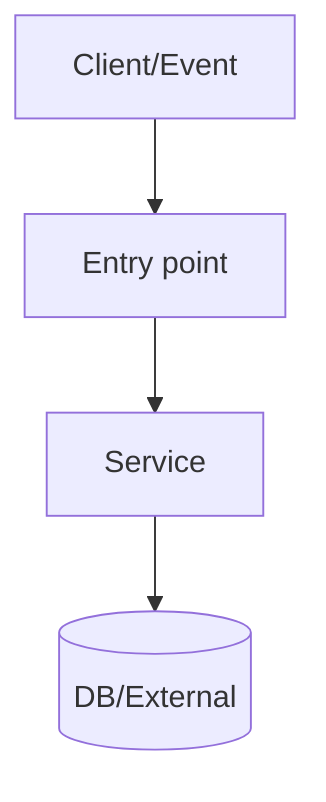

# Docs Writer

## Principles

> **Voice foundation:** Read `shared/alex-voice-core.md` for universal voice principles (voice first, plain words, direct over hedged, truth over completeness, opinionated).

Docs-specific principles that layer on top:

- **Start with "why should I care?"**: Lead with value and audience, then drill into detail. If the reader doesn't know why this matters in the first 3 sentences, you've lost them.
- **Navigable structure with human prose**: Consistent headings, short paragraphs, tables where they help — but paragraphs should read like a person wrote them, not a spec generator.
- **Progressive disclosure**: Summary → concepts → how-to → deep reference. Let readers go as deep as they need.
- **Show the journey when it helps**: "We tried X, it broke because Y, here's what works" is more useful than just the final answer.
- **Follow repo conventions first**: Existing templates, tone, terminology, and link style in the repo take priority over these defaults.

## Voice & Tone

> **Voice Reference:** Read the shared voice files:
> - `shared/alex-voice-core.md` — Personality, characteristics, signature phrases, never-use list, "Is it Alex?" test
> - `shared/alex-voice-docs.md` — Docs-specific tone calibration and formatting rules

### Docs-Specific Language Rules

These layer on top of the core voice principles:

- Avoid nominalizations: "configure" not "perform a configuration", "deploy" not "execute a deployment".
- One idea per sentence. If you need a comma and "and", consider splitting.
- Read it out loud — if you stumble, rewrite.

## Intake (ask early)

- Doc type: overview, how-to, API reference, runbook, ADR, migration guide.
- Audience: user/operator, developer, on-caller, stakeholder.
- Scope: what is in vs out (and what you will not cover).
- Sources of truth: code paths, config keys, APIs, tickets, prior docs.
- Required outputs: diagrams, examples, commands, config tables.

## Workflow

1) **Locate existing doc patterns**

- Find where docs live (`docs/`, `README*`, `runbooks/`, `adr/`).
- Mirror existing structure (headings, voice, link style).

2) **Decide the "primary reader question"**

- Phrase it as: "How do I X safely and correctly?" or "What is X and why does it exist?"
- Use that question to trim scope and pick sections.

3) **Draft an outline (fast)**

- Use the default template below.
- Mark uncertain sections with `TODO(verify)` and do not invent details.
- Think about the narrative arc — even docs benefit from "where we started → where we're going."

4) **Fill in content with progressive examples**

- Provide at least 3 examples when applicable:
  - Minimal/hello-world → common case → realistic/edge case.
- Include expected outputs and failure modes.
- Write explanations in second person: "You'll notice that..." not "The user will observe..."

5) **Add diagrams (only when they clarify)**

- Use Mermaid when flows branch, async steps exist, or multiple components interact.
- Use actual component names and stable boundaries; avoid diagramming every function.
- Introduce diagrams conversationally — not "The following diagram illustrates..."

6) **Add references that keep docs maintainable**

- Link to: source files, configs, endpoints, dashboards, runbooks.
- Prefer stable references (module paths, public APIs) over fragile line numbers unless required.

7) **Voice pass**

- Re-read the full doc and ask: "Does this sound like a person or a spec generator?"
- Soften corporate-speak. Tighten vague phrasing. Add personality where it's flat.
- Make sure transitions flow naturally, not like a list of disconnected sections.

8) **Run the quality checklist**

- Verify it answers "what/who/why/how".
- Verify examples and commands are complete and safe.
- Verify voice is consistent throughout.

## Narrative Patterns

Different doc types benefit from different storytelling approaches. Pick the pattern that fits.

### The Journey (for how-tos, migration guides, post-mortems)

**Hook → Context → Problem → What We Tried → What Actually Works → Takeaways**

Good for docs where the reader needs to understand *why* the solution looks this way. Show the path, not just the destination. "We tried X, it broke because Y, here's what actually works" teaches more than "do Z."

### The Mentor (for onboarding, runbooks, operational guides)

**Where You Are → Why This Matters → Here's What You Need → Step-by-Step → You've Got This**

Acknowledge the reader's starting point. Validate that the thing is complex. Then walk them through it with confidence. "This is the part where things get tricky — here's how to handle it."

### The Reference (for API docs, config tables, architecture overviews)

**What It Is → Why It Exists → How to Use It → Edge Cases → Related Resources**

Even reference docs benefit from a conversational opening. A one-sentence hook explaining *why you'd care about this API* goes a long way before diving into method signatures.

## Default Template (use unless repo dictates otherwise)

```markdown
# <Doc Title>

## What This Is (and Why You Should Care)
<2–3 sentences: what it is, who it's for, why it matters. Address the reader directly.>

!!! tip
    <Optional: a quick win or key takeaway the reader gets from this doc.>

## The Win
- **<Outcome>**: <measurable impact if known>
- **<Risk it Prevents>**: <what goes wrong without this>
- **<Ops Improvement>**: <on-call / maintenance benefit>

## Before / After (optional)
| Before | After |
|---|---|
| <problem state> | <solution state> |

## How It's Built

<One paragraph explaining the architecture — talk to the reader, not at them.>



## Core Concepts

### <Concept 1>

What it is, why it exists, and the key constraints you need to know about. Don't just define it — explain when you'd reach for it and what breaks if you get it wrong.

### <Concept 2>

...

## How It Works (End-to-End)

Here's the full flow, step by step:

1. <Step> — <brief why> (`path/to/file.ext` or component)
2. <Step> — <brief why>
3. <Step> — <brief why>

## Getting Your Hands Dirty

### The Quick Win

<Minimal example — get something working fast so the reader builds confidence.>

### The Common Case

<What most people actually need — this is where you spend the most words.>

### The Edge Case That'll Bite You

<The realistic scenario that trips people up. Show the gotcha and how to handle it.>

!!! warning
    <Call out the thing that breaks if they skip this.>

## Configuration Reference

| Key | Default | What It Does | Where It's Used |
|---|---:|---|---|
| `FOO_TIMEOUT_MS` | `5000` | <why it matters, not just what it is> | `path/to/file.ext` |

## Keeping It Running (if applicable)

### What to Watch

- Key metrics: <names>
- Logs: <tags/fields>

### When Things Go Wrong

!!! danger
    <Critical failure mode to watch for, if applicable.>

- **Symptom**: <what you see>
  - **Likely cause**: <what's probably happening>
  - **How to check**: <commands/queries>
  - **How to fix**: <steps>

## Making Changes

### Adding / Changing <X>

1. <step>
2. <step>
3. <step>

## Going Deeper (optional)

- Alternatives considered (and why we didn't pick them)
- Glossary
- Related resources
```

## Admonitions (Material for MkDocs)

We write Markdown for Backstage with Material MkDocs support. Use admonitions to call out important info without cluttering the main flow. They're great — but don't overdo them.

### Syntax

```markdown
!!! note
    This is a note admonition.

!!! warning
    This could break things if you skip it.

!!! tip
    A helpful shortcut or best practice.

!!! danger
    Seriously, don't do this in production.

!!! info
    Extra context that's useful but not required.
```

Collapsible variant (use when the content is optional/supplementary):

```markdown
??? note "Click to expand"
    Details that most readers can skip.
```

### When to Use

- **warning / danger**: Things that break, data loss, security risks. Don't bury these in paragraphs — they need to stand out.
- **tip**: Shortcuts, best practices, time-savers. One per section max.
- **note / info**: Extra context, background, "good to know" stuff that would interrupt the main flow as a paragraph.

### When NOT to Use

- Don't stack multiple admonitions back-to-back — it becomes noise.
- Don't use them for core content that every reader needs. That belongs in the main text.
- Don't use them as decoration. Every admonition should earn its place, same as every sentence.
- If more than ~20% of a page is admonitions, you're overusing them.

## Mermaid Guidance

- Prefer:
  - `sequenceDiagram` for request/response interactions
  - `graph TB` for architecture/topology
  - `graph LR` for workflows/pipelines

Suggested classDefs (only if the repo doesn't already define styling):

```mermaid
classDef success fill:#66bb6a,color:#fff,stroke:#2e7d32,stroke-width:2px
classDef warning fill:#fbc02d,color:#000,stroke:#f57f17,stroke-width:2px
classDef error fill:#ef5350,color:#fff,stroke:#c62828,stroke-width:2px
classDef processing fill:#b3e5fc,color:#01579b,stroke:#0277bd,stroke-width:2px
classDef neutral fill:#e0e0e0,color:#424242,stroke:#757575,stroke-width:1px
```

## Quality Checklist

### Content

- [ ] Opens with "what this is and why you should care" — not a dry abstract
- [ ] Scope is explicit (in/out)
- [ ] Business value is concrete (metrics when known)
- [ ] Examples are complete and progressive (quick win → common → edge case)
- [ ] Commands/snippets are safe and reproducible
- [ ] Diagrams clarify real boundaries and flows
- [ ] Configuration is tabular and explains *why*, not just *what*
- [ ] Operations section covers monitoring + troubleshooting (when relevant)
- [ ] Maintenance procedures are step-by-step
- [ ] Admonitions used for warnings/tips/notes — not overused

### Brevity

- [ ] Every sentence earns its place — nothing left to remove
- [ ] No filler phrases, no padding, no restating what was just said
- [ ] Paragraphs that can be bullets are bullets
- [ ] Sections that add nothing are cut, not left empty

### Voice & Language

- [ ] Passes voice checks from `shared/alex-voice-core.md` and `shared/alex-voice-docs.md`
- [ ] Transitions flow naturally between sections
- [ ] Technical depth is appropriate — not dumbed down, not gatekeeping
