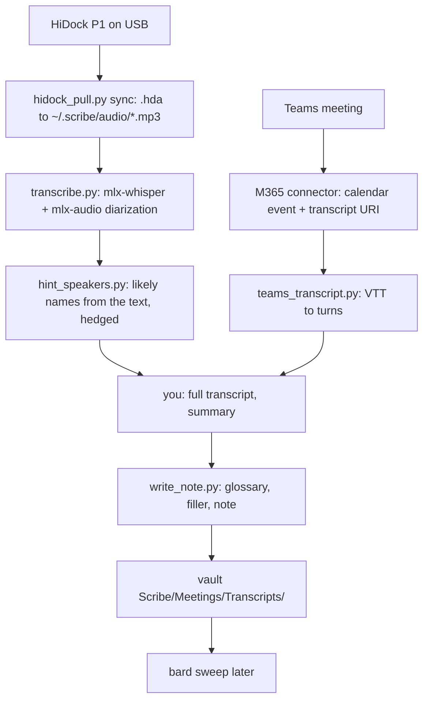

# scribe — meetings → cleaned transcript notes

scribe is the intake step of Alex's knowledge pipeline: **scribe → bard → ea-projects-curator**.
It fetches raw transcripts, cleans them, adds a short summary, and writes one note per meeting
into the vault. It does not distill knowledge (bard does) and does not publish anything
(ea-projects-curator does).



## Paths (verified 2026-09-03)

- Vault root: `/Users/alexandrecastro/Developer/obsidian/Alex`
- Notes: `<vault>/Scribe/Meetings/Transcripts/<YYYY-MM-DD HHMM> <title>.md`
- Glossary: `<vault>/Scribe/Glossary.md` (`- wrong => Right` lines; scribe applies, you may append)
- State: `<vault>/Scribe/.scribe-state.json`
- Local store (outside the vault, never synced): `~/.scribe/audio/` (MP3s from the device,
  deleted after transcription; the device keeps the only copy), `~/.scribe/transcripts/`
  (normalized JSON, kept), `~/.scribe/raw/` (raw M365 payloads)
- Scripts: `~/.agents/skills/scribe/scripts/` — run from that directory with
  `uv run --with pyusb --with mlx-whisper --with mlx-audio python <script>` (uv caches the env; first run ~45 s)

**First run on a new Mac**: `brew install libusb ffmpeg` (pyusb needs libusb; whisper, ffprobe
and the diarizer need ffmpeg), then run `transcribe.py` once with `--allow-download` so the
`mlx-community/whisper-large-v3-turbo` (1.5 GB) and `mlx-community/Nemotron-3-Diarization`
(~200 MB) weights land in the Hugging Face cache; every later run stays offline. The diarizer
download hits a Hugging Face Xet bug; `transcribe.py` sets `HF_HUB_DISABLE_XET=1` for it. On this
Mac both were already present on 2026-09-24.

## Hard constraints (never violate)

- **On-demand only.** No scheduler, no watcher, no autonomous run.
- **Read-only on the device.** `hidock_pull.py` implements only list and download. Never add a
  delete, format, or settings command. HiNotes manages device storage, not scribe.
- **Read-only on Microsoft 365.** Calendar search and transcript read only.
- **Audio and transcripts stay on this Mac.** Local whisper only. Never send audio, transcript
  text, or summaries to Exa, a web tool, or any external service: a call recording is confidential
  even when it sounds like small talk, and Attain is a regulated lender. HiNotes cloud is not a
  source (no API, no export).
- **Nothing is held and nothing is withheld.** Every work recording and every Teams transcript
  becomes a note, in full, including turns about HR, compensation, performance, personal topics,
  and HR cases about named people. No recording is skipped on HR grounds and no note carries a
  `[Segment withheld ...]` marker; trimmed JSON copies are no longer produced. Keep every note
  `confidential: true`. Alex's decision, 2026-09-24, replacing the segment-withholding rule of
  2026-09-08. Notes sync (see **Sync the vault**), so this content is intended to leave this Mac.
- **scribe does not curate.** Every work recording and every Teams transcript becomes a note,
  including standups, 1:1s, and calls that turn out to be personal. Deciding what matters is
  bard's job, not scribe's. The Teams-wins dedup in Source B drops a HiDock copy that carries
  strictly less information (anonymous labels instead of names) than the Teams note of the same meeting; it is
  not a judgment about relevance. The sync date and minimum-duration filters still apply.
- **Write only** inside `<vault>/Scribe/`, `~/.scribe/`, and the state file. Never touch
  `Bard/`, `Evidence/`, `Todo.md`, or any other vault folder. Never edit an existing transcript
  note; re-run with `--force` only when Alex asks for a rewrite.
- **Never invent.** No guessed names, owners, dates, or decisions in the summary: bard and the
  AAB recap build on these notes as the record of what was said, so one invented owner becomes a
  wrong commitment downstream. A garbled proper noun you cannot confirm stays described, not
  named. A transcript that ends mid-sentence gets a footer line saying so.
- **Never `git`, never a server, never commit.** Alex reviews and signs every commit himself.
  `obsidian sync:status vault=Alex` at the end is fine (see **Sync the vault**); `obsidian reload`
  is not, it hangs.

## Modes

Argument decides the mode. With no argument, run both sources for the window since `last_run`.

- `/scribe` — Teams + HiDock, everything new since the state watermark (default 7 days back on
  a first run).
- `/scribe teams [YYYY-MM-DD | YYYY-MM-DD..YYYY-MM-DD]` — Teams only, for a day or a range.
- `/scribe hidock` — HiDock only: sync the device, skip what Teams covers, transcribe the
  rest, write notes. Run Teams first in a combined run so the coverage check sees the notes.
- `/scribe status` — writes nothing. Read `.scribe-state.json`, run `hidock_pull.py list --json`,
  and list the calendar events in the window; report three tables: device recordings not yet in
  state, Teams events not yet in state, and the skipped map. Use it before a big run or when a
  note seems missing.

Teams needs the Microsoft 365 connector, so it works in Claude Code only. HiDock works in
Claude Code and Pi.

## Source routing

- **Teams intake:** for `/scribe teams` or the Teams part of `/scribe`, read
  [Source A: Microsoft Teams](references/teams.md) before fetching transcripts.
- **HiDock intake:** for `/scribe hidock` or the HiDock part of `/scribe`, read
  [Source B: HiDock P1](references/hidock.md) before accessing the device.
- **Combined run:** finish Teams notes through **Summary and write** first. Then
  process HiDock so the coverage check sees the Teams notes.
- **Status:** read both references, but use only Teams steps 1–2 for calendar
  inventory and HiDock step 1 with `list --json` for device inventory. Report the
  three tables in **Modes** and stop. Do not fetch transcripts, sync/download audio,
  transcribe, write summaries/notes, or update state.

Run all shell commands from `~/.agents/skills/scribe/scripts/`, not from the
reference directory. HiDock-only in Pi has no M365 connector: use the no-calendar
fallback in Source B; do not assume Teams coverage.

### Teams-first dedupe

**Teams wins.** Before transcribing, match the recording to the calendar:
`outlook_calendar_search` with `query: "*"` over start −10 min to start +10 min. Skip the
recording with reason `teams-covers` ONLY when a scribe Teams note already exists for that slot
and the match is unambiguous (one event, same start within 10 min, similar length). Teams has
speaker names; the HiDock copy carries only anonymous labels, so it adds nothing then. In every other case,
including concurrent meetings, a Teams note with almost no cues, or Source A not yet run, write
the HiDock note; a duplicate is bard's problem, a missing meeting is not recoverable.
`meetingTranscriptUrl` on the event is NOT proof of a transcript: every Teams meeting carries
it. Expect `no-transcript` for most standups and 1:1s and `FORBIDDEN 3003` for meetings
organized by someone whose transcript you may not look up; both mean the HiDock copy is the
record. A recording whose window overlaps two calendar events matches neither: write the
HiDock note and let the summary say which meeting it turned out to be.

## Source A — Microsoft Teams

Use the Teams intake route above. The source mechanics end at **Summary and write**.

## Source B — HiDock P1

Use the HiDock intake route above. Apply **Teams-first dedupe** before any
transcription, including a batch run. The source mechanics end at **Summary and write**.

## Summary and write (both sources)

1. **Hint the speaker labels, then read the normalized JSON in full.** For a HiDock recording
   run `uv run python hint_speakers.py ~/.scribe/transcripts/<id>.json --attendees "A, B, C"`
   first, using the calendar attendees: it writes `speaker 1 (likely Alexandre Castro)` only
   where the transcript gives explicit evidence, cites that quote in provenance, and leaves
   every other label anonymous. Then read `turns[].text` in full. Do not summarize from grep
   hits.
2. **Keep the full meeting** (see **Hard constraints**): nothing is withheld. Summarize
   every topic. Apply the normal transcript cleaning below.
3. **Write the summary file** to `~/.scribe/transcripts/<id>.summary.md`. Voice: neutral
   reference, terse, factual, like a bard note. Shape:

   ```markdown
   ## Summary
   One-sentence description first (it becomes the frontmatter `description`).
   3-8 bullets: what was discussed, in order, outcome-first. Name people only when the
   transcript names them. Unclear proper noun → describe it, do not guess.

   ## Decisions
   Only decisions someone stated as decided. Empty section → omit it.

   ## Actions
   `Owner → action (due if stated)`. Only explicit commitments. Empty → omit.
   ```

   HiDock turns carry speaker labels (`speaker 0`, `speaker 1`, ...). A label reads
   `speaker 1 (likely Alexandre Castro)` only when `hint_speakers.py` found explicit textual
   evidence and the name is an attendee; otherwise write "speaker 2 asked ..." instead of
   "the caller" / "the other party". Never label a voice from tone alone and never invent a
   name: voiceprint naming was evaluated and rejected, so do not re-propose it (see
   `.scratch/scribe-diarization/phase2-decision.md`).
4. **Write the note**:

   ```bash
   uv run python write_note.py ~/.scribe/transcripts/<id>.json \
     --vault /Users/alexandrecastro/Developer/obsidian/Alex \
     --summary-file ~/.scribe/transcripts/<id>.summary.md \
     --glossary /Users/alexandrecastro/Developer/obsidian/Alex/Scribe/Glossary.md \
     [--title "..."] [--attendees "A,B"] [--tags aab,forum]
   ```

   The script applies the glossary (case-insensitive, whole words), drops filler words, merges
   same-speaker turns, and writes frontmatter (`type: transcript`, `source`, `date`, `speakers`,
   `provenance`, `confidential: true`). It refuses to overwrite without `--force`. stdout is the
   note path.
5. **Glossary upkeep**: when you confirmed a garble → real name during the summary, append a
   `- wrong => Right` line to `<vault>/Scribe/Glossary.md`. Only confirmed ones.
6. **State**: add the item to `.scribe-state.json` (`teams.<eventId>` or `hidock.<deviceFile>` →
   note path, plus `skipped.<id>` → reason). When Alex asks to recover a previously skipped
   recording, use its existing local JSON even if it is older than the watermark. Remove its
   old `skipped` entry only after the note is successfully written. Do not backfill unrelated
   historical skips unless requested. Set `last_run` to now (ISO) at the end.
7. **Sync the vault**: Obsidian watches the filesystem, so new files show up on their own. Run
   only `obsidian sync:status vault=Alex` (expect `status: synced`). Do NOT run
   `obsidian reload`: on 2026-09-03 it printed `Reloading...` and never returned. Wrap the CLI in
   a 20 s timeout (macOS has no `timeout` binary; use `python3 -c` with `subprocess.run(...,
   timeout=20)`), and report "Obsidian not running" if it times out.
8. **Report** in one table: source, meeting, date, duration, speakers, note path or skip reason.
   Reasons you assign: `teams-covers`, `no-transcript`. Reasons the sync script prints
   (`already present`, `already transcribed`, `shorter than --min-seconds`, `older than --since`):
   quote them as printed.
   Then one line for glossary lines added and one for the vault sync status.

## State file shape

```json
{
  "last_run": "2026-09-03T16:40:12Z",
  "teams": { "<eventId>": "<vault>/Scribe/Meetings/Transcripts/2026-09-02 1500 Architecture Advisory Board.md" },
  "hidock": { "2026Sep02-113150-Rec13.hda": "<vault>/Scribe/Meetings/Transcripts/2026-09-02 1131 EKSKubernetesBackstage Discussion.md" },
  "skipped": { "2026Sep02-150056-Rec17.hda": "teams-covers: 2026-09-02 1500 Architecture Advisory Board" }
}
```

Keys are the Teams event id and the device filename, so a re-run recognises both sources without
re-fetching. `skipped` values start with the reason, then a short why.

## Note shape (what bard and ea-projects-curator read)

```markdown
---
type: transcript
title: "Architecture Advisory Board"
description: "One-sentence summary."
date: 2026-09-02T20:00:56Z
end: 2026-09-02T21:25:40Z
duration_min: 85
source: teams            # or hidock
speakers: ["Ana Silva", "Bruno Costa"]   # who actually spoke; ["speaker 0", ...] for hidock
attendees: ["Ana Silva", "Bruno Costa", "Carla Reyes"]
tags: ["scribe", "meeting", "source/teams"]
confidential: true
provenance:
  teams_event_id: "..."
  transcript_uri: "..."
  cue_count: 729
cleaned: true
glossary_replacements: 3
scribe_schema: scribe.transcript/1
---

# Architecture Advisory Board

## Summary
...

## Transcript

**[00:00:12] Ana Silva:** ...        # teams
**[00:00:12] speaker 0:** ...        # hidock (diarized; labels are arrival order, not names)
**[00:00:12] speaker 1 (likely Alexandre Castro):** ...   # hidock with text evidence + attendee name
**[00:00:12]** ...                   # hidock turn with no diarization overlap
```

## Known limits

- An inline Teams payload reaches disk only through the model writing it out, so the raw file is
  a copy, not a download. The cue count on stderr from `teams_transcript.py` is the only check;
  compare it against the payload if a note looks thin.

- HiDock diarization labels voices, not names: up to 8 speakers, anonymous, arrival order.
  Substantive turns separate reliably (88-96% vs Teams ground truth, measured 2026-09-24); short
  backchannels ("Yeah") often land on the dominant speaker's label.
- Speaker hints are text evidence only, never biometric: a hint needs a self-introduction
  ("I'm Alex") or an addressed name ("Thanks, Greg.") that matches an attendee, so most calls
  stay anonymous. Conflicting evidence gives nothing — on 2026-09-24 one label was addressed as
  both "Brock" and "Greg" and correctly got no name. A self-introduction proves the person is
  inside that label, not that the whole label is them.
- The diarizer sometimes collapses a call to one label: a 63-minute, three-person call on
  2026-09-24 came back with a single voice and 5 labelled turns. A single-label result on a
  known multi-person call is a miss, not a quiet meeting.
- Re-transcribing does not reliably reproduce the text: of 15 recordings re-run on 2026-09-24,
  11 came back byte-identical and 4 differed by 1-115 words (mlx-whisper's temperature fallback
  plus the unpinned `uv run --with` versions). Check the text before overwriting an existing note.
- Diarization failure degrades to the old unlabeled note and says why on stderr; provenance
  records `diarization_status` (ok / skipped / failed).
- Whisper still garbles names. The glossary fixes the known ones; the summary step catches the
  rest only when you check.
- Teams path needs Claude Code (M365 connector). In Pi, run `/scribe hidock` only.
- The state file is the only dedupe. Deleting it re-processes everything; `write_note.py` then
  refuses to overwrite existing notes, which is the safety net.

## Tests

```bash
cd ~/.agents/skills && uv run --with pytest --with pyusb pytest scribe/tests -q
```

69 tests: protocol parsing on a real captured device listing, the silent-device retry and exit 4,
Teams VTT parsing, cleaning, note layout, transcription grouping, diarization alignment and
degradation, and one real-device listing that auto-skips when the P1 is not plugged in.
