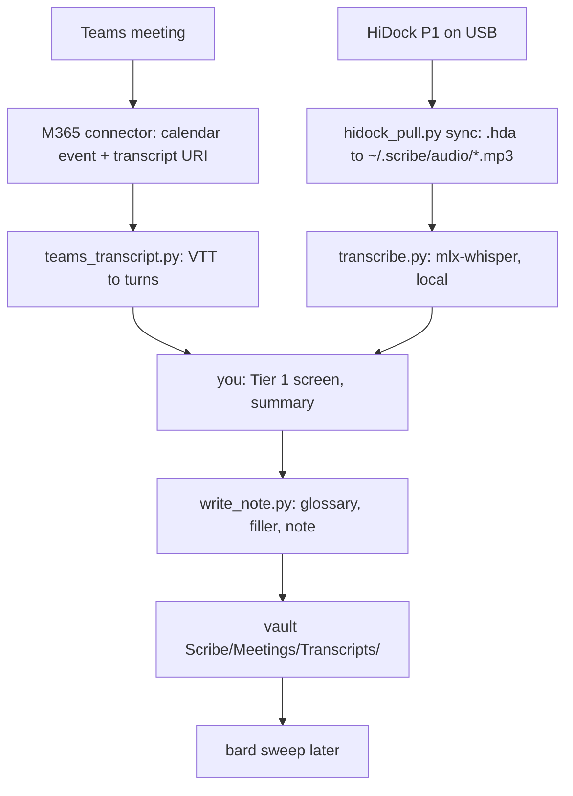

# scribe — meetings → cleaned transcript notes

scribe is the intake step of Alex's knowledge pipeline: **scribe → bard → ea-projects-curator**.
It fetches raw transcripts, cleans them, adds a short summary, and writes one note per meeting
into the vault. It does not distill knowledge (bard does) and does not publish anything
(ea-projects-curator does).



## Paths (verified 2026-09-03)

- Vault root: `/Users/alexandrecastro/Developer/obsidian/Alex`
- Notes: `<vault>/Scribe/Meetings/Transcripts/<YYYY-MM-DD HHMM> <title>.md`
- Glossary: `<vault>/Scribe/Glossary.md` (`- wrong => Right` lines; scribe applies, you may append)
- State: `<vault>/Scribe/.scribe-state.json`
- Local store (outside the vault, never synced): `~/.scribe/audio/` (MP3s from the device,
  deleted after transcription; the device keeps the only copy), `~/.scribe/transcripts/`
  (normalized JSON, kept), `~/.scribe/raw/` (raw M365 payloads)
- Scripts: `~/.agents/skills/scribe/scripts/` — run from that directory with
  `uv run --with pyusb --with mlx-whisper python <script>` (uv caches the env; first run ~45 s)

**First run on a new Mac**: `brew install libusb ffmpeg` (pyusb needs libusb; whisper and ffprobe
need ffmpeg), then run `transcribe.py` once with `--allow-download` so the
`mlx-community/whisper-large-v3-turbo` weights (1.5 GB) land in the Hugging Face cache; every later
run stays offline. On this Mac all three were already present on 2026-09-03.

## Hard constraints (never violate)

- **On-demand only.** No scheduler, no watcher, no autonomous run.
- **Read-only on the device.** `hidock_pull.py` implements only list and download. Never add a
  delete, format, or settings command. HiNotes manages device storage, not scribe.
- **Read-only on Microsoft 365.** Calendar search and transcript read only.
- **Audio and transcripts stay on this Mac.** Local whisper only. Never send audio, transcript
  text, or summaries to Exa, a web tool, or any external service: a call recording is confidential
  even when it sounds like small talk, and Attain is a regulated lender. HiNotes cloud is not a
  source (no API, no export).
- **Tier 1 screen before every write.** If a transcript contains personal data about customers,
  applicants, borrowers, or other non-employees (names tied to accounts, SSN/SIN, card or bank
  numbers, government IDs, birth dates, home addresses, personal phones, health data), or HR
  case, compensation, or performance data about anyone: do NOT write the note. Record the item
  in state under `skipped` with reason `tier1` and tell Alex. Employee names, titles, and teams
  are fine (Tier 2). Only an admin edit of the Attain policy unlocks Tier 1, not an approval in
  chat.
- **scribe does not curate.** Every work recording and every Teams transcript becomes a note,
  including standups, 1:1s, and calls that turn out to be personal. Deciding what matters is
  bard's job, not scribe's (Alex, 2026-09-03). Two exceptions only: the Tier 1 rule above, which
  is Attain policy, and the Teams-wins dedup in Source B, which drops a HiDock copy that carries
  strictly less information (no speaker names) than the Teams note of the same meeting. Neither
  is a judgment about relevance.
- **Write only** inside `<vault>/Scribe/`, `~/.scribe/`, and the state file. Never touch
  `Bard/`, `Evidence/`, `Todo.md`, or any other vault folder. Never edit an existing transcript
  note; re-run with `--force` only when Alex asks for a rewrite.
- **Never invent.** No guessed names, owners, dates, or decisions in the summary: bard and the
  AAB recap build on these notes as the record of what was said, so one invented owner becomes a
  wrong commitment downstream. A garbled proper noun you cannot confirm stays described, not
  named. A transcript that ends mid-sentence gets a footer line saying so.
- **Never `git`, never a server, never commit.** Alex reviews and signs every commit himself.
  `obsidian sync:status vault=Alex` at the end is fine (see **Sync the vault**); `obsidian reload`
  is not, it hangs.

## Modes

Argument decides the mode. With no argument, run both sources for the window since `last_run`.

- `/scribe` — Teams + HiDock, everything new since the state watermark (default 7 days back on
  a first run).
- `/scribe teams [YYYY-MM-DD | YYYY-MM-DD..YYYY-MM-DD]` — Teams only, for a day or a range.
- `/scribe hidock` — HiDock only: sync the device, skip what Teams covers, transcribe the
  rest, write notes. Run Teams first in a combined run so the coverage check sees the notes.
- `/scribe status` — writes nothing. Read `.scribe-state.json`, run `hidock_pull.py list --json`,
  and list the calendar events in the window; report three tables: device recordings not yet in
  state, Teams events not yet in state, and the skipped map. Use it before a big run or when a
  note seems missing.

Teams needs the Microsoft 365 connector, so it works in Claude Code only. HiDock works in
Claude Code and Pi.

## Source A — Microsoft Teams

Verified end to end by ea-projects-curator on 2026-08-28; the mechanics moved here unchanged.

1. Load the tools:
   `ToolSearch("select:mcp__claude_ai_Microsoft_365__outlook_calendar_search,mcp__claude_ai_Microsoft_365__read_resource")`.
2. Find candidate meetings: `outlook_calendar_search` with `query: "*"` and a
   `afterDateTime`/`beforeDateTime` window covering the requested days. Search by the **real
   calendar subject** (the AAB forum is `Architecture Advisory Board`, not "Architecture Review
   Forum"). The search returns 25 events per page; when the result ends with `nextOffset`,
   call again with `offset` until it is gone (two working days already exceed one page). Skip
   events already present in state under `teams`.
3. For each event, `read_resource` on `calendar:///events/{eventId}` to get its
   `meetingTranscriptUrl`. Every Teams meeting carries one, so its presence proves nothing.
4. `read_resource` on that URL. It looks like
   `meeting-transcript:///events/{token}?start={iso}&end={iso}`. Recurring occurrences carry
   `start`/`end`, which pin the series to one occurrence; keep them. **One-off meetings carry no
   window**: append `?start=<event start>&end=<event end>` yourself, converted to UTC
   (`2026-09-04T09:00 Central` → `start=2026-09-04T14%3A00%3A00.000Z`). Without a window the read
   returns "the most recent transcripts of the series, capped", which is the wrong occurrence
   for a series and works only by luck for a one-off.
   `NOT_FOUND transcripts_empty`, `NOT_FOUND 3004`, and `FORBIDDEN 3003` all mean no transcript
   for that occurrence: record `no-transcript` for that event. **Check every occurrence, every
   run.** A standup that had no transcript yesterday is not evidence about today; the read costs
   one call, and inferring from history was a mistake made on 2026-09-04.
5. The payload comes back two ways. Above roughly 50 KB (an 85-minute AAB is ~114 KB) the
   harness saves it to a file and gives you the path: do not `Read` it (one giant line), copy it
   to `~/.scribe/raw/<eventId>.json`. Below that it arrives **inline** in the tool result, and
   the only way to disk is to write it yourself. Write the `content` (WEBVTT) to
   `~/.scribe/raw/<eventId>.vtt` with the Write tool **exactly as received**: every cue, every
   "Yeah.", every garble. Do not drop filler, do not fix names inline; the cleaner drops filler
   and the glossary fixes names, and the raw file is the record that lets anyone check the note.
   Then wrap it into the payload shape (`{"meeting": {...}, "transcripts": [{"createdDateTime",
   "endDateTime", "content"}]}`) with a short Python snippet. Pass the **real** URI, with the
   window, as `--transcript-uri`; it lands in provenance, and a placeholder there is a false
   record. Then:

   ```bash
   cd ~/.agents/skills/scribe/scripts
   uv run python teams_transcript.py ~/.scribe/raw/<eventId>.json \
     -o ~/.scribe/transcripts/<eventId>.json --event-id <eventId> --transcript-uri "<url>"
   ```

   stderr prints the occurrence window, cue and turn counts, and the speaker list. Confirm the
   window matches the event you meant. `meeting.startDateTime` is the SERIES start; the script
   ignores it on purpose. Two transcripts in one payload means you dropped the window params:
   the script refuses and you re-fetch. The note's `date`/`end` and its filename come from the
   `?start=&end=` calendar slot in the URI (so the AAB note is `... 1500 ...`, not `1459`); the
   transcript's own first/last cue times land in provenance.
6. Continue at **Summary, screen, write**.

## Source B — HiDock P1

Device facts (verified 2026-09-03): HiDock P1, USB 0x10D6:0xB00E, vendor protocol over bulk
endpoints, not a USB drive. Recordings are `YYYYMonDD-HHMMSS-RecNN.hda`, which are plain MP3
(mono, 48 kHz, 96 kbps). The filename timestamp is the device clock in Central time. The device
keeps every recording until HiNotes removes it; scribe never deletes.

1. Device check and inventory:

   ```bash
   cd ~/.agents/skills/scribe/scripts
   uv run --with pyusb python hidock_pull.py list
   ```

   Exit 2 = not plugged in. Exit 3 = USB claim error: another process holds the device. Tell
   Alex to close the HiNotes tab in Edge and any other scribe/pytest run, then retry once.
   Exit 4 = the device is connected but never answered the list request, even after the script's
   own retry: unplug, replug, retry. `No recordings found.` (exit 0) means the device answered
   with an empty list; if state shows recordings from yesterday, that is still suspicious, since
   HiNotes is the only thing that deletes. Run `list` again before believing it. On 2026-09-04
   a silent first request was reported as an empty device and nearly cost a day of calls.
2. Pull and transcribe in one go:

   ```bash
   ./hidock_batch.sh <YYYY-MM-DD of watermark>
   ```

   It runs `hidock_pull.py sync` (skips files already present with the same size, already
   transcribed in `--done-dir`, shorter than 120 s, or older than the date), then
   `transcribe.py` on each new MP3, and deletes the MP3 once its JSON exists. One JSON line per
   file from the sync (`downloaded` or `skipped` + reason), then one `=== transcribing <stem> ===`
   per file on stderr. ~7 MB/s download; a 40-minute call downloads in a few seconds. Every
   download is size- and magic-byte-checked. `--done-dir` is what stops re-downloads once the
   local audio is gone: a recording is done when `<stem>.json` exists there.
3. If you need the steps apart (one file, a re-run), the pieces are:

   ```bash
   uv run --with pyusb python hidock_pull.py sync -o ~/.scribe/audio \
     --done-dir ~/.scribe/transcripts --since <YYYY-MM-DD> --min-seconds 120
   uv run --with mlx-whisper python transcribe.py ~/.scribe/audio/<stem>.mp3 \
     -o ~/.scribe/transcripts/<stem>.json
   ```

   Runs offline with the cached `mlx-community/whisper-large-v3-turbo` (~95× realtime on the
   M5 Max, so a 40-minute call takes ~30 s; 18 recordings, 8.7 hours of audio, took 6 minutes on
   2026-09-03). Start time comes from the filename. Whisper has no speaker labels: turns are
   paragraphs split on 2 s pauses, `speaker` is null. The script drops the repeated-line
   hallucinations whisper produces on silence. **Then delete the MP3** (`rm ~/.scribe/audio/<stem>.mp3`)
   once the JSON exists: Alex wants no local audio copies, the device keeps the recording. The
   JSON carries the file's sha256 in provenance, so the source stays verifiable.
4. **Teams wins.** Before transcribing, match the recording to the calendar:
   `outlook_calendar_search` with `query: "*"` over start −10 min to start +10 min. Skip the
   recording with reason `teams-covers` ONLY when a scribe Teams note already exists for that slot
   and the match is unambiguous (one event, same start within 10 min, similar length). Teams has
   speaker names; whisper does not, so the HiDock copy adds nothing then. In every other case,
   including concurrent meetings, a Teams note with almost no cues, or Source A not yet run, write
   the HiDock note; a duplicate is bard's problem, a missing meeting is not recoverable.
   `meetingTranscriptUrl` on the event is NOT proof of a transcript: every Teams meeting carries
   it. Expect `no-transcript` for most standups and 1:1s and `FORBIDDEN 3003` for meetings
   organized by someone whose transcript you may not look up; both mean the HiDock copy is the
   record. A recording whose window overlaps two calendar events matches neither: write the
   HiDock note and let the summary say which meeting it turned out to be.
5. Title and attendees for what is left: one calendar match → its subject as `--title` and its
   attendee names as `--attendees`. No match, or Pi (no M365): read the transcript and pick a
   short factual title from content (`Call about <topic>`); if the content does not say what it
   is, `Untitled call`.
6. Continue at **Summary, screen, write**.

## Summary, screen, write (both sources)

1. **Read the normalized JSON in full** (`turns[].text`). Do not summarize from grep hits.
2. **Tier 1 screen** per the hard constraint. If it trips: skip, record, report. Stop here for
   this item.
3. **Write the summary file** to `~/.scribe/transcripts/<id>.summary.md`. Voice: neutral
   reference, terse, factual, like a bard note. Shape:

   ```markdown
   ## Summary
   One-sentence description first (it becomes the frontmatter `description`).
   3-8 bullets: what was discussed, in order, outcome-first. Name people only when the
   transcript names them. Unclear proper noun → describe it, do not guess.

   ## Decisions
   Only decisions someone stated as decided. Empty section → omit it.

   ## Actions
   `Owner → action (due if stated)`. Only explicit commitments. Empty → omit.
   ```

   HiDock notes have no speaker labels: write "the caller" / "the other party" unless a name is
   spoken. Never label a voice as Alex from tone alone.
4. **Write the note**:

   ```bash
   uv run python write_note.py ~/.scribe/transcripts/<id>.json \
     --vault /Users/alexandrecastro/Developer/obsidian/Alex \
     --summary-file ~/.scribe/transcripts/<id>.summary.md \
     --glossary /Users/alexandrecastro/Developer/obsidian/Alex/Scribe/Glossary.md \
     [--title "..."] [--attendees "A,B"] [--tags aab,forum]
   ```

   The script applies the glossary (case-insensitive, whole words), drops filler words, merges
   same-speaker turns, and writes frontmatter (`type: transcript`, `source`, `date`, `speakers`,
   `provenance`, `confidential: true`). It refuses to overwrite without `--force`. stdout is the
   note path.
5. **Glossary upkeep**: when you confirmed a garble → real name during the summary, append a
   `- wrong => Right` line to `<vault>/Scribe/Glossary.md`. Only confirmed ones.
6. **State**: add the item to `.scribe-state.json` (`teams.<eventId>` or `hidock.<deviceFile>` →
   note path, plus `skipped.<id>` → reason). Set `last_run` to now (ISO) at the end.
7. **Sync the vault**: Obsidian watches the filesystem, so new files show up on their own. Run
   only `obsidian sync:status vault=Alex` (expect `status: synced`). Do NOT run
   `obsidian reload`: on 2026-09-03 it printed `Reloading...` and never returned. Wrap the CLI in
   a 20 s timeout (macOS has no `timeout` binary; use `python3 -c` with `subprocess.run(...,
   timeout=20)`), and report "Obsidian not running" if it times out.
8. **Report** in one table: source, meeting, date, duration, speakers, note path or skip reason.
   Reasons you assign: `teams-covers`, `tier1`, `no-transcript`. Reasons the sync script prints
   (`already present`, `already transcribed`, `shorter than --min-seconds`, `older than --since`):
   quote them as printed.
   Then one line for glossary lines added and one for the vault sync status.

## State file shape

```json
{
  "last_run": "2026-09-03T16:40:12Z",
  "teams": { "<eventId>": "<vault>/Scribe/Meetings/Transcripts/2026-09-02 1500 Architecture Advisory Board.md" },
  "hidock": { "2026Sep02-113150-Rec13.hda": "<vault>/Scribe/Meetings/Transcripts/2026-09-02 1131 EKSKubernetesBackstage Discussion.md" },
  "skipped": { "2026Sep02-150056-Rec17.hda": "teams-covers: 2026-09-02 1500 Architecture Advisory Board" }
}
```

Keys are the Teams event id and the device filename, so a re-run recognises both sources without
re-fetching. `skipped` values start with the reason, then a short why.

## Note shape (what bard and ea-projects-curator read)

```markdown
---
type: transcript
title: "Architecture Advisory Board"
description: "One-sentence summary."
date: 2026-09-02T20:00:56Z
end: 2026-09-02T21:25:40Z
duration_min: 85
source: teams            # or hidock
speakers: ["Ana Silva", "Bruno Costa"]   # who actually spoke; [] for hidock
attendees: ["Ana Silva", "Bruno Costa", "Carla Reyes"]
tags: ["scribe", "meeting", "source/teams"]
confidential: true
provenance:
  teams_event_id: "..."
  transcript_uri: "..."
  cue_count: 729
cleaned: true
glossary_replacements: 3
scribe_schema: scribe.transcript/1
---

# Architecture Advisory Board

## Summary
...

## Transcript

**[00:00:12] Ana Silva:** ...        # teams
**[00:00:12]** ...                   # hidock (no speaker labels)
```

## Known limits

- An inline Teams payload reaches disk only through the model writing it out, so the raw file is
  a copy, not a download. The cue count on stderr from `teams_transcript.py` is the only check;
  compare it against the payload if a note looks thin.

- No speaker diarization on HiDock audio. Follow-up candidate: pyannote or a channel split if a
  future firmware records stereo.
- Whisper still garbles names. The glossary fixes the known ones; the summary step catches the
  rest only when you check.
- Teams path needs Claude Code (M365 connector). In Pi, run `/scribe hidock` only.
- The state file is the only dedupe. Deleting it re-processes everything; `write_note.py` then
  refuses to overwrite existing notes, which is the safety net.

## Tests

```bash
cd ~/.agents/skills && uv run --with pytest --with pyusb pytest scribe/tests -q
```

59 tests: protocol parsing on a real captured device listing, the silent-device retry and exit 4,
Teams VTT parsing, cleaning, note layout, transcription grouping, and one real-device listing
that auto-skips when the P1 is not plugged in.
