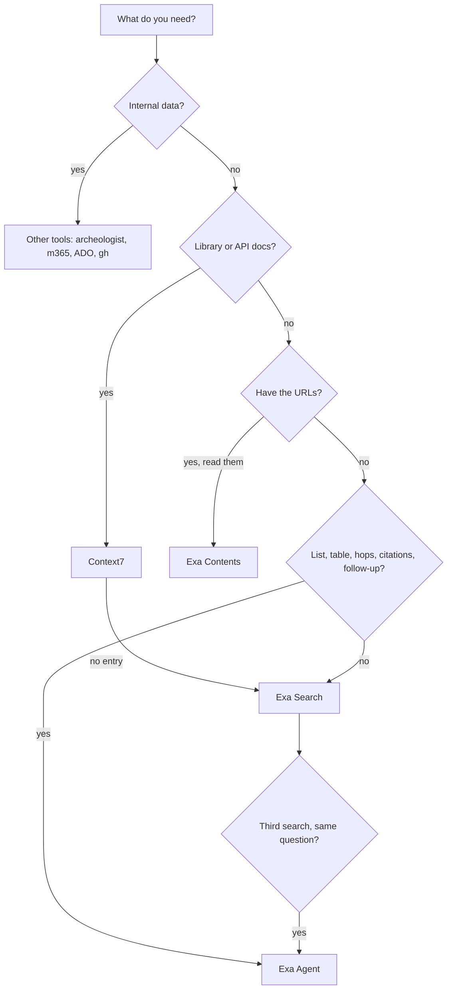

# Search

One skill for looking things up on the public web. Walk the tree below to pick the tool, then load only that tool's reference.

**Public data only.** Everything you send to Context7 or Exa (a query, a URL, a row, a schema) leaves the company. Do not send internal URLs (SharePoint, Azure DevOps, private GitHub, internal hosts), names or details of customers or employees, account or loan numbers, secrets, or anything you read from an Attain system. Internal questions go to `archeologist`, `m365`, the Azure DevOps tools, or `gh` instead. If the request mixes the two, search only the public part, and say what you kept back. Why: Attain is a regulated lender, and an internal URL often carries IDs even when the page itself cannot be reached.

## Pick the tool



Walk it in order. The first match wins.

1. **Docs for a library, framework, SDK, CLI, or cloud service?** Use [Context7](references/context7.md). Its snippets are versioned; the web is full of old answers. If Context7 has no entry for it, or the question is about the library rather than its API (which library to pick, a release date, a deprecation notice), go to Exa Search.
2. **You already have the URLs and need their content?** Use [Exa Contents](references/exa-contents.md).
3. **Is the answer a list, a table, or several hops, or does it need a citation per fact, or is it a follow-up?** Use [Exa Agent](references/exa-agent.md). Any one of these is enough:
   - The answer is a **list** of things that match criteria: "find companies that...", "which vendors...", "all the papers on...".
   - The answer is a **table**: several fields per item, or rows the user gave you to fill in ("add the CEO and funding for each of these").
   - It needs **more than one hop**: find X, then find Y about each X.
   - Each fact needs **its own citation**, or the output must match a schema.
   - It is a **follow-up** on earlier research: "find ten more", "now add their pricing". Continue the earlier run with `previousRunId`. If that is rejected (teams with Zero Data Retention cannot use it), start a new run and pass the earlier results in `input.exclusion` or `input.data`.
   - You would need to **open more than about three pages** to answer well.
4. **Otherwise**, use [Exa Search](references/exa-search.md): a fact, a page, recent news, or one synthesized answer. Use `type: "deep"` when that one answer needs several sources. The line between the two: `deep` search returns one answer in prose; Agent returns one record per item, with fields and citations you can check.
5. **Escalate.** If you are about to run a third Exa Search for the same question, stop and start an Agent run with what you learned. A third search means the job has more than one step.

### Why Agent is the default for research, not the last resort

A manual loop of searches and page reads spends far more model tokens and time than an Agent run, and it returns prose with no per-field citations. Agent returns structured output with citations, and a confidence where it has one.

What it costs (from [exa-agent.md](references/exa-agent.md), last updated 2026-10-01; read `costDollars` after each run for the real number):

- Research on one entity uses a fixed effort at a flat price: `low` $0.025, `medium` $0.10, up to `xhigh` $1.00.
- Lists and any task whose size you cannot predict use `auto`, which is metered with a default cap of $5. Set `budget.maxCostDollars` on purpose, and put `maxItems` on arrays in the schema.

`completed` does not mean correct. Check `stopReason` (`budget_reached` also ends as `completed`) and drop records with null fields before you use the output. Use Exa Search for one call, not for a loop.

Do not use Agent for a single fact, one known page, library docs, or a call where the answer is needed in seconds. A run is asynchronous and takes longer than one search.

## CLI first, MCP as the fallback

Use the CLI path in each reference first: `npx --yes ctx7@latest` for Context7, `curl` for Exa. Fall back to the Context7 or Exa MCP tools only when the CLI fails or the API cannot be reached. Pi has no MCP tools, so there the fallback is its `web_search`. Do not use the built-in web search or fetch tools next to Exa by default; use them last.

Why: Alex finds the Exa API more reliable, with better search and research features, and the CLI path is the same in Claude Code, OpenCode, and Pi. The MCP tools stay as the fallback because the corporate network stack (Cisco Umbrella, Secure Access) can block raw `curl`. If a call fails with a certificate, proxy, or blocked-site error, suspect that stack before you debug the request.

## Exa authentication

Every Exa call needs the header `x-api-key: $EXA_API_KEY`. Use `EXA_API_KEY` from the environment first, then `~/.config/exa/key`. Get a key at https://dashboard.exa.ai/api-keys.

Shell variables do not survive between tool calls. When the key comes from the file, put this at the top of the same call as the request:

```bash
set -euo pipefail

if [[ -z "${EXA_API_KEY:-}" && -r "$HOME/.config/exa/key" ]]; then
  IFS= read -r EXA_API_KEY < "$HOME/.config/exa/key" || [[ -n "$EXA_API_KEY" ]]
fi

if [[ -z "${EXA_API_KEY:-}" ]]; then
  printf '%s\n' 'Exa API key not found. Set EXA_API_KEY or create ~/.config/exa/key.' >&2
  exit 1
fi
```

Never print the key, and never use `set -x`: it expands the `curl` header into the output.

## Report what you found

- Answer from the source, not from memory. Cite the URL or the Context7 library ID for each fact that matters.
- When the sources disagree or are old, say so and give the date.
- If a lookup fails (quota, blocked network, no result), tell the user which tool failed and why. If you then answer from training data, say that it may be out of date.
- Do not put secrets, credentials, or internal data in a query. Queries leave the company.
