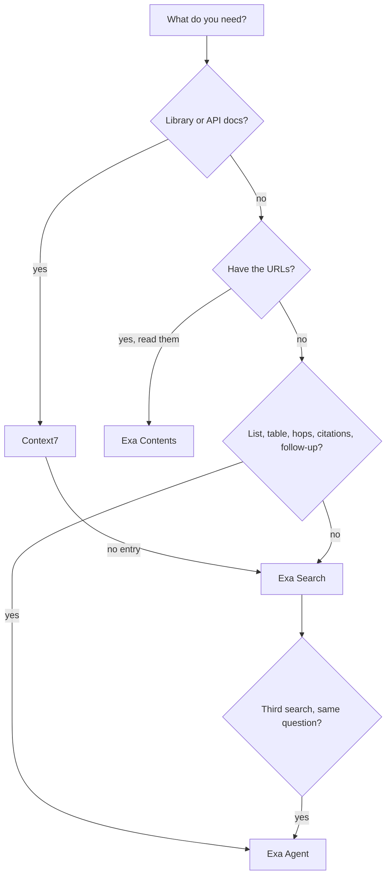

# Search

One skill for looking things up on the public web. Walk the tree below to pick the tool, then load only that tool's reference.

## Pick the tool



Walk it in order. The first match wins.

1. **Docs for a library, framework, SDK, CLI, or cloud service?** Use [Context7](references/context7.md). Its snippets are versioned; the web is full of old answers. If Context7 has no entry for it, or the question is about the library rather than its API (which library to pick, a release date, a deprecation notice), go to Exa Search.
2. **You already have the URLs and need their content?** Use [Exa Contents](references/exa-contents.md).
3. **Is the answer a list, a table, or several hops, or does it need a citation per fact, or is it a follow-up?** Use [Exa Agent](references/exa-agent.md). Any one of these is enough:
   - The answer is a **list** of things that match criteria: "find companies that...", "which vendors...", "all the papers on...".
   - The answer is a **table**: several fields per item, or rows the user gave you to fill in ("add the CEO and funding for each of these").
   - It needs **more than one hop**: find X, then find Y about each X.
   - Each fact needs **its own citation**, or the output must match a schema.
   - It is a **follow-up** on earlier research: "find ten more", "now add their pricing". Continue the earlier run with `previousRunId`. If that is rejected (teams with Zero Data Retention cannot use it), start a new run and pass the earlier results in `input.exclusion` or `input.data`.
   - You would need to **open more than about three pages** to answer well.
4. **Otherwise**, use [Exa Search](references/exa-search.md): a fact, a page, recent news, or one synthesized answer. When that one answer needs several sources: through the MCP, use Exa Agent at `low` effort (the MCP search has no `deep` type); in Pi, use `type: "deep"`. The line between the two: `deep` search returns one answer in prose; Agent returns one record per item, with fields and citations you can check.
5. **Escalate.** If you are about to run a third Exa Search for the same question, stop and start an Agent run with what you learned. A third search means the job has more than one step.

### Why Agent is the default for research, not the last resort

A manual loop of searches and page reads spends far more model tokens and time than an Agent run, and it returns prose with no per-field citations. Agent returns structured output with citations, and a confidence where it has one.

What it costs (from [exa-agent.md](references/exa-agent.md), last updated 2026-10-01; read `costDollars` after each run for the real number):

- Research on one entity uses a fixed effort at a flat price: `low` USD 0.025, `medium` USD 0.10, up to `xhigh` USD 1.00.
- Lists and any task whose size you cannot predict use `auto`, which is metered with a default cap of USD 5. Set `budget.maxCostDollars` on purpose, and put `maxItems` on arrays in the schema.
- `ultra` is the highest effort, for large list builds and deep research: metered up to USD 20 by default, and it can run for hours. Use it only when the user asks for maximum completeness, and set `budget.maxDurationSeconds` (300 to 10800).

(Prices are written as USD because Claude Code replaces a dollar sign followed by a digit in this file with the skill's arguments.)

`completed` does not mean correct. Check `stopReason` (`budget_reached` also ends as `completed`) and drop records with null fields before you use the output. Use Exa Search for one call, not for a loop.

Do not use Agent for a single fact, one known page, library docs, or a call where the answer is needed in seconds. A run is asynchronous and takes longer than one search.

## Which path: Exa MCP, Context7 CLI

- **Exa: always the Exa MCP tools** in Claude Code and OpenCode. Alex has the Exa MCP installed in both. The `curl` blocks in the Exa references are for Pi, which has no MCP, and for reading what each API field means.
- **Context7: the CLI first** (`npx --yes ctx7@latest`), the Context7 MCP tools only when the CLI fails.
- Do not use the built-in web search or fetch tools next to Exa by default; use them last.

Why: in Claude Code the Bash sandbox blocks `api.exa.ai` (`curl` fails with "Could not resolve host"), while the MCP tools reach Exa. Do not try to bypass the sandbox. If an MCP call fails with a certificate, proxy, or blocked-site error, suspect the corporate network stack (Cisco Umbrella, Secure Access) before you debug the request.

| Job | Claude Code and OpenCode | Pi (no MCP) | Watch out |
| --- | --- | --- | --- |
| Library docs | `npx --yes ctx7@latest library`, then `docs`; MCP `resolve-library-id` and `query-docs` as fallback | same CLI | |
| Web search | Exa `web_search_exa`, or `web_search_advanced_exa` for filters | `curl` `POST /search` | The MCP offers only `auto`, `fast`, and `instant` search types: no `deep`. When you need `deep`, use Exa Agent at `low` effort instead |
| Read known URLs | Exa `web_fetch_exa` | `curl` `POST /contents` | |
| Agent run | Exa `agent_run` | `curl` `POST /agent/runs` | The MCP defaults to `effort: low`, the API to `auto`: always set `effort`. Resume with `runId`; do not start a duplicate run |

## Exa authentication (Pi and raw API only)

The MCP tools carry their own key. For `curl`, every Exa call needs the header `x-api-key: $EXA_API_KEY`. Use `EXA_API_KEY` from the environment first, then `~/.config/exa/key`. Get a key at https://dashboard.exa.ai/api-keys.

Shell variables do not survive between tool calls. When the key comes from the file, put this at the top of the same call as the request:

```bash
set -euo pipefail

if [[ -z "${EXA_API_KEY:-}" && -r "$HOME/.config/exa/key" ]]; then
  IFS= read -r EXA_API_KEY < "$HOME/.config/exa/key" || [[ -n "$EXA_API_KEY" ]]
fi

if [[ -z "${EXA_API_KEY:-}" ]]; then
  printf '%s\n' 'Exa API key not found. Set EXA_API_KEY or create ~/.config/exa/key.' >&2
  exit 1
fi
```

Never print the key, and never use `set -x`: it expands the `curl` header into the output.

## Report what you found

- Answer from the source, not from memory. Cite the URL or the Context7 library ID for each fact that matters.
- When the sources disagree or are old, say so and give the date.
- If a lookup fails (quota, blocked network, no result), tell the user which tool failed and why. If you then answer from training data, say that it may be out of date.
