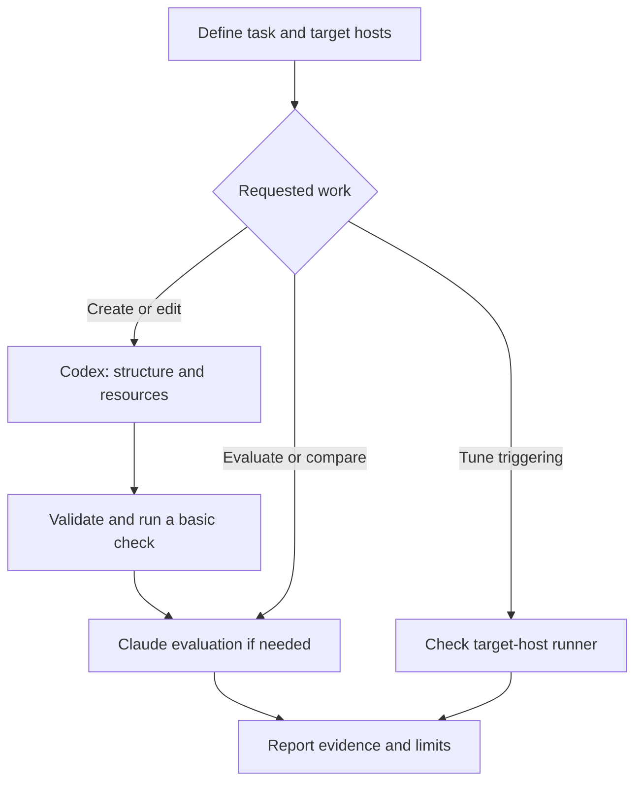

# Skill Creator

Reuse both upstream creators without merging their instructions or maintaining copies. This file selects the workflow; the upstream files supply the detail.



## Resolve the sources

Paths below are relative to this file's directory, not the terminal's working directory. Resolve them to absolute paths before running commands.

| Source | Skill directory | Read for |
| --- | --- | --- |
| Codex | `../.upstream/codex/skills/.system/skill-creator/` | Structure, resource planning, scaffolding, validation, Codex UI metadata |
| Claude | `../.upstream/claude/skills/skill-creator/` | Test prompts, baseline comparisons, human review, improvement, trigger evaluation |

Read `SKILL.md` in the selected directory, starting with the sections named below. Do not load both by default. Resolve an upstream file's scripts and references from its own skill directory. Keep outputs outside `.upstream/`.

This wrapper requires the parent repository and its initialized submodules. Do not package `skill-creator/` alone as a standalone `.skill` file: its source links would break. When taking evaluation snapshots, preserve the sibling source layout or supply the resolved source paths explicitly. Keep the pinned versions unchanged during a comparison.

If either required source is missing, stop and request submodule initialization from the repository root:

```bash
git submodule update --init --recursive -- .upstream/codex .upstream/claude
```

This restores recorded commits, not the newest upstream versions. Git operations still require the user's approval. Never clone a replacement or update upstream during normal skill creation.

## Select the work

1. Read the target skill and its repository rules before editing. Recover intent from the conversation first. Ask only for missing decisions: purpose, trigger boundaries, expected output, and target hosts. The current host supplies tools; the target hosts determine metadata and trigger tests. Choose the route by the requested work, not by which host is running this session.
2. For a new skill or structural changes, use Codex's **Core Principles** and **Skill Creation Process**. Keep instructions short and put detailed material in linked resources. For prose-producing skills, follow `../alex-voice/SKILL.md` and reference it in the generated skill with a path that resolves from that skill.
3. For a new skill with Codex among its targets, including shared Pi/Codex skills, use Codex's `scripts/init_skill.py`. Read `references/openai_yaml.md` before generating UI metadata. If Codex is not a target, write the minimal directory directly: the initializer always creates `agents/openai.yaml`. Preserve existing skill names, metadata, and useful resources; do not reinitialize an existing skill.
4. For behavioral changes, use Claude's **Capture Intent**, **Test Cases**, and **Improving the skill**. Agree on realistic examples and checks. Use a basic execution check for small changes; use the full comparison loop when requested or when the behavior needs stronger proof.
5. For an evaluation-only or comparison request, go directly to Claude's **Running and evaluating test cases**, its relevant `agents/` instructions, and `references/schemas.md`. Skip creation and scaffolding. Leave the supplied skills unchanged; write test artifacts in the workspace and report findings without starting upstream's rewrite loop. Use the same prompts and host/model settings for both versions. Compare a new skill against no skill; compare an edit against a snapshot taken before editing. Do not call an inline self-review an independent benchmark.
6. For trigger tuning, use Claude's **Description Optimization** only after checking the runner and target host. Its scripts use `claude -p`; they do not measure Pi or Codex triggering. On another host, test selection there or report it as unverified. Do not pass a non-Claude model ID to the Claude runner.

## Apply local rules before upstream mechanics

This wrapper selects which upstream steps apply. It does not override system instructions, user decisions, repository rules, or tool permissions.

- Keep upstream submodules read-only. Change the target skill, not the creators. Preserve upstream licenses and source history.
- Use the current host's available tools and delegation rules. Do not invent subagent APIs or launch an evaluation swarm because upstream says to. If independent runs are unavailable, do a clearly labeled inline check without claiming a baseline advantage.
- Put evaluation artifacts in the repository's ignored `.skill-workspace/` directory, grouped by target skill and iteration. Record the host/model, upstream commit IDs, and check outputs there. Inspect the checked-out scripts before using them; upstream instructions and schemas can differ.
- Use Claude's review viewer with `--static` when a review artifact is needed. Do not start a server for the user. Collect actual feedback before attributing a revision to human review.
- Report only measured timing and token values. Mark unavailable metrics as unmeasured; never insert zero to make a benchmark look complete.
- Validate with Codex's `scripts/quick_validate.py` and the target repository's checks. Its frontmatter allowlist is narrower than some hosts. If it rejects a host-supported field, verify the host's schema and report that limit rather than deleting valid metadata or changing the upstream validator.

## Verify and finish

Run the target skill's existing tests and the smallest realistic task that exercises the changed behavior. Check resource paths from the target skill directory. A valid frontmatter check does not prove the skill helps.

Report changed files, checks run, evidence, and remaining limits. Update the repository handoff if it exists. Leave commits to the user.

For this wrapper's own changes, follow the same process: keep a pre-edit snapshot, review routing with Codex's structure guidance and Claude's improvement guidance, run representative routing checks, then revise once. Stop after that bounded pass unless another iteration is requested. Never delegate back to this wrapper recursively.
